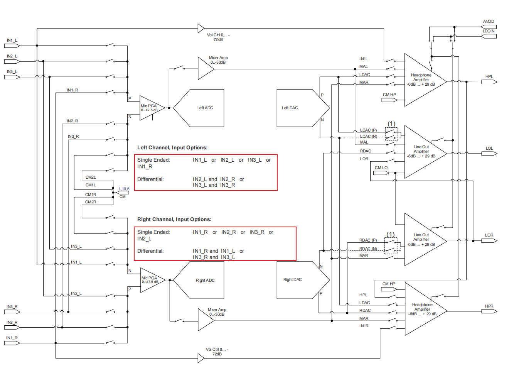
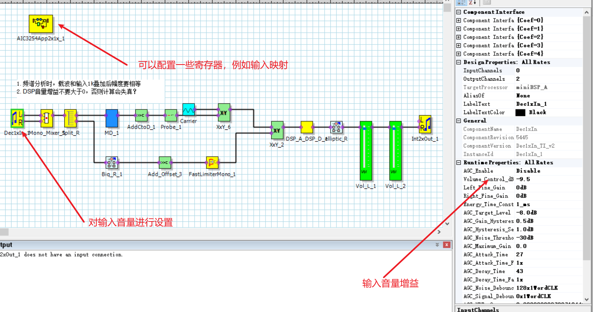
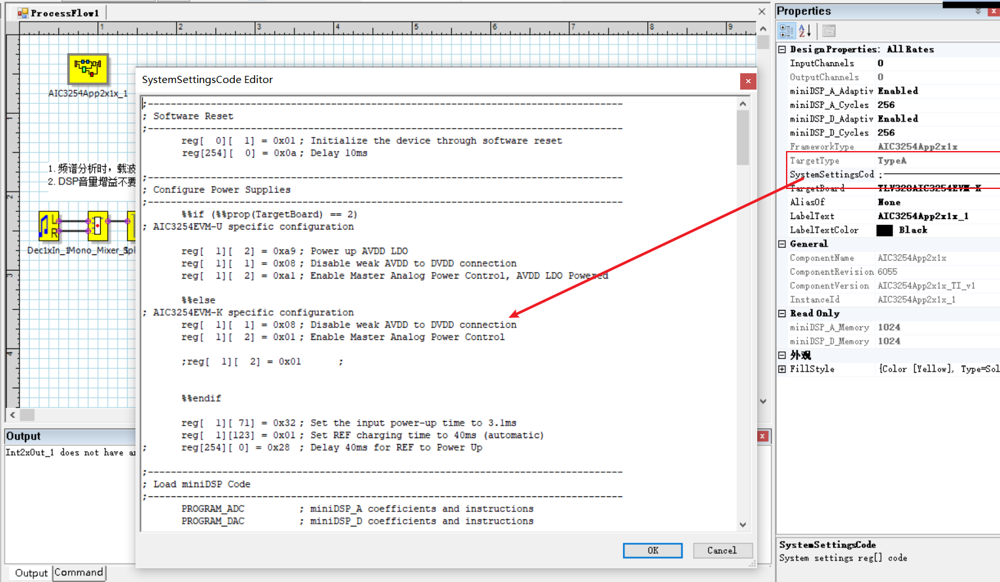
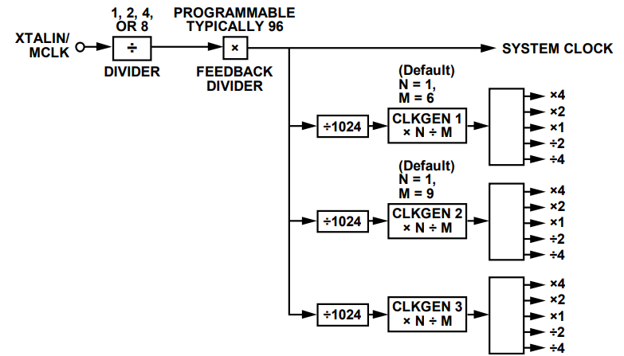
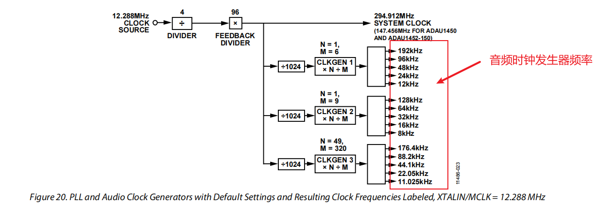
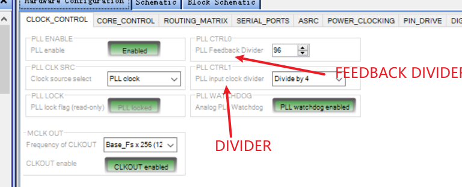
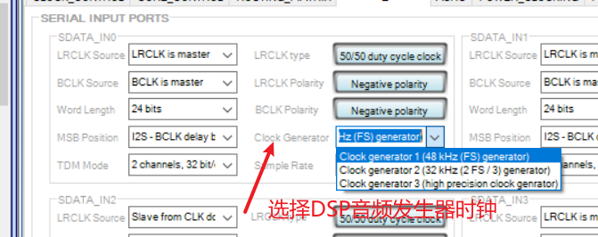

# 音频DSP开发套路

## 开发步骤

1. 确认硬件接口
2. 搭建直通数据链路，验证音频信号经过 DSP 后可以正常输出到后端电路
3. 添加常用的音频算法，处理输入DSP的信号
4. 调试音频算法的参数（有些上位机具有动态侦测功能，可以边看侦测参数，再对音频算法的参数进行修改。比如ADI的上位机sigmastudio具有Level Decterors功能）

| 常用的DSP音频处理算法 | 通途                                                         |
| --------------------- | ------------------------------------------------------------ |
| 滤波器                | 处理噪声，变相提高人声的清晰度<br />备注：<br />**低通滤波器（Low-pass Filter）**：允许低频信号通过，并衰减高频信号。它可以用于去除高频噪音或控制音频信号的高频部分。 <br />**高通滤波器（High-pass Filter）**：允许高频信号通过，并衰减低频信号。它可以用于去除低频噪音或控制音频信号的低频部分。 <br />**带通滤波器（Band-pass Filter）**：只允许特定频率范围内的信号通过，并衰减其他频率范围的信号。它可以用于突出或控制特定频率范围内的音频内容。 <br />**带阻滤波器（Band-stop Filter，也称为陷波器或带消滤波器）**：阻止特定频率范围的信号通过，并允许其他频率范围的信号通过。它可以用于消除特定频率范围内的噪音或干扰。 <br />**陷波滤波器（Notch Filter）**：类似于带阻滤波器，但通常用于抑制单个频率的噪音或干扰，例如电源嗡嗡声。 <br />**均衡器（Equalizer）**：均衡器是一种多频段滤波器，允许用户调整不同频率范围内的音量和音色，以实现所需的音频效果。常见的均衡器类型包括图形均衡器、参数均衡器和半参数均衡器。 |
| EQ                    |                                                              |
| 语音侦测，音乐侦测    | 与其它控件组合，动态调整多个音频的优先级                     |
| 限幅器                | 禁止设备功率超限                                             |
| 增益，音量控制        | 对输入信号进行增益                                           |
| 混合                  | 将左右声道混合为一路或混合多路音频                           |
| 分开                  | 将一路音频分为多路，进行逻辑处理                             |
|                       |                                                              |

5. 基本套路

```mermaid
```


## 参数调试

### 声音发闷的原因及解决办法

#### 原因

1. 因为音频中低音能量太大，高音能量偏小，这就造成了听起来声音闷。类似于水管流量是一定的，低音流的太多，那你收到的效果就是低音多，导致声音发闷
1. 低频内容稍多

#### 解决办法

1. 减小低音能量，增大高音能量。可以使用EQ调试，较小低频增益，增大高频增益
1. 使用高通滤波器将低频过滤

### 底噪太大的原因及解决办法

#### 原因

1. 电源噪声
2. 电路噪声

#### 解决办法

1. 减小音频增益可以将部分噪声过滤掉
2. 加入滤波器，避免播放噪声，例如高通，低通，陷波器

## 功能模块

#### 自动静音

1. 放入音频检测模块
2. 放置比较模块
3. 设置音频检测模块的阈值，大于阈值输出1，小于阈值输出0
4. 将音频乘以比较结果，可以实现静音效果


## TIDSP

### tlvaic32054

#### 输入管脚映射

配置寄存器为page1,reg55~58



#### 上位机配置



## ADIDSP

[**Sigmastudio教程**](https://wiki.analog.com/resources/tools-software/sigmastudio/usingsigmastudio)

### 1452确定采样率

- 配置音频发生器时钟


Clock Generators 1/2/3 
generate audio clocks for the serial ports, DSP, ASRCs, and other audio related functional blocks in the system







- 选择时钟，并设置Sample Rate，其中，Fs为Clock Generators 1/2/3 


