## CherryUSB+SFUD+W25Q64模拟U盘无法格式化

在usbd_msc_sector_write接口函数内，写数据不对。W25Q64需要先擦除，再写入数据

```c
int usbd_msc_sector_write(uint32_t sector, uint8_t *buffer, uint32_t length)
{
    /* TODO 擦除前读出数据，将buffer写入付出缓冲，再写入缓冲，保证Flash内数据不被改变 */
    if (sector < BLOCK_COUNT)
    {
        nor_flash1.ops.erase(sector * BLOCK_SIZE, length);//先擦除
        nor_flash1.ops.write(sector * BLOCK_SIZE, buffer, length);//在写入
    }
ok:
    return 0;
error:
    return -1;    
}
```

## RTthread 如何挂载多个设备

1. 将一个存储设备挂载到一个根目录（“/”）

2. 在根目录创建一个文件夹NewFolder 
3. 将另一个（或更多）设备挂载到新创建的文件夹("/NewFolder")上
4. 挂载更多设备依此类推

## 判断摄像头数据是否正确

1. 查看手册，配置摄像头输出色条（ov2640 COM7 寄存器的bit2可以使能输出色条）
2. 根据实际输出的色块判断驱动是否有问题
## Keil全局变量分配的内存被OS内的molloc函数申请的内存覆盖，其它编译器类似
1. 首先检查keil的sct文件，检查是否分配了AXISRAM
2. 检查OS是否对AXISRAM区域的内存做了管理
3. 如果出现标题所述的现象，很有可能是全局变量分配内存与malloc函数申请内存重叠，导致全局变量被覆盖

## GPIO不够时可以采用的硬件设计方案

- keyADC检测
- IO组合，三个GPIO可以检测8(2的三次方)种按键
- 使用串转并或并转串的IC通过MCU外设进行扩展，如HC595

## 系统卡死、没有日志输出，但是系统并没有复位。排查办法

- 将shell调整至最大优先级
- 关闭看门狗
- 查看任务状态

- 连接仿真器，看程序一直在哪里运行，判断卡死位置

## HardWare 卡死


## MAP文件分析

map文件主要存储了编译文件内的数据存储结构，可以参看[Amap | Sergey Sikorskiy](https://www.sikorskiy.net/info/prj/amap/)进行文件分析

## 去除警告

功能写完一定要去除警告，可以避免出现未知的错误！
使用attribute可以修饰函数，将定义的函数却没有引用的函数警告进行修饰，可以避免编译器警告

如果提示missing braces around initializer，确实是缺少了括号，初始化时对结构体内部成员使用了一个错误的值

~~~c
struct apm32_adc
{
    const char *name;
    ADC_T *adc;
    ADC_Config_T adc_config;
    rt_base_t channel_pin[DRV_ADC_CHANNEL_MAX_NUM];
    struct rt_adc_device adc_dev;//为一个结构体
};

static struct apm32_adc adc_config[] =
{
    {
        "adc2",
        ADC2,
        {
            ADC_MODE_INDEPENDENT,
            DISABLE,
            DISABLE,
            ADC_EXT_TRIG_CONV_None,
            ADC_DATA_ALIGN_RIGHT,
            1
        },
        {
            GET_PIN(A, 0), GET_PIN(A, 1), GET_PIN(A, 2), GET_PIN(A, 3), GET_PIN(A, 4),
            GET_PIN(A, 5), GET_PIN(A, 6), GET_PIN(A, 7), GET_PIN(B, 0), GET_PIN(B, 1),
            GET_PIN(C, 0), GET_PIN(C, 1), GET_PIN(C, 2), GET_PIN(C, 3)
        },
        {}//正确实例，将结构体初始化为空，这样就避免了missing braces around initializer警告
    },
    {
        "adc1",
        ADC1,
        {
            ADC_MODE_INDEPENDENT,
            DISABLE,
            DISABLE,
            ADC_EXT_TRIG_CONV_None,
            ADC_DATA_ALIGN_RIGHT,
            1
        },
        {
            GET_PIN(A, 0), GET_PIN(A, 1), GET_PIN(A, 2), GET_PIN(A, 3), GET_PIN(A, 4),
            GET_PIN(A, 5), GET_PIN(A, 6), GET_PIN(A, 7), GET_PIN(B, 0), GET_PIN(B, 1),
            GET_PIN(C, 0), GET_PIN(C, 1), GET_PIN(C, 2), GET_PIN(C, 3)
        },
        RT_NULL//错误实例，将结构体赋值为RT_NULL
    },    
}
~~~

## 串口乱码分析原因

1. 一样的程序放在不同板子上验证
2. 查看寄存器是否配置正确
3. 查看发送端与接收端配置是否相同
4. 如果不同板子有些正常，排查下系统时钟是否正常，有可能晶振频率不对或者晶振不稳定

## Rt-thread DFS使能时stdio的fopen无效


1. 检查是否使能RT_USING_POSIX_FS
2. 检查是否使能RT_USING_POSIX_DEVIO
3. 检查IDE是否使能了标准库，例如Keil使能 MicroLIB

## Rt-thread 开启RT_USING_POSIX_STDIO后，shell线程一直死循环


## HardFault_Handler原因分析

首先记住以下几个特殊寄存器的作用

| 寄存器名 | 作用                                                   |
| -------- | ------------------------------------------------------ |
| r0~r3    | 通用寄存器，形参或临时变量                             |
| R12      | 用于存储中断或异常返回后的下一条指令地址               |
| R13(SP)  | 指示当前程序运行时刻，栈的位置（栈自上而下生长的满栈） |
| R14(LR)  | 程序跳转时，会存储函数调用返回后的地址                 |
| R15(PC)  | 当前程序正在执行的指令                                 |
| xPSR     | 存储处理器运行状态                                     |

了解中断压栈的顺序

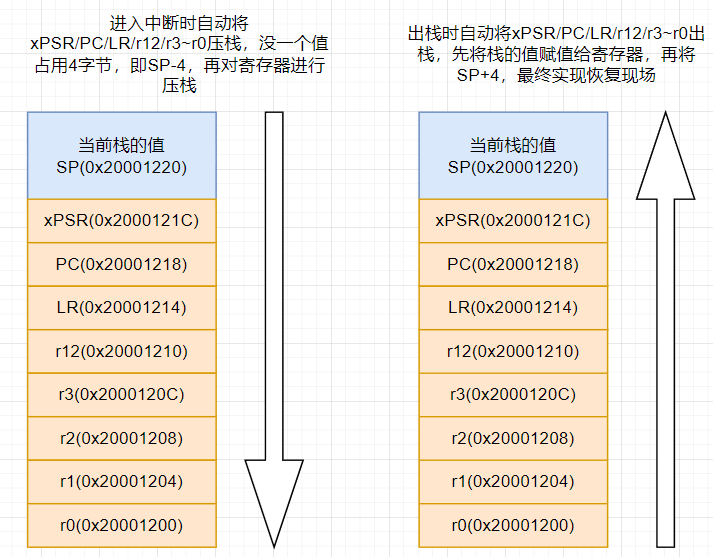

实例分析：

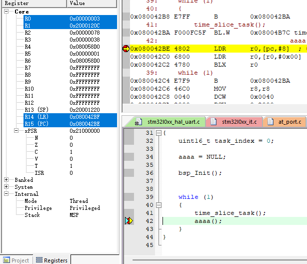

其中aaaa为被赋值为NULL的函数指针，执行前的寄存器状态如上图

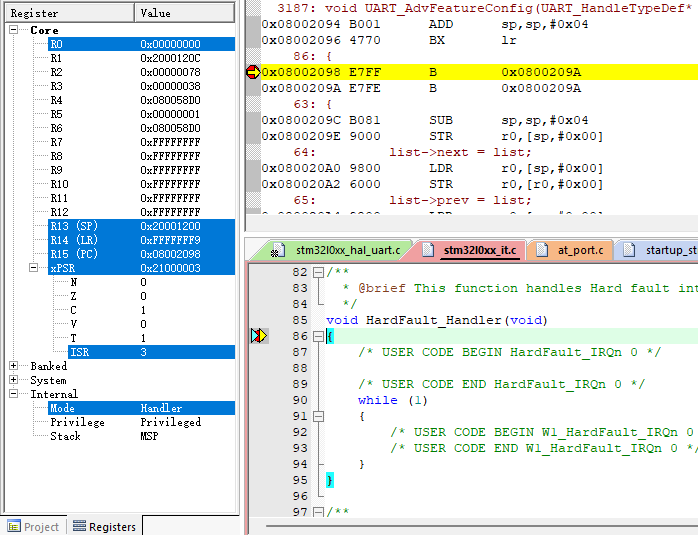

执行aaaa后，进入HardFault_Handler，发现SP由0x20001220变为了0x20001200。根据自动入栈分析，此时

0x20001200保存的为r0寄存器进入HardFault_Handler之前的值。此时查看0x20001200memory窗口。

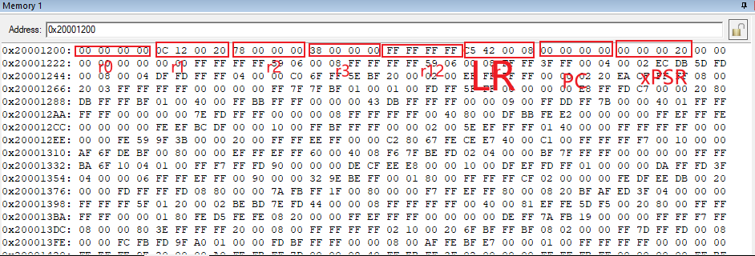

r0无法对应，不知道为什么。

**根据PC的值找到发生故障的位置**

法1：Keil直接分析

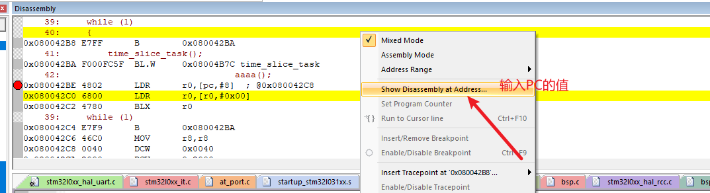

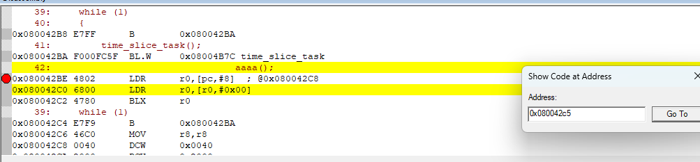

此时跳转到了发生HardFault_Handler的指令位置

法2：addr2line.exe 分析

addr2line.exe -e [可执行文件路径] -f(显示函数名) -i(显示文件及行号) -a(显示地址)

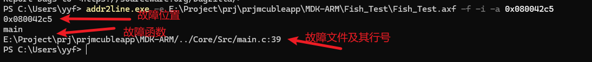

法3：[CmBacktrace](https://github.com/armink/CmBacktrace)库分析

## 中断

### 自动入栈出栈

详见 HardFault_Handler原因分析

### 咬尾中断

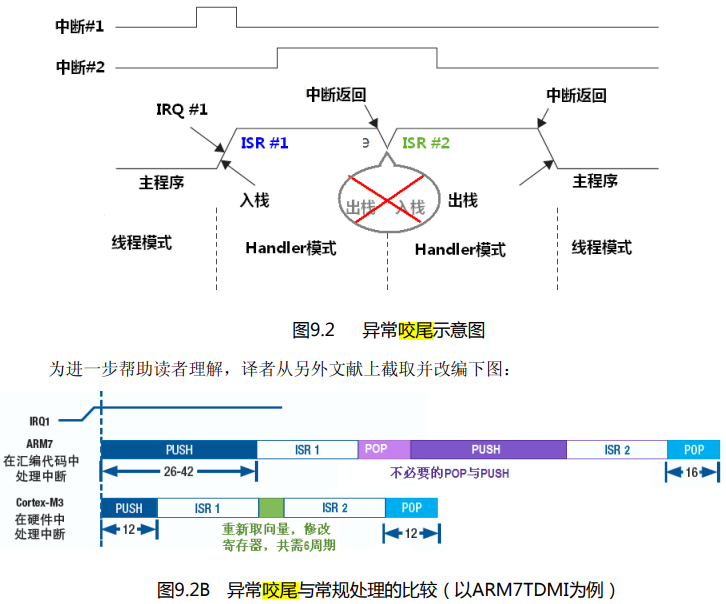

图片截取自Cortex-M3权威指南（中文版）。咬尾中断的意思就是，出现连续中断(两个中断的标志位均被置位)，**第一次中断执行完后，直接修改向量寄存器进入第二个中断**，不进行POP,PUSH的操作，减小了指令周期

### 晚到中断

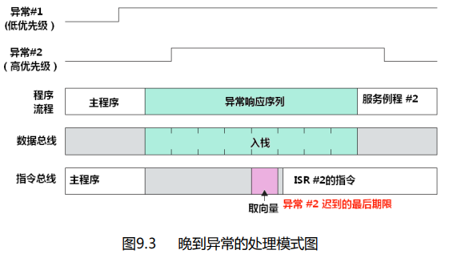

图片截取自Cortex-M3权威指南（中文版）。晚到中断的意思是，**异常1入栈，且没有执行异常1指令的时间之间，异常2发生了请求，则在入栈后，实际执行的指令为异常2**。这种现象称之为晚到中断。

### LR的特殊值

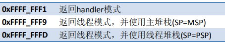

### 双堆栈

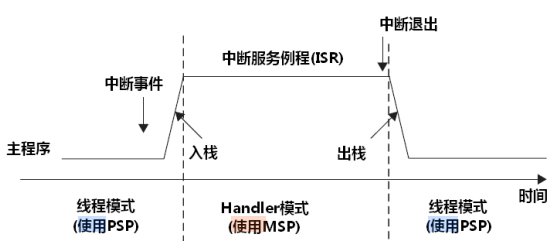

**MSP能在特权级和用户级使用，PSP只能在线程级使用**

### 特殊功能寄存器

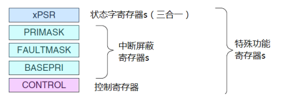

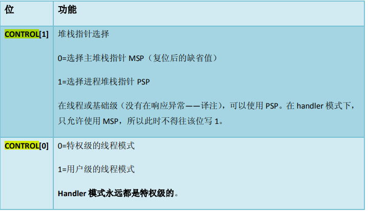
