## Debug仿真时，不进行复位调试

### [Keil不复位调试](https://www.stmcu.com.cn/Designresource/detail/document/712028)

## CherryUSB+SFUD+W25Q64模拟U盘无法格式化

在usbd_msc_sector_write接口函数内，写数据不对。W25Q64需要先擦除，再写入数据

```c
int usbd_msc_sector_write(uint32_t sector, uint8_t *buffer, uint32_t length)
{
    /* TODO 擦除前读出数据，将buffer写入付出缓冲，再写入缓冲，保证Flash内数据不被改变 */
    if (sector < BLOCK_COUNT)
    {
        nor_flash1.ops.erase(sector * BLOCK_SIZE, length);//先擦除
        nor_flash1.ops.write(sector * BLOCK_SIZE, buffer, length);//在写入
    }
ok:
    return 0;
error:
    return -1;    
}
```

## RTthread 如何挂载多个设备

1. 将一个存储设备挂载到一个根目录（“/”）

2. 在根目录创建一个文件夹NewFolder 
3. 将另一个（或更多）设备挂载到新创建的文件夹("/NewFolder")上
4. 挂载更多设备依此类推

## 判断摄像头数据是否正确

1. 查看手册，配置摄像头输出色条（ov2640 COM7 寄存器的bit2可以使能输出色条）
2. 根据实际输出的色块判断驱动是否有问题
## Keil全局变量分配的内存被OS内的molloc函数申请的内存覆盖，其它编译器类似
1. 首先检查keil的sct文件，检查是否分配了AXISRAM
2. 检查OS是否对AXISRAM区域的内存做了管理
3. 如果出现标题所述的现象，很有可能是全局变量分配内存与malloc函数申请内存重叠，导致全局变量被覆盖

## GPIO不够时可以采用的硬件设计方案

- keyADC检测
- IO组合，三个GPIO可以检测8(2的三次方)种按键
- 使用串转并或并转串的IC通过MCU外设进行扩展，如HC595

## 系统卡死、没有日志输出，但是系统并没有复位。排查办法

- 将shell调整至最大优先级
- 关闭看门狗
- 查看任务状态

- 连接仿真器，看程序一直在哪里运行，判断卡死位置

- GDB调试

## HardWare 卡死

- GDB调试，查看函数调用关系

## MAP文件分析

map文件主要存储了编译文件内的数据存储结构，可以参看[Amap | Sergey Sikorskiy](https://www.sikorskiy.net/info/prj/amap/)进行文件分析

[MapViewer](git@github.com:govind-mukundan/MapViewer.git)

## 去除警告

功能写完一定要去除警告，可以避免出现未知的错误！
使用attribute可以修饰函数，将定义的函数却没有引用的函数警告进行修饰，可以避免编译器警告

如果提示**missing braces around initializer**，确实是缺少了括号，初始化时对结构体内部成员使用了一个错误的值

~~~c
struct apm32_adc
{
    const char *name;
    ADC_T *adc;
    ADC_Config_T adc_config;
    rt_base_t channel_pin[DRV_ADC_CHANNEL_MAX_NUM];
    struct rt_adc_device adc_dev;//为一个结构体
};

static struct apm32_adc adc_config[] =
{
    {
        "adc2",
        ADC2,
        {
            ADC_MODE_INDEPENDENT,
            DISABLE,
            DISABLE,
            ADC_EXT_TRIG_CONV_None,
            ADC_DATA_ALIGN_RIGHT,
            1
        },
        {
            GET_PIN(A, 0), GET_PIN(A, 1), GET_PIN(A, 2), GET_PIN(A, 3), GET_PIN(A, 4),
            GET_PIN(A, 5), GET_PIN(A, 6), GET_PIN(A, 7), GET_PIN(B, 0), GET_PIN(B, 1),
            GET_PIN(C, 0), GET_PIN(C, 1), GET_PIN(C, 2), GET_PIN(C, 3)
        },
        {}//正确实例，将结构体初始化为空，这样就避免了missing braces around initializer警告
    },
    {
        "adc1",
        ADC1,
        {
            ADC_MODE_INDEPENDENT,
            DISABLE,
            DISABLE,
            ADC_EXT_TRIG_CONV_None,
            ADC_DATA_ALIGN_RIGHT,
            1
        },
        {
            GET_PIN(A, 0), GET_PIN(A, 1), GET_PIN(A, 2), GET_PIN(A, 3), GET_PIN(A, 4),
            GET_PIN(A, 5), GET_PIN(A, 6), GET_PIN(A, 7), GET_PIN(B, 0), GET_PIN(B, 1),
            GET_PIN(C, 0), GET_PIN(C, 1), GET_PIN(C, 2), GET_PIN(C, 3)
        },
        RT_NULL//错误实例，将结构体赋值为RT_NULL
    },    
}
~~~

## 串口乱码分析原因

1. 一样的程序放在不同板子上验证
2. 查看寄存器是否配置正确
3. 查看发送端与接收端配置是否相同
4. 如果不同板子有些正常，排查下系统时钟是否正常，有可能晶振频率不对或者晶振不稳定

## Rt-thread DFS使能时stdio的fopen无效


1. 检查是否使能RT_USING_POSIX_FS
2. 检查是否使能RT_USING_POSIX_DEVIO
3. 检查IDE是否使能了标准库，例如Keil使能 MicroLIB

## Rt-thread 开启RT_USING_POSIX_STDIO后，shell线程一直死循环


## HardFault_Handler原因分析

首先记住以下几个特殊寄存器的作用

| 寄存器名 | 作用                                                   |
| -------- | ------------------------------------------------------ |
| r0~r3    | 通用寄存器，形参或临时变量                             |
| R12      | 用于存储中断或异常返回后的下一条指令地址               |
| R13(SP)  | 指示当前程序运行时刻，栈的位置（栈自上而下生长的满栈） |
| R14(LR)  | 程序跳转时，会存储函数调用返回后的地址                 |
| R15(PC)  | 当前程序正在执行的指令                                 |
| xPSR     | 存储处理器运行状态                                     |

了解中断压栈的顺序

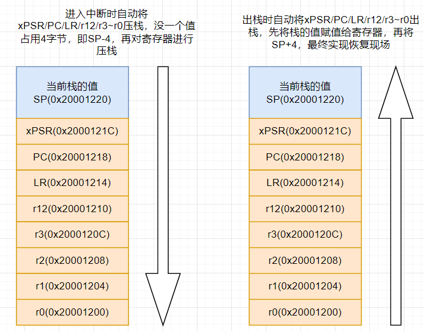

实例分析：

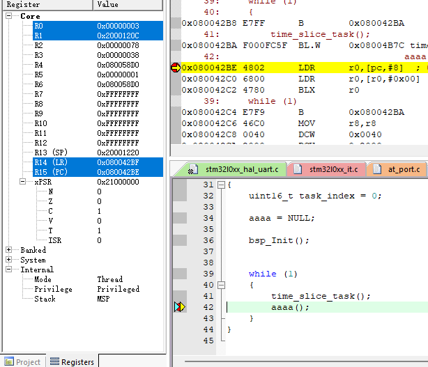

其中aaaa为被赋值为NULL的函数指针，执行前的寄存器状态如上图

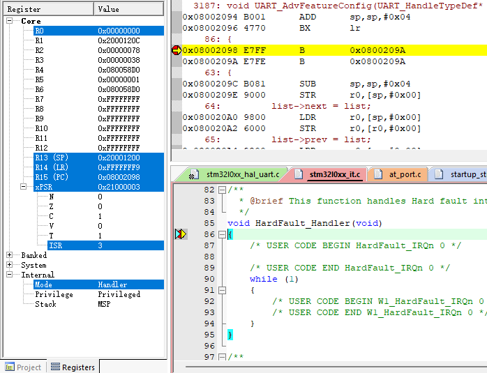

执行aaaa后，进入HardFault_Handler，发现SP由0x20001220变为了0x20001200。根据自动入栈分析，此时

0x20001200保存的为r0寄存器进入HardFault_Handler之前的值。此时查看0x20001200memory窗口。

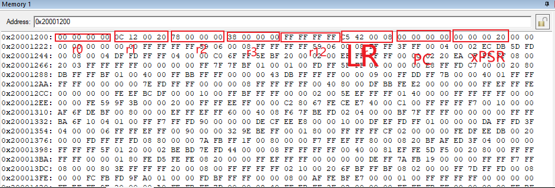

r0无法对应，不知道为什么。

**根据PC的值找到发生故障的位置**

#### 法1：Keil直接分析

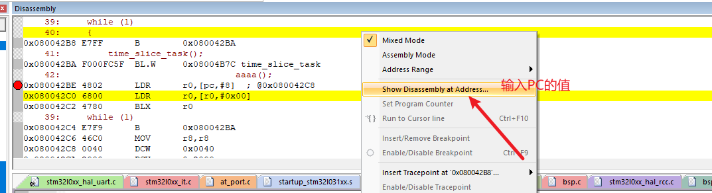

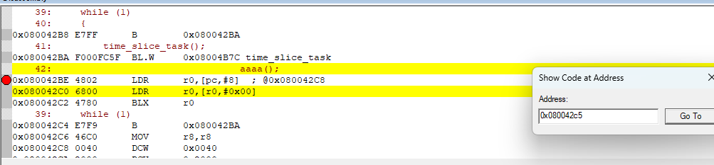

此时跳转到了发生HardFault_Handler的指令位置

#### 法2：addr2line.exe 分析

使用J-link commander连接目标设备

输入halt暂停MCU，使用go可以让CPU继续运行

输入regs查看MCU寄存器R0～R14等寄存器的值

根据PC寄存器及LR寄存器的值，使用addr2line.exe 判断函数运行位置

输入memx [addr],[大小] 可以查看指定位置的数据

addr2line.exe -e [可执行文件路径] -f(显示函数名) -i(显示文件及行号) -a(显示地址)


#### 法3：[CmBacktrace](https://github.com/armink/CmBacktrace)库分析

#### 法4：根据GBD工具调试信息分析

[详情参考](https://developer.aliyun.com/article/699000)

选择Jlink的连接方式

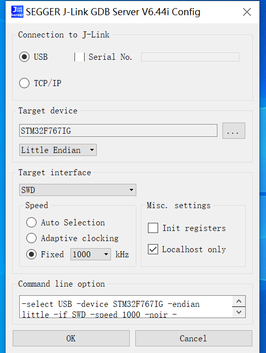

连接成功后，启用GDB调试

```shell
arm-none-eabi-gdb.exe {可执行文件，axf文件或elf文件}
#进入gdb命令行，输入
target remote localhost:{端口地址}
#此时已经可以正常调试
#收入backtrace显示函数调用关系，判函卡死在哪里
backtrace
```

实际调试输出日志如下

```shell
arm-none-eabi-gdb.exe [axf文件]
(gdb) target remote lowarning: could not convert 'lo' from the host encoding (CP1252) to UTF-32.
This normally should not happen, please file a bug report.

could not open file: l (error 2):
(gdb) target remote localhost:2331
Remote debugging using localhost:2331
0x080cd940 in stm32_putc (serial=0x2001b334 <uart_obj+760>, c=85 'U') at libraries/HAL_Drivers\drv_usart_v2.c:299
299         while (__HAL_UART_GET_FLAG(&(uart->handle), UART_FLAG_TC) == RESET)
(gdb)
(gdb) backtrace
#0  0x00000000 in stm32_putc (serial=0x2001b334 <uart_obj+760>, c=85 'U') at libraries/HAL_Drivers\drv_usart_v2.c:299
#1  0x00000000 in _serial_poll_tx (dev=0x2001b334 <uart_obj+760>, pos=0, buffer=0x2001750c <rt_kprintf.rt_log_buf>, size=27)
    at rt-thread/components/drivers/serial\serial_v2.c:370
#2  0x00000000 in _serial_fifo_tx_blocking_buf (dev=0x2001b334 <uart_obj+760>, pos=0, buffer=0x2001750c <rt_kprintf.rt_log_buf>,
    size=27) at rt-thread/components/drivers/serial\serial_v2.c:513
#3  0x00000000 in rt_device_write (dev=0x2001b334 <uart_obj+760>, pos=0, buffer=0x2001750c <rt_kprintf.rt_log_buf>, size=27)
    at rt-thread/src\device.c:375
#4  0x00000000 in rt_kprintf (fmt=0x80e474d "UART1 message queue full!\r\n") at rt-thread/src\kservice.c:1324
#5  0x00000000 in com1_rx_done (dev=0x2001b18c <uart_obj+336>, size=45) at bsp\bsp_uart.c:23
#6  0x00000000 in rt_hw_serial_isr (serial=0x2001b18c <uart_obj+336>, event=2307)
    at rt-thread/components/drivers/serial\serial_v2.c:1502
#7  0x00000000 in dma_recv_isr (serial=0x2001b18c <uart_obj+336>, isr_flag=0 '\000') at libraries/HAL_Drivers\drv_usart_v2.c:428
#8  0x00000000 in uart_isr (serial=0x2001b18c <uart_obj+336>) at libraries/HAL_Drivers\drv_usart_v2.c:495
#9  0x00000000 in USART1_IRQHandler () at libraries/HAL_Drivers\drv_usart_v2.c:551
#10 <signal handler called>
#11 0x00000000 in stm32_putc (serial=0x2001b334 <uart_obj+760>, c=27 '\033') at libraries/HAL_Drivers\drv_usart_v2.c:299
#12 0x00000000 in _serial_poll_tx (dev=0x2001b334 <uart_obj+760>, pos=0, buffer=0x2001750c <rt_kprintf.rt_log_buf>, size=14)
    at rt-thread/components/drivers/serial\serial_v2.c:370
#13 0x00000000 in _serial_fifo_tx_blocking_buf (dev=0x2001b334 <uart_obj+760>, pos=0, buffer=0x2001750c <rt_kprintf.rt_log_buf>,
    size=14) at rt-thread/components/drivers/serial\serial_v2.c:513
#14 0x00000000 in rt_device_write (dev=0x2001b334 <uart_obj+760>, pos=0, buffer=0x2001750c <rt_kprintf.rt_log_buf>, size=14)
    at rt-thread/src\device.c:375
#15 0x00000000 in rt_kprintf (fmt=0x80e24f7 "\033[32m[I/comm] ") at rt-thread/src\kservice.c:1324
#16 0x00000000 in comm_thd_count_printf () at applications/public\comm.c:184
#17 0x00000000 in _thd_timer_timeout (parameter=0x0) at applications\thd_init.c:28
#18 0x00000000 in rt_soft_timer_check () at rt-thread/src\timer.c:758
#19 0x00000000 in _timer_thread_entry (parameter=0x0) at rt-thread/src\timer.c:823
#20 0x00000000 in ?? ()
Backtrace stopped: previous frame identical to this frame (corrupt stack?)
```


## 中断

### 自动入栈出栈

详见 HardFault_Handler原因分析

### 咬尾中断

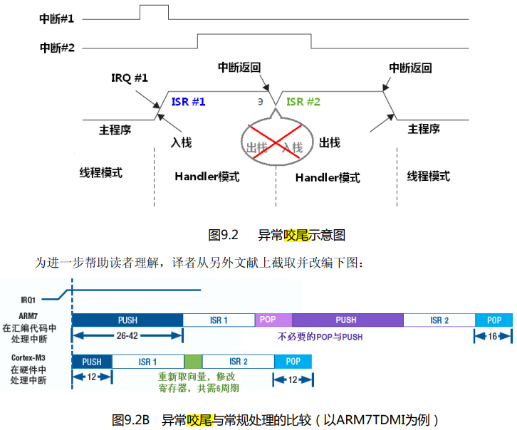

图片截取自Cortex-M3权威指南（中文版）。咬尾中断的意思就是，出现连续中断(两个中断的标志位均被置位)，**第一次中断执行完后，直接修改向量寄存器进入第二个中断**，不进行POP,PUSH的操作，减小了指令周期

### 晚到中断

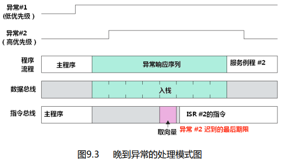

图片截取自Cortex-M3权威指南（中文版）。晚到中断的意思是，**异常1入栈，且没有执行异常1指令的时间之间，异常2发生了请求，则在入栈后，实际执行的指令为异常2**。这种现象称之为晚到中断。

### LR的特殊值

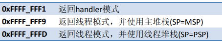

### 双堆栈

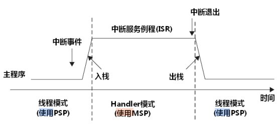

**MSP能在特权级和用户级使用，PSP只能在线程级使用**

### 特殊功能寄存器

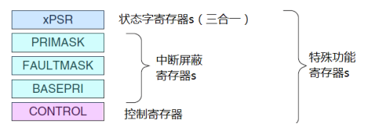

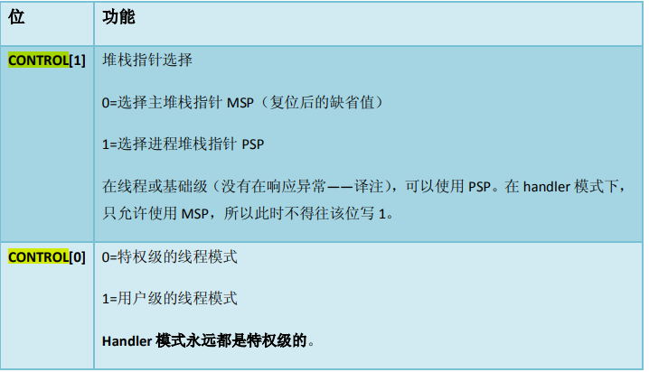

## Bootloader原理

boot原理就是，将一个工程分为两部分，一个名为boot，一个名为app。上电或复位后首先进入boot，在boot内跳转到app，最终程序运行在app内。

### 直接升级

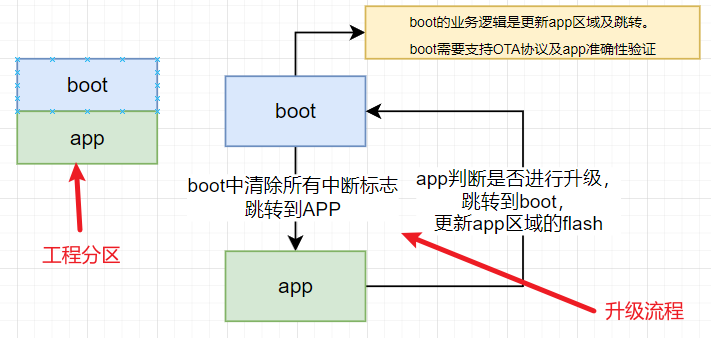

这里app分区也可以扩展为app1，app2。此时可以在app内更新另一个app。然后根据标志由boot选择跳转到哪一个app（改善后为后台升级）

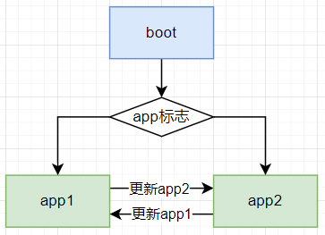

优点：占用flash小，

缺点：如果app错误，则很大概率造成板子变砖（app无法跳转，一直运行在boot程序）。升级时无法运行其它任务

### 后台升级

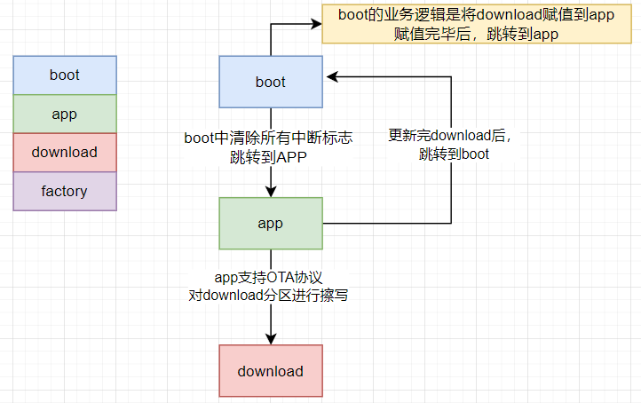

download不限于下载app，也可以用于下载其它分区的内容。boot根据download的内容，将download的数据覆盖到download对应的分区。

参考[QBoot](git@gitee.com:qiyongzhong0/rt-thread-qboot.git)

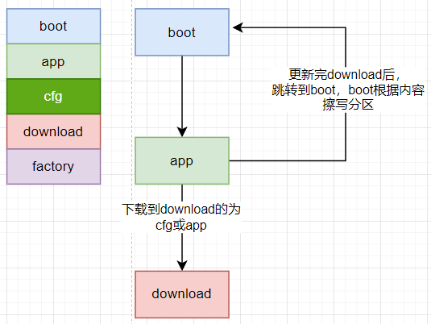

优点：升级期间，也可以运行其他任务，升级变砖的概率小。可以考虑在boot内加一个恢复出厂设置的功能，app挂掉后，可以恢复到factory。

缺点：占用空间大

### Boot跳转App步骤

前提条件是app的内容准确无误。

1. 关闭中断
2. 清除所有中断标志位
3. 提供干净的运行环境，如关闭外设（看门狗）
4. 跳转到app(appflash地址 + 4)

```c
/*
*跳转函数
*/
void qbt_jump_to_app(void)
{
    //定义函数指针别名
    typedef void (*app_func_t)(void);
    //APP地址
    u32 app_addr = QBOOT_APP_ADDR;
    //取出MSP指针
    u32 stk_addr = *((__IO uint32_t *)app_addr);
    //(app_addr + 4) 是因为第一个unsigned long为msp指针，第二个unsigned long为Reset_Handler
    app_func_t app_func = (app_func_t)(*((__IO uint32_t *)(app_addr + 4)));
	//判断函数指针，MSP是否符合标准
    if ((((u32)app_func & 0xff000000) != 0x08000000) || ((stk_addr & 0x2ff00000) != 0x20000000))
    {
        LOG_E("No legitimate application.");
        return;
    }
	
    rt_kprintf("Jump to application running ... \n");
    rt_thread_mdelay(200);
	
    /* 关闭全部中断 */
    __disable_irq();

    /* 关闭及清空所有中断标志 */
    for(int i = 0; i < 128; i++)
    {
        NVIC_DisableIRQ((IRQn_Type)i);
        NVIC_ClearPendingIRQ((IRQn_Type)i);
    }

    /* 复位Systick */
    SysTick->CTRL = 0;
    SysTick->LOAD = 0;
    SysTick->VAL = 0;

    /* 设置PSP和MSP寄存器的初始值 */
    __set_CONTROL(0);
    __set_MSP(stk_addr);
	//执行中断向量表的Reset_Handler
    app_func();

    LOG_E("Qboot jump to application fail.");
}
```

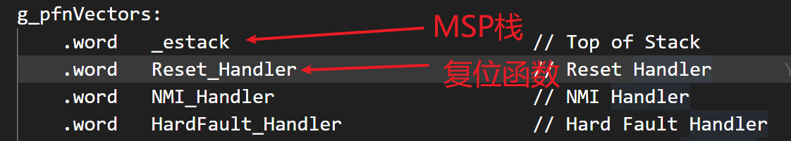

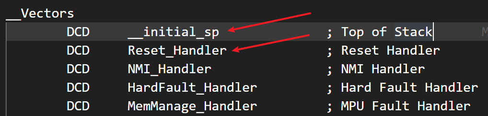

**注：编写跳转函数时，函数不能有形参，可能会进行入栈，出栈的操作。这样就会导致设置MSP时出现意想不到的错误，[详见](https://cloud.tencent.com/developer/article/2367283)**。

## MDK-ARM V6编译freertos port.c文件报错

因为添加的freertos的port文件在RVDS文件夹内，不兼容V6编译器，需要使用gcc文件夹内的接口文件

[MDK-ARM编译器从V5升级到V6需要做哪些工作？](https://blog.csdn.net/ybhuangfugui/article/details/99826708)

[arm论坛](https://community.arm.com/support-forums/f/keil-forum/54781/freertos-error-with-portmacro-h---__forceinline)

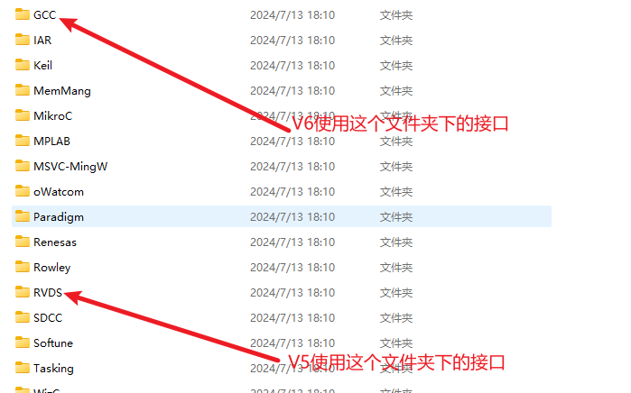

## pyocd-gdbserver.exe 无法仿真

###  错误例子

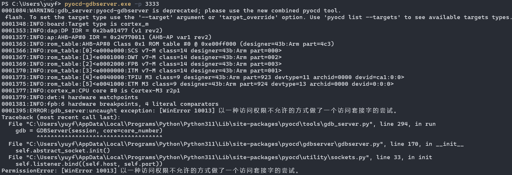

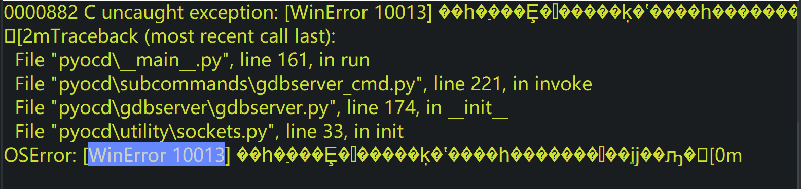

### 解决错误

- 查看端口是否被其他线程占用

  ```shell
  netstat -nao|findstr 3333
  ```

  如果被占用，则结束占用的线程。如果没被占用，则进行下一步排查

- 查看端口是否被排除

  ```shell
  netsh interface ipv4 show excludedportrange protocol=tcp
  ```

  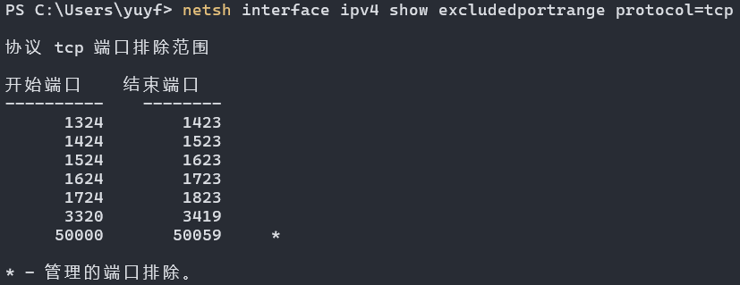

  发现3333端口被排除

- 解决办法

  - 法1：使用没有被排除的端口，如使用指令 netstat -nao|findstr 4444

  - 法2：关闭对3333端口的排除，实际是关闭NAT服务再开启

    ```shell
    net stop winnat
    net start winnat
    ```
    
    缺陷：可能导致重启nat后，虚拟机无法上网
    
    [参考连接](https://gsw945.com/index.php/archives/33/)
    
  - 法3：重新设置一下「TCP 动态端口范围」
  
    ```shell
    net stop winnat
    net start winnat
    netsh int ipv4 set dynamic tcp start=49152 num=16384
    netsh int ipv6 set dynamic tcp start=49152 num=16384
    ```
  
    设置后需要重启电脑。
  
    [参考连接](https://zhuanlan.zhihu.com/p/474392069)
  

## RT-Thread Studio 报错-----uses VFP register arguments

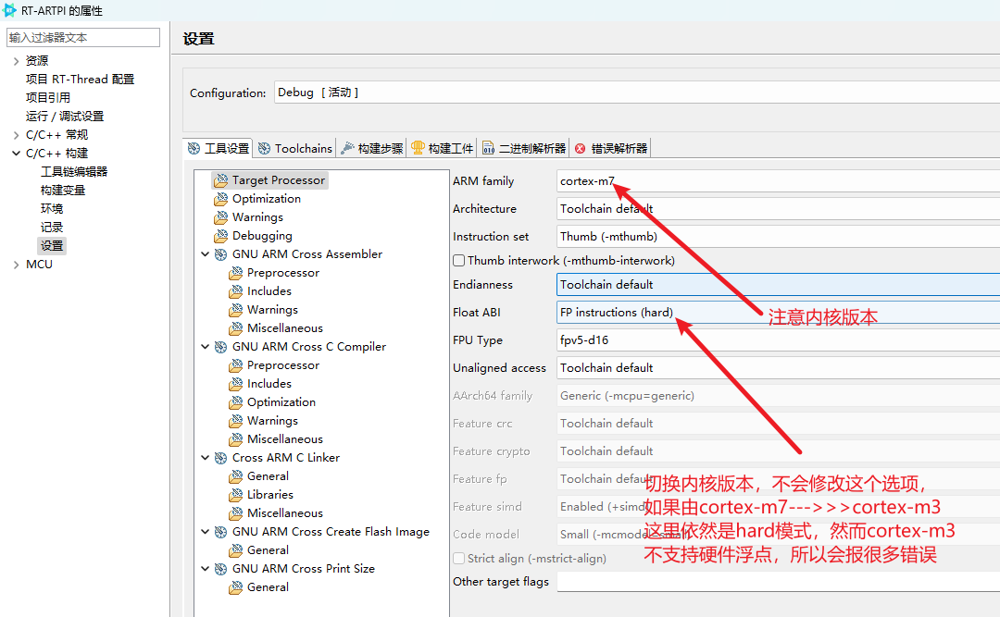

## 一个定时器输出四路频率不一致且占空比可调的PWM

### 操作步骤（APM32F003F6P6）

1. 找到一个高级定时器，支持输出比较，且支持TOGGLE翻转输出

   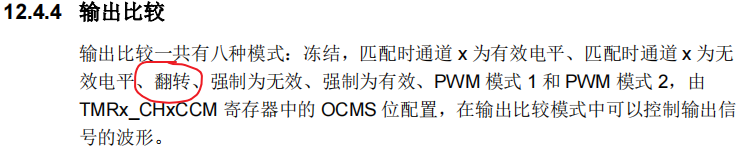

2. 配置输出比较使能

```c
void bsp_tmrpwm1_init(void)
{
    TMR1_TimeBaseConfig_T timeBaseConfig;

    _bsp_tmrpwm1_gpio_init();
    /* Up-counter */
    timeBaseConfig.cntMode = TMR1_CNT_MODE_UP;
    /* Set counter = 500 */
    timeBaseConfig.count = 65535; //TIM1_ARR;
    /* Set divider = 1 - 1.So TMR1 clock freq ~= 24/(0 + 1) = 24MHZ */
    timeBaseConfig.divider = 1 - 1;
    /* Repetition counter = 0x0 */
    timeBaseConfig.repetitionCount = 0;

    TMR1_ConfigTimerBase(TMR1, &timeBaseConfig);

    /* Clear Status Flag */
    TMR1_ClearStatusFlag(TMR1, TMR1_FLAG_UPDATE | TIM1_CH1_CCR_INC| TIM1_CH2_CCR_INC | TIM1_CH3_CCR_INC| TIM1_CH4_CCR_INC);

    _target_scan_cnt = 0;
    _scan_inc_id     = 0;
    bsp_tmrpwm1_oc_init(TMR1_CHANNEL_1, _target_ccr_inc_scan[0]);
    bsp_tmrpwm1_oc_init(TMR1_CHANNEL_2, _target_ccr_inc_scan[0]);
    bsp_tmrpwm1_oc_init(TMR1_CHANNEL_3, _target_ccr_inc_scan[0]);
    bsp_tmrpwm1_oc_init(TMR1_CHANNEL_4, _target_ccr_inc_scan[0]);
    
    TMR1_EnableInterrupt(TMR1,
                         TMR1_INT_CH1CC | TMR1_INT_CH2CC | TMR1_INT_CH3CC
                             | TMR1_INT_CH4CC);

    /* Enable TMR1  */
    TMR1_EnableAutoReloadBuffer(TMR1);
    TMR1_Enable(TMR1);

    NVIC_EnableIRQRequest(TMR1_UT_IRQn, 0x00);
    NVIC_EnableIRQRequest(TMR1_CC_IRQn, 1);
}

void bsp_tmrpwm1_oc_init(uint8_t channel, uint16_t count)
{
    TMR1_OCConfig_T ocConfigStruct;

    /* Select channen1  */
    ocConfigStruct.channel = channel;
    /* Set compare value = count，比较值用来实现PWM波形输出 */
    ocConfigStruct.count = count;
    /* PWM1 mode */
    ocConfigStruct.mode =
        TMR1_OC_MODE_TOGGLE; //TMR1_OC_MODE_TOGGLE; TMR1_OC_MODE_ACTIVE TMR1_OC_MODE_PWM
    /* Idle State is reset */
    ocConfigStruct.OCxIdleState = TMR1_OC_IDLE_RESET;
    /* Idle State is reset */
    ocConfigStruct.OCxNIdleState = TMR1_OC_IDLE_RESET;
    /* Disable CH1N ouput */
    ocConfigStruct.OCxNOutputState = TMR1_OC_OUTPUT_DISABLE;
    /* Enable CH1 ouput */
    ocConfigStruct.OCxOutputState = TMR1_OC_OUTPUT_ENABLE;
    /* CH1N polarity is high */
    ocConfigStruct.OCxNPolarity = TMR1_OC_POLARITY_HIGH;
    /* CH1 polarity is high */
    ocConfigStruct.OCxPolarity = TMR1_OC_POLARITY_HIGH;
    TMR1_ConfigOutputCompare(TMR1, &ocConfigStruct);

    TMR1_EnableOutputCompareFastMode(TMR1, channel);
    TMR1_DisableOutputCompareBuffer(TMR1, channel);

    TMR1_EnableOutputPWM(TMR1);
}

void TMR1_UT_IRQHandler(void)
{
    if (TMR1_ReadStatusFlag(TMR1, TMR1_FLAG_UPDATE) == SET) {
        TMR1_ClearStatusFlag(TMR1, TMR1_FLAG_UPDATE);
        utflag++;
    }
}

void TMR1_CC_IRQHandler(void)
{
 if (TMR1->STS1 & TMR1_FLAG_CH1CC) {
        _irq_flag  |= 0x01;
        TMR1->STS1 &= (uint32_t)~TMR1_FLAG_CH1CC;

        _read_compare[0]   = (uint16_t)TMR1->CH1CC1;
        _read_compare[0] <<= 8;
        _read_compare[0]  |= TMR1->CH1CC0;

        _target_compare[0] = _read_compare[0] + TIM1_CH1_CCR_INC;
        _target_compare[0] =
             _target_compare[0] <= TIM1_ARR ? _target_compare[0] : _target_compare[0] - TIM1_ARR;
        TMR1->CH1CC1 = (uint32_t)((_target_compare[0] >> 8) & 0xff);
        TMR1->CH1CC0 = (uint32_t)(_target_compare[0] & 0xff);
    }
    if (TMR1->STS1 & TMR1_FLAG_CH2CC) {
        _irq_flag  |= 0x02;
        TMR1->STS1 &= (uint32_t)~TMR1_FLAG_CH2CC;

        _read_compare[1]   = (uint16_t)TMR1->CH2CC1;
        _read_compare[1] <<= 8;
        _read_compare[1]  |= TMR1->CH2CC0;

        _target_compare[1] = _read_compare[1] + TIM1_CH2_CCR_INC;
        _target_compare[1] =
            _target_compare[1] <= TIM1_ARR ? _target_compare[1] : _target_compare[1] - TIM1_ARR;
        TMR1->CH2CC1 = (uint32_t)((_target_compare[1] >> 8) & 0xff);
        TMR1->CH2CC0 = (uint32_t)(_target_compare[1] & 0xff);
    }
    if (TMR1->STS1 & TMR1_FLAG_CH3CC) {
        _irq_flag  |= 0x04;
        TMR1->STS1 &= (uint32_t)~TMR1_FLAG_CH3CC;

        _read_compare[2]   = (uint16_t)TMR1->CH3CC1;
        _read_compare[2] <<= 8;
        _read_compare[2]  |= TMR1->CH3CC0;

        _target_compare[2] = _read_compare[2] + TIM1_CH3_CCR_INC;
        _target_compare[2] =
            _target_compare[2] <= TIM1_ARR ? _target_compare[2] : _target_compare[2] - TIM1_ARR;
        TMR1->CH3CC1 = (uint32_t)((_target_compare[2] >> 8) & 0xff);
        TMR1->CH3CC0 = (uint32_t)(_target_compare[2] & 0xff);
    }
    if (TMR1->STS1 & TMR1_FLAG_CH4CC) {
        _irq_flag  |= 0x08;
        TMR1->STS1 &= (uint32_t)~TMR1_FLAG_CH4CC;

        _read_compare[3]   = (uint16_t)TMR1->CH4CC1;
        _read_compare[3] <<= 8;
        _read_compare[3]  |= TMR1->CH4CC0;
        
        _target_compare[3] = _read_compare[3] + TIM1_CH4_CCR_INC;
        _target_compare[3] =
            _target_compare[3] <= TIM1_ARR ? _target_compare[3] : _target_compare[3] - TIM1_ARR;
        TMR1->CH4CC1 = (uint32_t)((_target_compare[3] >> 8) & 0xff);
        TMR1->CH4CC0 = (uint32_t)(_target_compare[3] & 0xff);
    }
}
```

3. 原理讲解

   定时器配置为输出比较模式，失能预装载比较值（这样更新比较值时会立即更新），开启输出比较中断。当定时器计数值与比较值相等时，进入中断，硬件会对IO口进行电平翻转。接着在中断内更新比较值，控制下一个翻转的时间，实现PWM多个频率输出。

   eg:假如设置定时器输出比较模式，定时器计数值为65535，周期为24Mhz。需要设置的PWM频率分别为22k/26k，占空比均为50%

   首先需要计算输出比较值
   22k比较值为 24000000/22000/2=545

   26k比较值为 24000000/26000/2=462

   得到比较值后，每次进入中断后，都需要对对应的输出比较通道的比较值进行更新，这样每次翻转的周期都一样，即可实现占空比为50%的26/24kPWM波形。

   如果需要修改占空比，那么就算先计算更改PWM周期所对应的比较值，再根据占空比的不同，计算每次更新输出比较通道的比较值

   22k比较值为 24000000/22000=1090

   26k比较值为 24000000/26000=924

   如果占空比为22k的占空比为30%，那么输出比较通道的比较值依次更新为1090x30%，1090x70%

   如果占空比为26k的占空比为70%，那么输出比较通道的比较值依次更新为924x70%，924x30%。

   **注，这种方式会频繁的进入中断，需要优化**

   ## 如何开关MCU日志输出
   
   在编写程序时，偶尔遇到这么一个问题。串口打印耗时，导致一些程序执行时间不及时，但是为了调试又不得不开启串口打印进行日志输出。因此引出了如何在程序运行时开关MCU的串口日志输出。
   
   临时解决办法：
   
   定义一个函数指针sys_printf，适时修改函数指针指向的内容（可以用按键触发修改或者指令修改）
   
   ```shell
   /*定义一个函数指针printf_pointer*/
   typedef int (*printf_pointer)(const char* fmt, ...);
   
   /*
   * 定义一个函数指针
   * 打印时将sys_printf赋值为printf,
   * 不打印时将sys_printf赋值为my_printf 
   */
   printf_pointer sys_printf;
   
   /* 自定义函数 */
   int my_printf(const char *format, ...) {
       return 0;
   }
   ```
   
## 使用AT指令注意事项
- AT指令必须执行完毕才允许执行下一条AT指令，否则会出现竞争

- RT-thread的at组件，接收从机由AT模式转化为透传模式发送的数据，可以新增一个缓冲区进行接收。

  ```
  static int at_recv_readline(at_client_t client)
  {
      char      ch = 0, last_ch = 0;
      rt_bool_t is_full = RT_FALSE;
  
      rt_memset(client->recv_line_buf, 0x00, client->recv_bufsz);
      client->recv_line_len = 0;
  
      while (1)
      {
          at_client_getchar(client, &ch, RT_WAITING_FOREVER);
  		/* 增加备份模式缓存透传模式数据 */
          if (1 == client->back_mode)
          {
              if (client->back_len < client->back_bufsz)
              {
                  if (client->back_buf)
                  {
                      client->back_buf[client->back_len++] = ch;
                  }
              }
          }
          /* 增加备份模式缓存透传模式数据 */
  
          if (client->recv_line_len < client->recv_bufsz)
          {
              client->recv_line_buf[client->recv_line_len++] = ch;
          }
          else
          {
              is_full = RT_TRUE;
          }
  
          /* is newline or URC data */
          if ((client->urc = get_urc_obj(client)) != RT_NULL || (ch == '\n' && last_ch == '\r')
              || (client->end_sign != 0 && ch == client->end_sign))
          {
              if (is_full)
              {
                  LOG_E("read line failed. The line data length is out of buffer size(%d)!", client->recv_bufsz);
                  rt_memset(client->recv_line_buf, 0x00, client->recv_bufsz);
                  client->recv_line_len = 0;
                  return -RT_EFULL;
              }
              break;
          }
          last_ch = ch;
      }
  
  #ifdef AT_PRINT_RAW_CMD
      at_print_raw_cmd("recvline", client->recv_line_buf, client->recv_line_len);
  #endif
  
      return client->recv_line_len;
  }
  ```

  

  

## STM32F767,LSE初始化一直超时
解决办法：加入__HAL_RCC_LSEDRIVE_CONFIG(RCC_LSEDRIVE_HIGH);提高LSE的驱动能力可以初始化

## qspi接口的flash芯片，可以识别型号，但是无法读写数据
可能是qspi flash的寄存器配置不对，需要重点检查（读写模式寄存器的配置）

## 字节对齐问题
联合体 内部结构体需要单字节对齐，否则会出现字节对齐问题

## Jlink无法稳定连接
降低Jlink的驱动版本

**注：本方法并不会减少编译后所占用的ROM大小**

## SPI半双工从机开发注意事项
- SPI从机切忌不能在CS下降沿中断获取DMA剩余传输字节。因为中断延迟会**导致DMA传输数据早于获取传输字节数，从而导致获取剩余字节数错误，继而导致拷贝时数据丢失**。
- 从机发送时，需要将数据准备好后，主机才可以**产生时钟进行接收数据**
- 从机接收时，需要**先使能从机接收，再开启主机发送**，否则可能造成数据错误

- 从机空闲时，将SPI禁止，取消DMA请求

- 主机发送时，需要确保从机已经准备好接收数据，即从机先使能接收

- 主机接收时，需要确保从机已经准备好发送数据，再使能主机（产生SPI CLK）进行数据接收（从机发送完毕后，主机CLK可能没有暂停，故主机可能接收到一些dummy数据）

- 禁止SPI时，需要根据标志位依次判断，直到符合停止条件方可禁止SPI，如下图。

  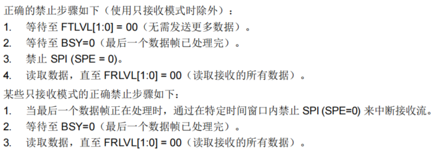

  **注意：主机发送数据时，必须在从机准备好接收数据后才允许是能SPI（SPI CLK），否则数据可能混乱**

## SPI全双工从机开发注意事项
- SPI从机切忌不能在CS下降沿中断获取DMA剩余传输字节。因为中断延迟会**导致DMA传输数据早于获取传输字节数，从而导致获取剩余字节数错误，继而导致拷贝时数据丢失**。
- CS下降要通知从机开始传输数据
- CS上升沿通知从机数据传输结束
- 从机仅在主机有CLK时，产生数据传输。（即配置好DMA，且使能DMA发送时，从机才开使传输数据，主机同理）
- 硬件设计时，建议增加一个从机状态引脚，用于通知主机当前从机状态。
