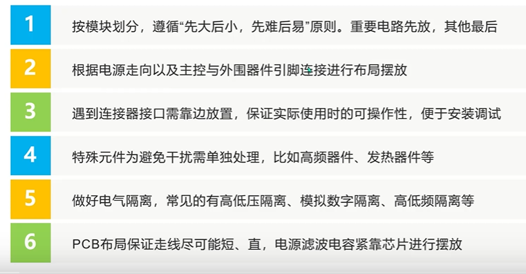
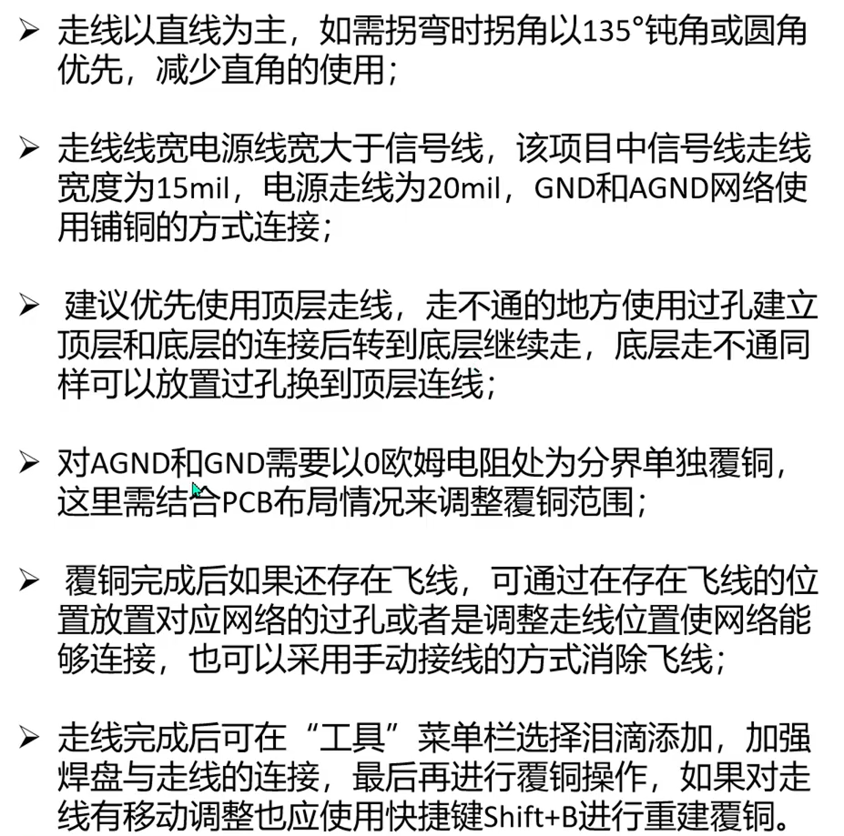
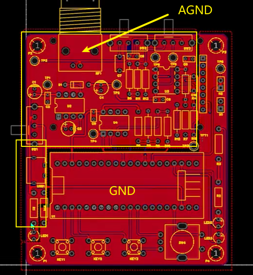

# 立创EDA常用功能总结

- [官方快捷键](https://docs.lceda.cn/cn/Introduction/Shortcut-Keys/index.html)右键编辑符号，可以修改器件引脚颜色

- SHIFT+F 搜索器件

- 放置网络标签为N键，选中网络标签，按下TAB调增标签规则

- 如何对选中目标进行镜像

  Y X键，进行镜像，基本可以镜像所以选中的目标

- 如何计算外部晶振匹配电容

  [嘉立创阻抗计算 (jlc.com)](https://tools.jlc.com/jlcTools/index.html#/impedanceCalculateNew)

- 如何将原理图的位号重新自动分配？

  在原理图界面，选中 设计-->>分配位号-->>选择分配的规则即可自动分配位号

- 如何添加多层

  在PCB界面，选中 工具-》图层管理器 可以添加多图层，或者快捷键ctrl+L即可快速调出添加图层弹框

- 如何进行布局传递

  ctrl+shift+x进行布局传递，可以在PCB画线时，将所有的元器件进行模块化，方便布局

- 绘制PCB时，先布局，再走线

  布局要素

  

  走线要素

  

  **信号线回路：信号发送与接收两根信号线组成的回路！**

  走线Demo，参考自[立创示波器教学](https://www.bilibili.com/video/BV1xC411j7xu?p=4)

  

- PCB飞线及网络颜色

- 走线前需要对设计规则进行设置

- 内电层用作参考，到板框距离为40mil

- 电源线向内部过孔，避免影响信号线

- 查分对管理：设计->差分对

- 走线时先走有阻挡的地方，避免最后走无可走

- 信号刚出来时，不要着急拐弯

- 高速信号线越小越好，旁边用GND过孔占位

- 电源线过大电流，需要加大宽度

- **绘制填充区域，将电源整理成一大块**

- 高速信号线旁边需要有一些地过孔，用于增加信号传输质量

- 差分对等长调节采用3W原则，即等长调节内的间距为3倍线宽
- 内电层保留孤岛

- shift+m 隐藏铺铜 shift+b重新铺铜

- 游离铜块不利于铺铜

- 如果某个元器件没有3D模型，可以选中元器件，在器件属性内绑定3D模型。最后在3D视图内，用3D模型导入变更

- 如果某个元器件封装不对，可以修改封装-->>应用整个工程

- GND和AGND的元器件尽量分隔开。布线时将GND与AGND分别覆铜，两者使用0Ω电阻连接

  

