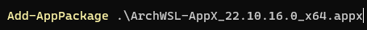
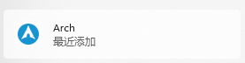

# Linux记录

## Win安装Linux

### VMware 加Linux镜像

1. 下载VMware,需要安装的Linux镜像
2. 安装

### 基于Windows的WSL子系统安装

1. 参照[这里](https://docs.microsoft.com/zh-cn/windows/wsl/install-win10)安装WSL，安装后需要重启一下电脑
2. 点击[这里](https://github.com/yuk7/ArchWSL)下载ArchLinux，此处安装以ArchLinux为准


3. 安装证书*.cer，如果提示下图内容，则需要在安装证书时，将证书存储到受信任的区域里边


4. 切换到*.appx的路径，在shell内输入进行安装，如果提示突发安装，则可以百度相应的故障码进行搜索

   

5. 此时，系统已经可以识别到安装的Linux子系统，如果是其他系统，则图标可能是其它的



[视频参考连接](https://www.bilibili.com/video/BV1sW411v7VZ?p=1&vd_source=2e33a3cba9dea05126d330dcf100be27)

### WSL访问PC的USB设备

- [下载usbipd-win](https://github.com/dorssel/usbipd-win/actions/runs/7813976713)

​	不安装这个可能[报错](https://github.com/dorssel/usbipd-win/issues/856)

- linux安装 hwdata

```
sudo pacman -S hwdata
```

- 关闭WSL

```
WSL --shutdown
```

- 查看windows USB设备
- 共享windows USB设备
- 附加USB设备
- 打开linux命令行，查看新增的USB设备

```
#PowerShell
usbipd list
#假设需要访问的USB设备busid为4-4
usbipd bind --busid 4-4
usbipd attach --wsl --busid <busid>
#Linux bash
#lsusb需要先安装usbutils
lsusb
#PowerShell
#断开linux对usb的访问
usbipd detach --busid <busid>
```

- [参考网址](https://learn.microsoft.com/zh-cn/windows/wsl/connect-usb#attach-a-usb-device)

## 初装Linux需要进行的操作

1. 镜像源改为国内地址，也可以不更换

```
sudo vim  /etc/pacman.d/mirrorlist
```

2. 更新镜像

3. 将默认shell更换为fish

   ```
   sudo pacman -S fish
   chsh -s /bin/fish yf
   ```

4. 使用 VS Code + Clangd + CMake 搭建 C/C++开发环境参考链接

[Win10 下 WSL 的安装方法](https://docs.microsoft.com/zh-cn/windows/wsl/install-win10)

[ArchWSL 的下载与文档](https://github.com/yuk7/ArchWSL)

[VS Code 替换变量定义](https://code.visualstudio.com/docs/editor/variables-reference)

[Clangd](https://clangd.llvm.org/)

[VSCode-Clangd 插件](https://github.com/clangd/vscode-clangd)

[CMake-Tools 插件文档](https://github.com/microsoft/vscode-cmake-tools/tree/develop/docs)

[Clang-Format 代码整理选项](https://clang.llvm.org/docs/ClangFormatStyleOptions.html)

[Clang-Tidy](https://clang.llvm.org/extra/clang-tidy/)

[VS Code 的使用技巧与键位表等](https://code.visualstudio.com/docs/getstarted/tips-and-tricks)

/usr/bin文件夹一般存放全家环境变量

tree 用来显示树形文件


which 用来搜索环境变量实际所在的位置

## GCC工具使用

[参考链接](https://www.cnblogs.com/kele-dad/p/9394568.html)

### add2line

```
addr2line -e test1.out -a 160b  -f -p -C -i
```

注意：map文件需要包含调试信息，在编译的时候需要设置gcc的编译标志''-g"，也需要设置map文件输出“-Wl,-Map,name.map”

## Linux指令教程

[参考网址](https://www.runoob.com/linux/linux-file-attr-permission.html)

## 动态库找不到怎么解决


下载相关库

```
sudo pacman -S llvm-libs
```

### 库找不到的原因

1. 下载的软件版本与之前已经安装的版本不匹配。所以找不到库，需要对原来的库进行更新
   - clang: error while loading shared libraries: libLLVM-17.so: cannot open shared object file: No such file or directory
   - sudo pacman -S llvm-libs

## Doxygen使用

### 帮助文档

```
Doxygen version 1.10.0 (GIT-NOTFOUND)
Copyright Dimitri van Heesch 1997-2021

You can use doxygen in a number of ways:

1) Use doxygen to generate a template configuration file*:
    doxygen [-s] -g [configName]

2) Use doxygen to update an old configuration file*:
    doxygen [-s] -u [configName]

3) Use doxygen to generate documentation using an existing configuration file*:
    doxygen [configName]

4) Use doxygen to generate a template file controlling the layout of the
   generated documentation:
    doxygen -l [layoutFileName]

    In case layoutFileName is omitted DoxygenLayout.xml will be used as filename.
    If - is used for layoutFileName doxygen will write to standard output.

5) Use doxygen to generate a template style sheet file for RTF, HTML or Latex.
    RTF:        doxygen -w rtf styleSheetFile
    HTML:       doxygen -w html headerFile footerFile styleSheetFile [configFile]
    LaTeX:      doxygen -w latex headerFile footerFile styleSheetFile [configFile]

6) Use doxygen to generate a rtf extensions file
    doxygen -e rtf extensionsFile

    If - is used for extensionsFile doxygen will write to standard output.

7) Use doxygen to compare the used configuration file with the template configuration file
    doxygen -x [configFile]

   Use doxygen to compare the used configuration file with the template configuration file
   without replacing the environment variables or CMake type replacement variables
    doxygen -x_noenv [configFile]

8) Use doxygen to show a list of built-in emojis.
    doxygen -f emoji outputFileName

    If - is used for outputFileName doxygen will write to standard output.

*) If -s is specified the comments of the configuration items in the config file will be omitted.
   If configName is omitted 'Doxyfile' will be used as a default.
   If - is used for configFile doxygen will write / read the configuration to /from standard output / input.

If -q is used for a doxygen documentation run, doxygen will see this as if QUIET=YES has been set.

-v print version string, -V print extended version information
-h,-? prints usage help information
doxygen -d prints additional usage flags for debugging purposes
```

### 生成文档步骤

- doxygen -g [configName] 生成doxygen的配置文件
- 修改[configName]配置文件
- doxygen [configName] 生成
- TODO 函数调用关系

### 常用注释命令，[全部注释](https://www.doxygen.nl/manual/commands.html)

@exception <exception-object> {exception description} 对一个异常对象进行注释。

@warning {warning message } 一些需要注意的事情

@todo { things to be done } 对将要做的事情进行注释，链接到所有TODO 汇总的TODO 列表

@bug 缺陷，链接到所有缺陷汇总的缺陷列表

@see {comment with reference to other items } 一段包含其他部分引用的注释，中间包含对其他代码项的名称，自动产生对其的引用链接。

@relates <name> 通常用做把非成员函数的注释文档包含在类的说明文档中。

@since {text} 通常用来说明从什么版本、时间写此部分代码。

@deprecated

@pre { description of the precondition } 用来说明代码项的前提条件。

@post { description of the postcondition } 用来说明代码项之后的使用条件。

@code 在注释中开始说明一段代码，直到@endcode命令。

@endcode 注释中代码段的结束。

@brief 概要信息

@deprecated 已废弃函数

@details  详细描述

@note 开始一个段落，用来描述一些注意事项

@par 开始一个段落，段落名称描述由你自己指定

@param 标记一个参数的意义

@fn 函数说明

@ingroup 加入到一个组

@return 描述返回意义

@retval 描述返回值意义

@include 包含文件

@var、@enum、@struct、@class 对变量、美剧、结构体、类等进行标注

@list

```
  /*! 
   *  A list of events:
   *    - mouse events
   *         -# mouse move event
   *         -# mouse click event\n
   *            More info about the click event.
   *         -# mouse double click event
   *    - keyboard events
   *         1. key down event
   *         2. key up event
   *    - checkbox list
   *         - [ ] unchecked
   *         - [x] checked
   *
   *  More text here.
   */
```

上述demo生成的文档如下，list内的语法和markdown语法相似

，

- [Demo](./doxygenDemo)

### 如何区分普通注释与Doxygen注释

Doxygen通过在这里增加`*`，`/`，`!`来作为特殊标记，比如

```
/*
 * 正常注释
 */
/**
 * 要输出成文档的注释
 */
/*!
 * 要输出成文档的注释
 */
同时，中间的*号可以省略，像这样
/**
   要输出成文档的注释
 */
/*!
   要输出成文档的注释
 */
```

对于`//`这种类型的注释，Doxygen在第二个`/`后，增加`!`或`/`作为区分标志，如果检测到有这些，就将接下来的注释作为导出文档来解释

```
/// 要输出成文档的注释
或者
//! 要输出成文档的注释
```

对于单行注释，卸载程序后边，如下(再识别标志后边加一个‘<')

```
#define DEV_ON      ((int)(1))      //!< Simple device is power on.
#define DEV_OFF     ((int)(0))      //!< Simple device is power off.
```


### 参考连接

- [大佬的Confluence](https://www.midlane.top/wiki/display/utils/Doxygen)
- [知乎大佬总结](https://zhuanlan.zhihu.com/p/122523174)
- [官网](https://www.doxygen.nl/index.html)

## 文件权限


文件权限有读、写、执行，出现访问拒绝一般是文件没有执行权限

## 文件类型(7个)

- 普通文件类型
  Linux中最多的一种文件类型, 包括 纯文本文件(ASCII)；二进制文件(binary)；数据格式的文件(data);各种压缩文件.第一个属性为 [-]
- 目录文件

​	目录， 能用 # cd 命令进入的。第一个属性为 [d]，例如 [drwxrwxrwx]

- 块设备文件

​	就是存储数据以供系统存取的接口设备，简单而言就是硬盘。例如一号硬盘的代码是 /dev/hda1等文件。第一个属性为 [b]

- 字符设备

​	串行端口的接口设备，例如键盘、鼠标等等。第一个属性为 [c]

- 套接字文件

​	这类文件通常用在网络数据连接。可以启动一个程序来监听客户端的要求，客户端就可以通过套接字来进行数据通信。第一个属性为 [s]，最常在 /var/run目录中看到这种文件类型

- 管道文件

​	FIFO也是一种特殊的文件类型，它主要的目的是，解决多个程序同时存取一个文件所造成的错误。FIFO是first-in-first-out(先进先出)的缩写。第一个属性为 [p]

- 链接文件

​	类似Windows下面的快捷方式。第一个属性为 [l]，例如 [lrwxrwxrwx]
