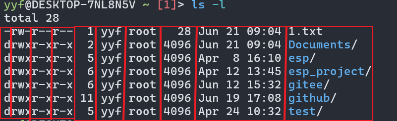

# Linux记录

## Win安装Linux

### VMware 加Linux镜像

1. 下载VMware,需要安装的Linux镜像
2. 安装

### 基于Windows的WSL子系统安装

1. 参照[这里](https://docs.microsoft.com/zh-cn/windows/wsl/install-win10)安装WSL，安装后需要重启一下电脑
2. 点击[这里](https://github.com/yuk7/ArchWSL)下载ArchLinux，此处安装以ArchLinux为准


3. 安装证书*.cer，如果提示下图内容，则需要在安装证书时，将证书存储到受信任的区域里边


4. 切换到*.appx的路径，在shell内输入进行安装，如果提示突发安装，则可以百度相应的故障码进行搜索

   

5. 此时，系统已经可以识别到安装的Linux子系统，如果是其他系统，则图标可能是其它的


[视频参考连接](https://www.bilibili.com/video/BV1sW411v7VZ?p=1&vd_source=2e33a3cba9dea05126d330dcf100be27)

### WSL访问PC的USB设备

- [下载usbipd-win](https://github.com/dorssel/usbipd-win/actions/runs/7813976713)

​	不安装这个可能[报错](https://github.com/dorssel/usbipd-win/issues/856)

- linux安装 hwdata

```
sudo pacman -S hwdata
```

- 关闭WSL

```
WSL --shutdown
```

- 查看windows USB设备
- 共享windows USB设备
- 附加USB设备
- 打开linux命令行，查看新增的USB设备

```
#PowerShell
usbipd list
#假设需要访问的USB设备busid为4-4
usbipd bind --busid 4-4
usbipd attach --wsl --busid <busid>
#Linux bash
#lsusb需要先安装usbutils
lsusb
#PowerShell
#断开linux对usb的访问
usbipd detach --busid <busid>
```

- [参考网址](https://learn.microsoft.com/zh-cn/windows/wsl/connect-usb#attach-a-usb-device)

## 初装Linux需要进行的操作

1. 镜像源改为国内地址，也可以不更换

```
sudo vim  /etc/pacman.d/mirrorlist
```

2. 更新镜像

3. 将默认shell更换为fish

   ```
   sudo pacman -S fish
   chsh -s /bin/fish yf
   ```

4. 使用 VS Code + Clangd + CMake 搭建 C/C++开发环境参考链接

[Win10 下 WSL 的安装方法](https://docs.microsoft.com/zh-cn/windows/wsl/install-win10)

[ArchWSL 的下载与文档](https://github.com/yuk7/ArchWSL)

[VS Code 替换变量定义](https://code.visualstudio.com/docs/editor/variables-reference)

[Clangd](https://clangd.llvm.org/)

[VSCode-Clangd 插件](https://github.com/clangd/vscode-clangd)

[CMake-Tools 插件文档](https://github.com/microsoft/vscode-cmake-tools/tree/develop/docs)

[Clang-Format 代码整理选项](https://clang.llvm.org/docs/ClangFormatStyleOptions.html)

[Clang-Tidy](https://clang.llvm.org/extra/clang-tidy/)

[VS Code 的使用技巧与键位表等](https://code.visualstudio.com/docs/getstarted/tips-and-tricks)

/usr/bin文件夹一般存放全部环境变量

tree 用来显示树形文件


which 用来搜索环境变量实际所在的位置

## GCC工具使用

[参考链接](https://www.cnblogs.com/kele-dad/p/9394568.html)

### add2line

```
addr2line -e test1.out -a 160b  -f -p -C -i
```

注意：map文件需要包含调试信息，在编译的时候需要设置gcc的编译标志''-g"，也需要设置map文件输出“-Wl,-Map,name.map”

### 编译32位、64位程序

如果linux的位数为64位，则默认编译的程序为64位程序（获取系统位数指令：**getconf LONG_BIT**）

编译32位时，需要在cmake内指定编译参数


编译时，如果出现编译报错

**Fatal error: gnu/stubs-32.h: No such file or directory**

则需要执行以下指令，安装gcc的32位支持库

```shell
$ sudo pacman -Ss gcc|grep gcc-lib
core/gcc-libs 12.2.0-1 [installed]
core/lib32-gcc-libs 12.2.0-1 (multilib-devel)
$ sudo pacman -Sy lib32-gcc-libs
```

### 查看可执行文件的位数

```shell
$ file 文件绝对位置
```


## Linux指令教程

[参考网址](https://www.runoob.com/linux/linux-file-attr-permission.html)

## 动态库找不到怎么解决


1. 下载相关库

```
sudo pacman -S llvm-libs
```

2. 根据“缺失库+Linux发行版名字”规则进行搜索，可以找到库属于哪一个安装包（Packages）

- 缺失libgcc_s.so.1，前往google搜索：libgcc_s.so.1 archlinux
- 搜索结果：


### 库找不到的原因

1. 下载的软件版本与之前已经安装的版本不匹配。所以找不到库，需要对原来的库进行更新
   - clang: error while loading shared libraries: libLLVM-17.so: cannot open shared object file: No such file or directory
   - sudo pacman -S llvm-libs

## 文件权限


文件权限有读、写、执行，出现访问拒绝一般是文件没有执行权限

## 文件类型(7个)

- 普通文件类型
  Linux中最多的一种文件类型, 包括 纯文本文件(ASCII)；二进制文件(binary)；数据格式的文件(data);各种压缩文件.第一个属性为 [-]
- 目录文件

​	目录， 能用 # cd 命令进入的。第一个属性为 [d]，例如 [drwxrwxrwx]

- 块设备文件

​	就是存储数据以供系统存取的接口设备，简单而言就是硬盘。例如一号硬盘的代码是 /dev/hda1等文件。第一个属性为 [b]

- 字符设备

​	串行端口的接口设备，例如键盘、鼠标等等。第一个属性为 [c]

- 套接字文件

​	这类文件通常用在网络数据连接。可以启动一个程序来监听客户端的要求，客户端就可以通过套接字来进行数据通信。第一个属性为 [s]，最常在 /var/run目录中看到这种文件类型

- 管道文件

​	FIFO也是一种特殊的文件类型，它主要的目的是，解决多个程序同时存取一个文件所造成的错误。FIFO是first-in-first-out(先进先出)的缩写。第一个属性为 [p]

- 链接文件

​	类似Windows下面的快捷方式。第一个属性为 [l]，例如 [lrwxrwxrwx]

## Vim键盘映射图


[vi—终端中的编辑器](viNOTE/vi—终端中的编辑器.md)

## alias 

类型别名，如**使用git log --oneline 经过配置可以使用git lg能有同样的效果**。主要用于减少shell输入字数。

## 终端

- ctrl+-键盘，缩小终端字体

- ctrl+shift+=键盘，扩大终端字体（shift+=实际表示+键）

- linux 终端的命令格式为 （命令 选项 参数），其中选项可以连着写，如ls -alh
- ls、rm可以使用[linux通配符和正则表达式](https://blog.csdn.net/youmatterhsp/article/details/80528761)进行过滤
- touch 创建一个文件，如果文件存在，则更新文件末次修改日期。如果文件不存在，则创建文件
- 同文件夹下，linux不允许文件和文件夹同名

- cp复制时，可以复制内容并改变复制后文件的名字

  ```shell
  yyf@DESKTOP-7NL8N5V ~> touch 1.txt
  yyf@DESKTOP-7NL8N5V ~> vim 1.txt
  yyf@DESKTOP-7NL8N5V ~> cp ~/1.txt ~/Documents/2.txt
  yyf@DESKTOP-7NL8N5V ~> vim ~/Documents/2.txt
  yyf@DESKTOP-7NL8N5V ~> rm ~/Documents/2.txt
  ```

- cp\mv加上 -i 选项会进行提示

- cat显示全部文件内容，more分页显示文件内容

- grep搜索文本内匹配的行，可以与正则表达式一起使用

- echo将终端显示内容重定向到指定文件内。echo 123 > a.txt(覆盖)  echo 123 >> a.txt(追加)

- 管道 | 可以将一个命令的输入作为另一个命令的输出，如ls -alh | more

- 127.0.0.1被称为本地回环地址，一般用于测试本机网卡工作是否正常

- 域名其实就是IP地址的别名

  

  获取baidu域名的ip地址，通过这个ip地址可以直接访问百度。web服务器的默认端口是80，浏览器网址输入**180.101.50.188:80** 也可以访问百度

- scp [-P port] user@ip:文件地址 本地文件 复制远端到本地

- scp [-P port] 本地文件 user@ip:文件地址  复制本地到远端

- ssh [-p port] user@ip

  ssh配置无密码连接，ssh -keygen生成公钥，私钥。公钥，私钥的作用是加密、解密数据

  ssh-copy-id -p port user@ip 将公钥上传到服务器

  服务器设置别名：在.ssh文件夹内新增config文件，配置别名及服务器的相关地址，如：

  ```
  Host yyf
  	HostName ip
  	User 用户名
  	Port 22
  ```

- ls -l显示内容

  

  方框对应关系如下


- chmod 改变用户权限

- groupadd groupdel 都需要root权限，组信息保存在/etc/group内。chgrp修改文件所属组

- useradd -m(自动创建用户家目录) -g(所属组) yyf(组)  bbq(用户)

- passwd 用户名，设置用户的密码

- su 切换用户 su - 用户名/su 用户名

- cal(显示月) date(显示日期) df -h /du -h

- ps -au /ps -aux/ ps/ 显示进程状态，top动态显示进程状态，kill 根据pid结束进程

- find [路径] -name "匹配字符串"

- 软连接类似于win的快捷方式

- tar -cvf 打包文件.tar 被打包文件 ... 路径

  tar -xvf 解包文件.tar

  需要压缩的话，就是tar -czvf 和tar -xzvf

  还有一种bz2的压缩方法，**待定！！！**

- linux不同的发行版对应的包管理器是不一样的，具体的需要搜索，常用的ubuntu为apt

  archlinux为pacman
  
- linux三种设备：字符设备（一次只能读写一个字节）、块设备（一次读写一个块）、网络接口。

