## buildroot编译

1. 下载pyenv工具，实现python多版本选择，下文按照pyenv安装2.7.18版本进行编译

   ```shell
   pyenv install 2.7.18
   pyenv shell 2.7.18
   ```

2. 设置环境变量

   ```shell
   ./build.sh device/rockchip/rk356x/BoardConfig-rk3566-tspi-v10.mk
   #或 ./build.sh lunch(会弹出选项，选择3)
   ./build.sh lunch
   #选择编译的操作系统
   export RK_ROOTFS_SYSTEM=buildroot
   ```

3. 全编译

   ```shell
   ./build.sh all
   ```

   - 构建uboot，提示缺少缺少.config文件

   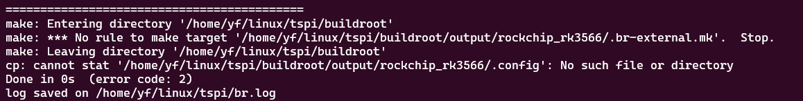

   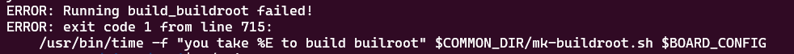

   需要再次进行build all

   - 构建kernel，变量重定义

   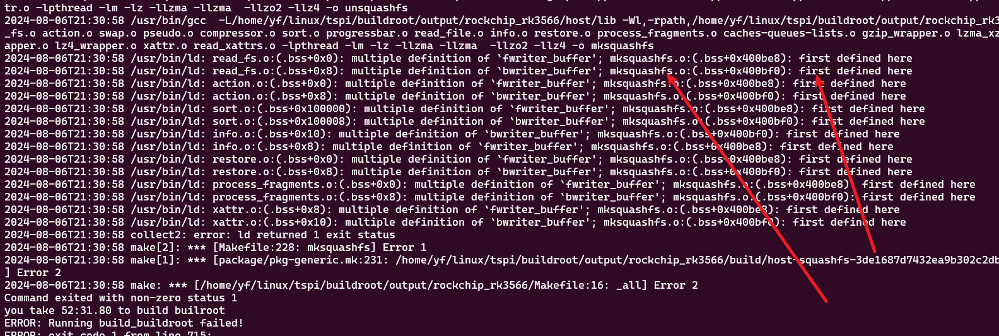

   变量重定义，需要删除mksquashfs.o及其同目录下的.o文件，同时将mksquashfs.h内的变量全部进行extern，如下图

   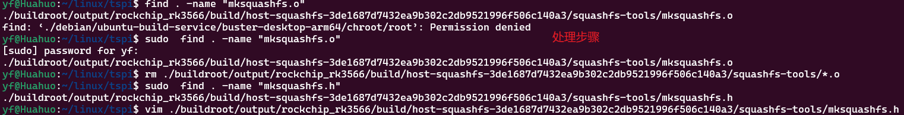

   - 构建recovery

   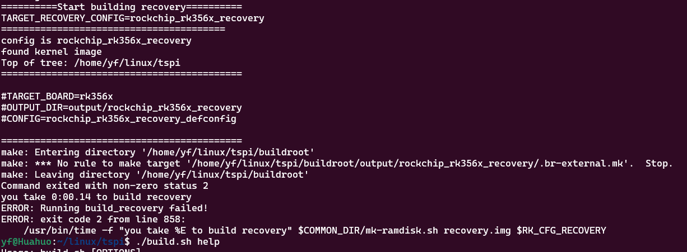

   手动执行

   ```shell
   #生成镜像
   ./build.sh firmware
   ```

   再次报错

   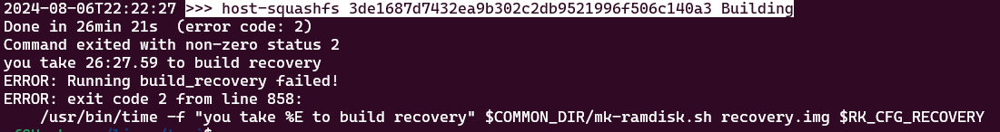

   重复以下步骤

   > |构建kernel，变量重定义

   ```shell
    sudo  find . -name "mksquashfs.h"
    #编辑头文件，extern 变量
    vim ./buildroot/output/rockchip_rk3566/build/host-squashfs-3de1687d7432ea9b302c2db9521996f506c140a3/squashfs-tools/mksquashfs.h
    vim ./buildroot/output/rockchip_rk356x_recovery/build/host-squashfs-3de1687d7432ea9b302c2db9521996f506c140a3/squashfs-tools/mksquashfs.h
    find . -name "mksquashfs.o"
    rm ./buildroot/output/rockchip_rk3566/build/host-squashfs-3de1687d7432ea9b302c2db9521996f506c140a3/squashfs-tools/*.o
    rm ./buildroot/output/rockchip_rk356x_recovery/build/host-squashfs-3de1687d7432ea9b302c2db9521996f506c140a3/squashfs-tools/*.o
   ```

   - 编译成功，生成镜像文件

   

   ```shell
   ./build.sh updateimg
   ```


4. 开启wifi

   ```shell
   #扫描WiFi命令
   iwlist wlan0 scan
   #修改配置文件
   vim /data/cfg/wpa_supplicant.conf 
   #名字 密码 加密方式
   network={
   ssid="WiFi-AP"
   psk="12345678"
   key_mgmt=WPA-PSK
   # key_mgmt=NONE
   }
   
   wpa_supplicant -B -i wlan0 -c /data/cfg/wpa_supplicant.conf //连接WiFi
   
   #开机自动连接WiFi
   #打开编辑 /etc/inittab
   #追加 ::sysinit:/root/wifi_con.sh，即在系统初始化后启动对应路径的脚本
   #创建文件 /root/wifi_con.sh
   # wifi_con.sh 内容如下 
   #!/bin/sh
   killall wpa_supplicant
   sleep 1
   wpa_supplicant -B -i wlan0 -c /data/cfg/wpa_supplicant.conf
   sleep 1
   iwgetid
   
   ```

5. 开启ssh

   ```shell
   cd /home/yf/linux/tspi/buildroot/output/rockchip_rk3566
   #选中 Target packages》Networking applications》OpenSSH，开启SSH服务
   make menuconfig
   
   #开发板开启ssh
   /usr/sbin/sshd
   
   #开机自动开启sshd
   #打开编辑 /etc/inittab
   #追加 ::sysinit:/root/sshd_wifistart.sh，即在系统初始化后启动对应路径的脚本
   
   #创建文件 /root/sshd_wifistart.sh
   # sshd_wifistart.sh 内容如下 
   #!/bin/sh
   /usr/sbin/sshd
   echo "Welcome to connect sshd"
   
   ```
   
6. 创建密钥，免密登录ssh

   暂时不做，没找到办法

### 错误解决记录

1. buildroot error validating a/b metadata from disk. resetting anding new a/b metadata to disk.

   这个报错原因没找到，全编译一次，然后执行./build.sh updateimg

2. buildroot加入ssh失败

   ```shell
   #进入buildroot的output目录rockchip_rk3566，这个为编译buildroot输出的目录，如果没有需要先执行./build.sh buildroot 
   cd /home/yf/linux/tspi/buildroot/output/rockchip_rk3566
   #加入ssh
   make menuconfig
   cd ~/linux/tspi/
   #编译buildroot，提示Found old config, override it? (y/n):时选择n，因为.config是刚刚用make menuconfig新生成的。而./build.sh buildroot 会重新生成.config文件，所以此处不进行覆盖
   ./build.sh buildroot 
   #进入编译目录，查看是否编译了ssh
   cd /home/yf/linux/tspi/buildroot/output/rockchip_rk3566/target/usr
   find . -name "ssh"
   ```

3. 

## 泰山派驱动学习

### 交叉编译环境设置

```shell
#新建.sh文件，导出环境变量
mkdir .yyf-env
cd .yyf-env
touch export-tspi-env.sh
vim export-tspi-env.sh
#将以下内容填写至export-tspi-env.sh内
#指定make编译目标架构
export ARCH=arm64
#指定make编译器
export CROSS_COMPILE=aarch64-rockchip-linux-gnu-
#将编译器导出到环境变量，导出路径时需要用export PATH=$PATH:这样写
export PATH=$PATH:/home/yf/linux/tspi/prebuilts/gcc/linux-x86/aarch64/gcc-buildroot-9.3.0-2020.03-x86_64_aarch64-rockchip-linux-gnu/bin
export LD_LIBRARY_PATH=$LD_LIBRARY_PATH:/home/yf/linux/tspi/prebuilts/gcc/linux-x86/aarch64/gcc-buildroot-9.3.0-2020.03-x86_64_aarch64-rockchip-linux-gnu/lib
#设置alias,调用脚本导出环境变量
vim ~/.bashrc
alias get-tspi='.  $HOME/.yyf-env/export-tspi-env.sh'
#验证环境变量是否配置正确
aarch64-linux-gcc -v
```

## 内核调试(dynamic debug)

[参考链接1](https://www.kernel.org/doc/html/v4.19/admin-guide/dynamic-debug-howto.html)

[参考链接2](http://linux.laoqinren.net/kernel/kernel-dynamic-debug/)

### 编写helloword动态加载模块

#### c文件编写

```c
/* 包含头文件 */
#include <linux/init.h>
#include <linux/kernel.h>
#include <linux/module.h>

/* 入口函数，__init指定函数被分配的区域 */
static int __init hello_init(void)
{
    /* 内核只能用printk打印 */
    printk("Hello word\n");
    return 0;
}

/* 出口函数 */
static void __exit hello_exit(void)
{
    printk("Bye bye\n");
}

/* 指定模块名 */
MODULE_LICENSE("GPL v2");
MODULE_AUTHOR("YYF");

/* 指定模块入口，出口函数 */
module_init(hello_init);
module_exit(hello_exit);
```

#### makefile编写

```makefile
ARCH = arm64
kernel_dir = /home/yf/linux/tspi/kernel

pwd = $(shell pwd)

all:
	make -C $(kernel_dir) modules M=$(pwd) 
clean:
	make -C $(kernel_dir) clean M=$(pwd)
#编写makefile时，目标文件名需要与C文件名一致，否则会报错。如此处C文件为helloword.c
obj-m += helloword.o
```

注：

1. makefile文件中命令行的行首不能有空格，而要用tab键
2. makefile文件中的字符有格式要求，必须是英文，不能有中文字符

#### 编译模块

```shell
make all
file helloword.ko
```

#### 模块加载

将PC 虚拟机编译的helloword.ko拷贝到开发板上，执行以下指令

```shell
#加载模块
insmod module_name
#移除模块
rmmod module_name
#查看内核调试信息,查看最后十行内核日志输出
dmseg | tail
```

#### 模块依赖

如果编译的模块依赖了另一个模块，需要按照以下步骤进行操作

1. 将被依赖的符号导出到全局变量中

   ```c
   EXPORT_SYMBOL(name);
   EXPORT_SYMBOL_GPL(name);
   ```

2. 在使用依赖的模块中，使用C语言关键字extern对需要的变量进行声明

3. 在编写使用依赖的模块的Makefile时，需要添加以下内容

   ```makefile
   KBUILD_EXTRA_SYMBOLS += 依赖的符号表所在的路径
   install:
       make -C $(kernel_dir) modules_install M=$(pwd) INSTALL_MOD_PATH=安装模块的默认路径为‘/’，这里进行修改默认路径
   ```

4. 使用**modprobe**安装模块

   ```shell
   #安装模块，自动检查依赖并安装
   modprobe module-name
   #卸载模块，自动检查依赖并卸载
   modprobe -r module-name
   ```

   modprobe与insmod区别是insmod直接安装，不检查依赖。modprobe是检查依赖，并对依赖进行安装

### 字符设备驱动开发框架

#### 挂载设备

##### 手动挂载

```shell
#安装app需要的驱动模块
insmod devchar.ko
#手动挂载设备 mknod [选项] 文件名 类型 主设备号 次设备号
mkmod /dev/devchar c 236 0
#查看是否挂载成功
ls /dev
#执行编译的文件
```

##### 自动挂载

申请到设备号后，调用device_create创建设备类，调用device_create创建在目录“/dev/”下边的设备

```c
/* 在模块初始化函数内，调用以下函数可以实现自动加载 */
//major：主设备号，如果设置为 0，内核将自动分配一个主设备号。
//name：设备名称，通常将出现在 /dev 目录下。
//fops：指向 file_operations 结构体的指针，定义设备的操作接口。
static inline int register_chrdev(unsigned int major, const char *name,
				  const struct file_operations *fops)
//owner：模块的指针，通常使用 THIS_MODULE。
//name：设备类的名称
class_create(owner, name)
//cls：设备类，通常由 class_create 创建。
//parent：父设备，通常为 NULL。
//devt：设备号，表示设备的唯一标识。
//drvdata：驱动私有数据，可用于存储设备特定的信息。
//fmt：设备文件的名称格式。
struct device *device_create(struct class *cls, struct device *parent,
             dev_t devt, void *drvdata,
             const char *fmt, ...);
    
/* 实例 */
my_chrdev.mydev_class = class_create(THIS_MODULE, "MYLED");
if (IS_ERR(my_chrdev.mydev_class)) {
    printk("class_create失败\n");
    return PTR_ERR(my_chrdev.mydev_class);
}

//申请设备对象：向上提交uevent事件：建立了设备节点与设备号之间的关系。
my_chrdev.mydev =
    device_create(my_chrdev.mydev_class, NULL, MKDEV(my_chrdev.major, 0), NULL, MYDEV_NAME);
if (IS_ERR(my_chrdev.mydev)) {
    printk("device_create失败\n");
    return PTR_ERR(my_chrdev.mydev);
}
```

### 设备树踩坑

[设备树Development guide](https://elinux.org/Device_Tree_Usage)

#### 1+0版本单独烧写img

##### 1. 准备工具

[DriverAssitant_v5.11(RK驱动)](./tools/DriverAssitant_v5.11.zip)

[RKDevTool_Release_v2.92(烧录工具)](./tools/RKDevTool_Release_v2.92.zip)

[MiniLoaderAll.bin(Loader)](./tools/MiniLoaderAll.bin)主要作用就是初始化DDR，然后将存储介质上的整个U-boot拷贝加载到DDR中，最后跳转到DDR中去执行U-boot镜像

##### 2. 操作步骤

顺序按下REC+RST，然后再松开RST按键，等待RKDevTool识别到MASKROM或者Loader模式

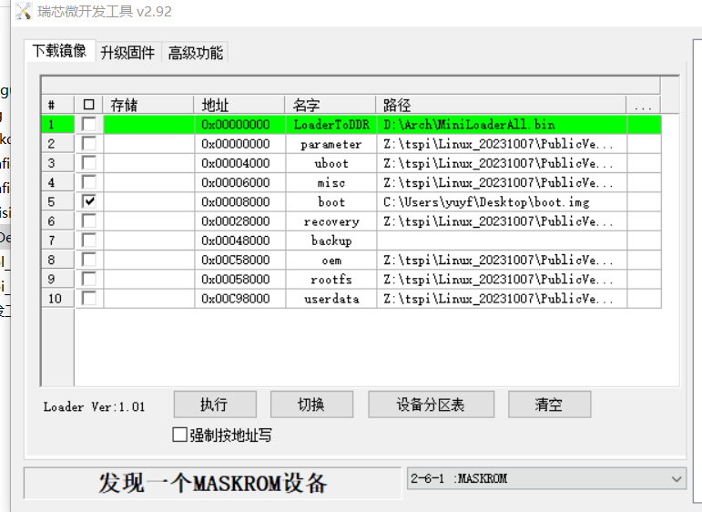

将MiniLoaderAll下载到DDR

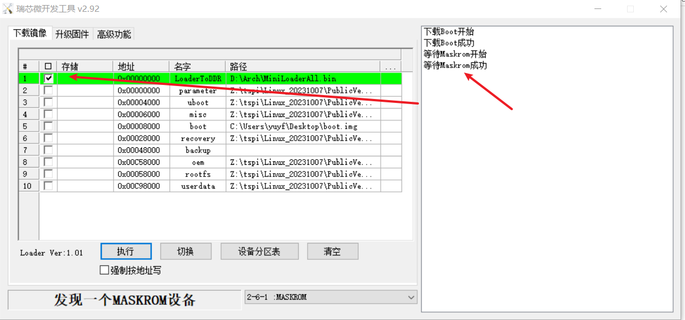

进入高级功能，切换存储

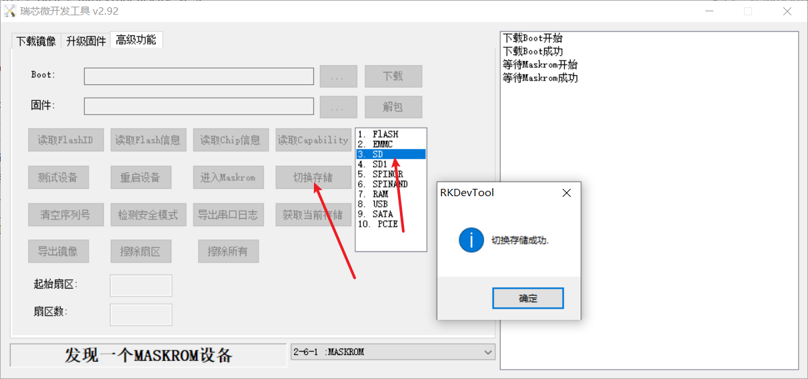

切换到下载镜像，读取一下设备分区表

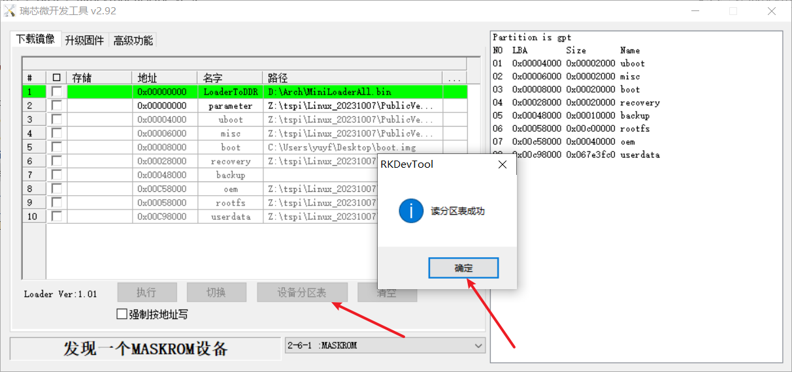

选中需要单独烧录的镜像并执行

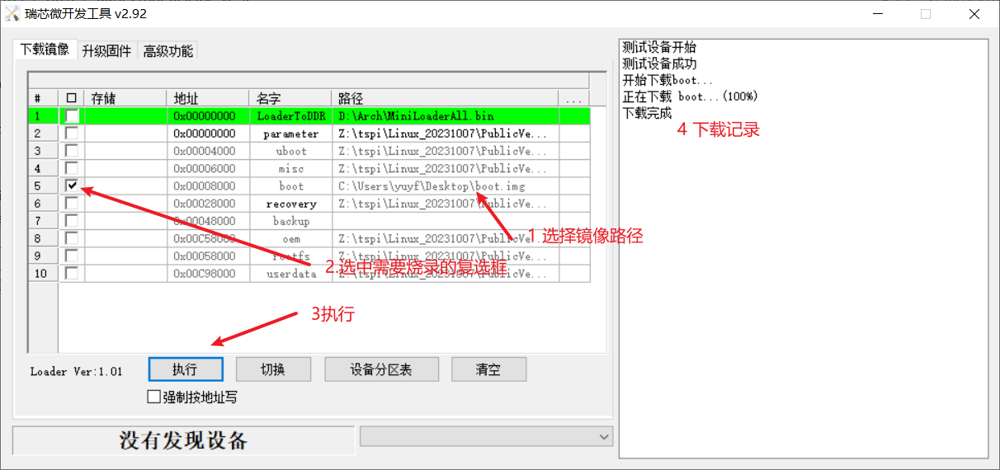

下载成功后，设备会进行重启！进入系统

#### 编译设备树，烧写镜像

##### 在目录下添加设备树节点

添加路径为tspiSDK内的：/kernel/arch/arm64/boot/dts/rockchip/tspi-rk3566-user-v10-linux.dts

```javascript
chrdev{
    	//描述节点特性
		model = "this is yyf chrdev";
		//用来与驱动进行匹配，与platform_driver->driver->of_match_table进行匹配,"->"表示指向的内容是上一级的成员
		compatible = "yyf,device01";
		//TODO 设备节点中信息的描述，暂时还不清楚dev_type的作用
         //dev_type = "LED";
    	//资源信息，资源属性为chrdev_gpios，可以用资源属性索引出资源内容
		chrdev_gpios = <&gpio3 RK_PB1 GPIO_ACTIVE_HIGH>,<&gpio3 RK_PB2 GPIO_ACTIVE_HIGH>,<&gpio0 RK_PB7 GPIO_ACTIVE_HIGH>;
		//status设置，默认为"okay"
		status = "okay";
	};
```

##### 编写驱动，自动匹配

[详见dts_driver.c](./driver_lesson/06-dts/driver/dts_driver.c)

```c
int chrdev_driver_probe(struct platform_device* pdev)
{
    int ret1, ret2, ret3;
    printk("恭喜，匹配上了, %s\n", pdev->name);

    /* 申请并初始化 */
    dts_chrdev.c_dev = cdev_alloc();
    cdev_init(dts_chrdev.c_dev, &fops);

    /* 申请设备号并添加到设备管理链表中 */
    alloc_chrdev_region(&dts_chrdev.c_dev->dev, 0, 1, pdev->name);
    cdev_add(dts_chrdev.c_dev, dts_chrdev.c_dev->dev, 1);

    /* 设备自动创建 */
    dts_chrdev.class = class_create(THIS_MODULE, "mychr");
    dts_chrdev.dev = device_create(dts_chrdev.class, NULL, dts_chrdev.c_dev->dev, NULL, pdev->name);

    /* 初始化等待队列头 */

    init_waitqueue_head(&dts_chrdev.wait_queue);
    dts_chrdev.condition = 0;

    /*TODO 获取设备树资源 */
    /**
     * 参数：
     * np:pdev内的设备树节点指针
     * propname:属性名，必须为设备树内的修饰资源的属性名，如
     * chrdev_gpios = <&gpio3 RK_PB1 GPIO_ACTIVE_HIGH>,<&gpio3 RK_PB2 GPIO_ACTIVE_HIGH>,<&gpio0 RK_PB7 GPIO_ACTIVE_HIGH>，此处需要填写chrdev_gpios
     * index：下标，即gpio资源是一个列表时，相应的gpio资源的索引值。从0开始。
     * 成功返回 gpio编号，失败则为错误码。
     * 所以获取设备节点，也是前提哦。
     */
    dts_chrdev.chrdev1 = of_get_named_gpio(pdev->dev.of_node, "chrdev_gpios", 0);
    if (dts_chrdev.chrdev1 < 0) {
        printk("dts_chrdev.chrdev1 error\n");
        goto error;
    }
    /**
     * 功能：申请当前进程使用GPIO号，防止进程竞态出现。
     * 参数：
     * gpio号 （设备树中获取）这里很关键。
     * label:用于标识该 GPIO 的标签。不使用，可以写NULL,主要作用是这个标签可以帮助在调试或日志中识别哪个模块或驱动程序请求了这个 GPIO。可以自由定义
     * 返回值，成功返回0，失败返回错误码。
     */
    ret1 = gpio_request(dts_chrdev.chrdev1, "chrdev1_gpios");
    if (ret1 < 0) {
        printk("ret1 error\n");
        goto error;
    }
    gpio_direction_output(dts_chrdev.chrdev1, 0);
    dts_chrdev.chrdev2 = of_get_named_gpio(pdev->dev.of_node, "chrdev_gpios", 1);
    if (dts_chrdev.chrdev2 < 0) {
        printk("dts_chrdev.chrdev2 error\n");
        goto error;
    }
    ret2 = gpio_request(dts_chrdev.chrdev2, "chrdev2_gpios");
    if (ret2 < 0) {
        printk("ret2 error\n");
        goto error;
    }
    gpio_direction_output(dts_chrdev.chrdev2, 0);
    dts_chrdev.chrdev3 = of_get_named_gpio(pdev->dev.of_node, "chrdev_gpios", 2);
    if (dts_chrdev.chrdev3 < 0) {
        printk("dts_chrdev.chrdev3 error\n");
        goto error;
    }
    ret3 = gpio_request(dts_chrdev.chrdev3, "chrdev3_gpios");
    if (ret3 < 0) {
        printk("ret3 error\n");
        goto error;
    }
    gpio_direction_output(dts_chrdev.chrdev3, 0);

    return 0;
error:
    return -1;
}
```

##### 编译kernel，单独更新boot.img

烧录步骤见

> 1+0版本单独烧写img

