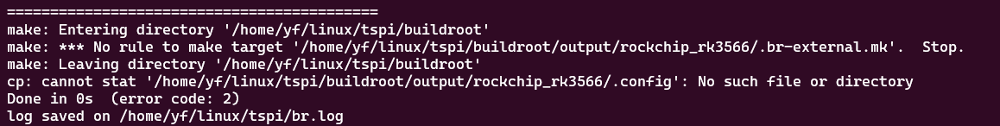
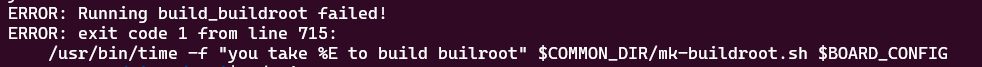
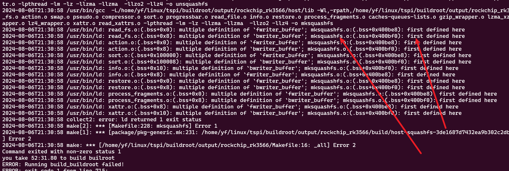
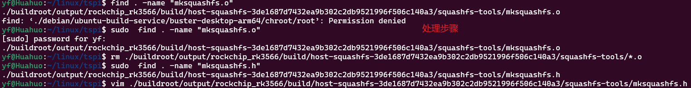
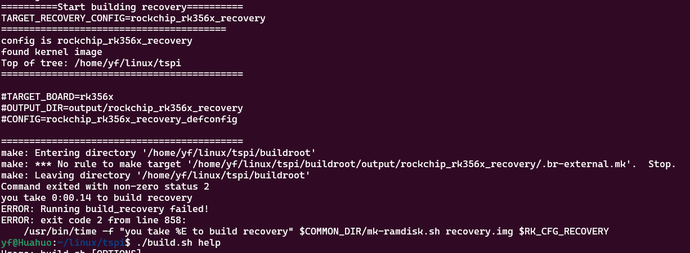
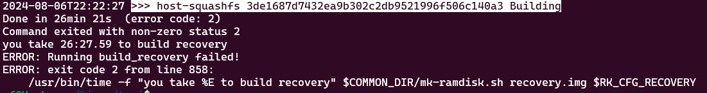
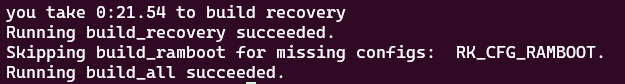

## buildroot编译

1. 下载pyenv工具，实现python多版本选择，下文按照pyenv安装2.7.18版本进行编译

   ```shell
   pyenv install 2.7.18
   pyenv shell 2.7.18
   ```

2. 设置环境变量

   ```shell
   ./build.sh device/rockchip/rk356x/BoardConfig-rk3566-tspi-v10.mk
   #或 ./build.sh lunch(会弹出选项，选择3)
   ./build.sh lunch
   #选择编译的操作系统
   export RK_ROOTFS_SYSTEM=buildroot
   ```

3. 全编译

   ```shell
   ./build.sh all
   ```

   - 构建uboot，提示缺少缺少.config文件

   

   

   需要再次进行build all

   - 构建kernel，变量重定义

   

   变量重定义，需要删除mksquashfs.o及其同目录下的.o文件，同时将mksquashfs.h内的变量全部进行extern，如下图

   

   - 构建recovery

   

   手动执行

   ```shell
   #生成镜像
   ./build.sh firmware
   ```

   再次报错

   

   重复以下步骤

   > |构建kernel，变量重定义

   ```shell
    sudo  find . -name "mksquashfs.h"
    #编辑头文件，extern 变量
    vim ./buildroot/output/rockchip_rk3566/build/host-squashfs-3de1687d7432ea9b302c2db9521996f506c140a3/squashfs-tools/mksquashfs.h
    vim ./buildroot/output/rockchip_rk356x_recovery/build/host-squashfs-3de1687d7432ea9b302c2db9521996f506c140a3/squashfs-tools/mksquashfs.h
    find . -name "mksquashfs.o"
    rm ./buildroot/output/rockchip_rk3566/build/host-squashfs-3de1687d7432ea9b302c2db9521996f506c140a3/squashfs-tools/*.o
    rm ./buildroot/output/rockchip_rk356x_recovery/build/host-squashfs-3de1687d7432ea9b302c2db9521996f506c140a3/squashfs-tools/*.o
   ```

   - 编译成功，生成镜像文件

   

   ```shell
   ./build.sh updateimg
   ```

