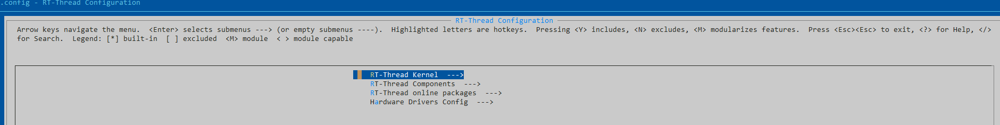
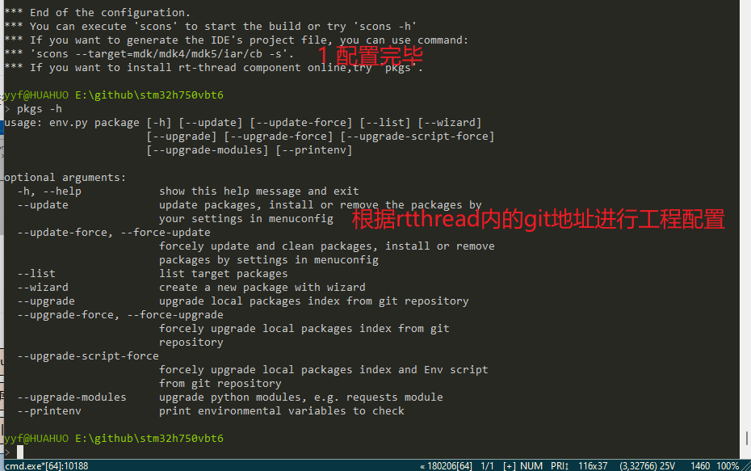
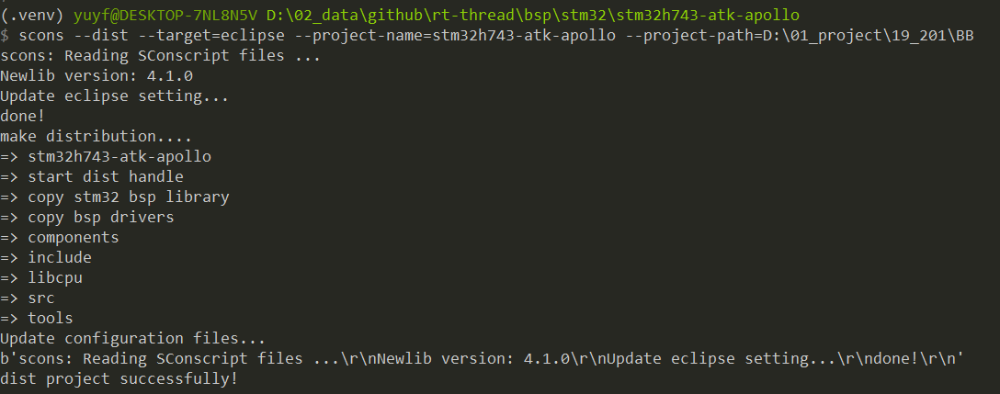
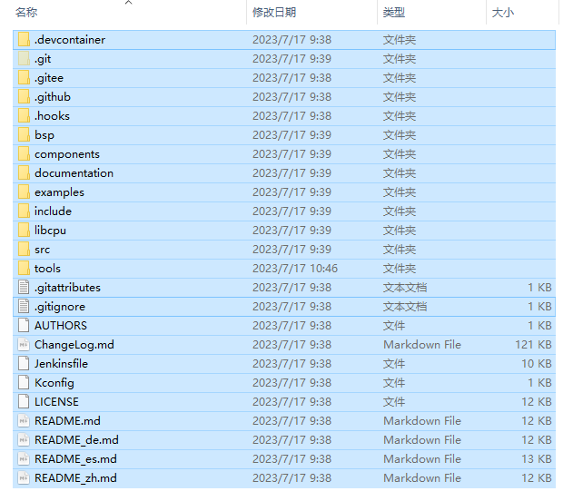
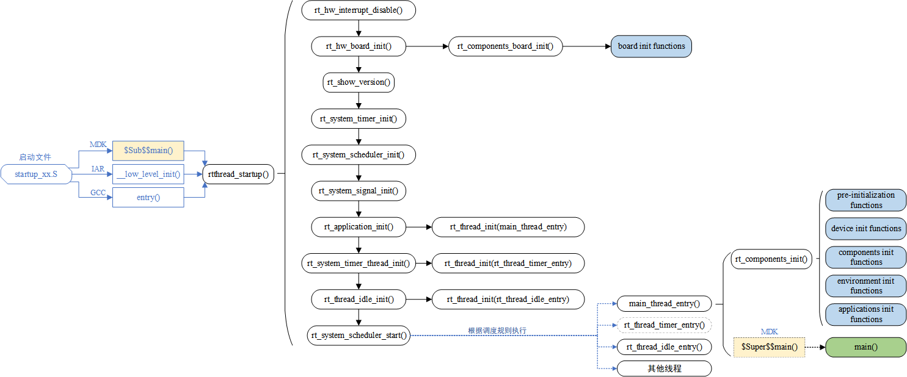
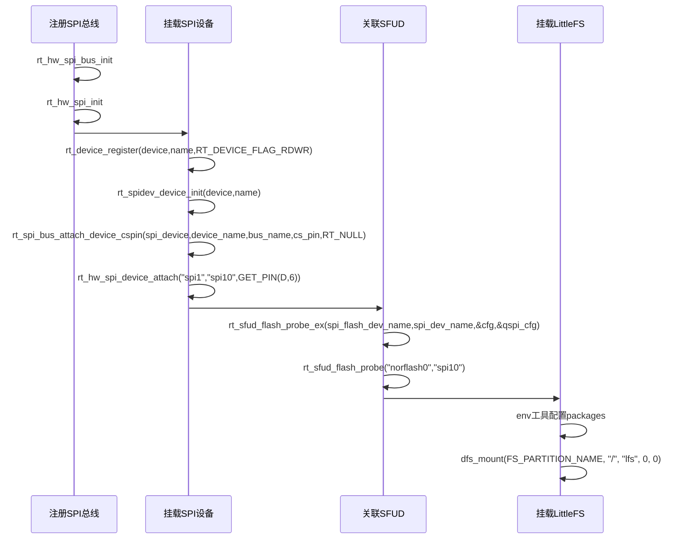

# 学习笔记
根据[RT-Thread官方参考文档](https://www.rt-thread.org/document/site/#/rt-thread-version/rt-thread-standard/README?id=rt-thread-%e7%9a%84%e6%9e%b6%e6%9e%84)做一些总结，意在对RT-Thread的架构有更充分的了解。[Github地址](https://github.com/RT-Thread/rt-thread)

[RT-Thread内核视频教程](https://www.rt-thread.org/document/site/#/rt-thread-version/rt-thread-standard/tutorial/kernel/kernel-video)

[rt-thread 使用宝典](https://club.rt-thread.org/ask/article/2460fcd7db4821ae.html)

## env工具使用

1. 在env工具内输入 menuconfig，对工程进行配置，例如设置onlinepackages



2. 输入pkgs



具体参考[env手册](https://www.rt-thread.org/document/site/#/development-tools/env/env)

3. ENV 生成eclipse工程

打开env，进入需要生成工程的bsp文件夹

执行以下指令

```shell
scons --dist --target=eclipse --project-name=stm32h743-atk-apollo --project-path=D:\01_project\19_201\BB
```



**如果路径不对，可以将RT-ThreadStudio 文件夹内的platform\env_released\env\packages\packages内对应的package.json内容修改为正确的git路径**

4. menuconfig配置后无法更新rtconfig.h

   ```shell
   scons --useconfig=.config
   ```

## 软件架构


## 目录结构

- bsp目录包含各个板厂提供的程序，可以由scons工具将bsp内提供的程序导出进行自行开发，[参考链接](https://www.rt-thread.org/document/site/#/development-tools/build-config-system/SCons)。
bsp开发包含三种，分别为：
片上外设驱动：指 MCU 芯片上的外设，例如硬件定时器、ADC 和看门狗等
板载外设驱动：指 MCU 之外，开发板上外设，例如 TF 卡、以太网和 LCD 等
扩展模块驱动：指可以通过扩展接口或者杜邦线连接的开发板的模块，例如 ESP8266 模块
- components 目录是RT-Thread自身提供的独立于MCU的功能模块，如dfs, finsh等，我们注意到，在drivers里定义了各种驱动的接口，所以我们在添加硬件时，一定要使用该drivers里的接口实现对硬件的操作，这样方便系统管理。
- documentation 目录包含官方文档
- examples 列举了rt-thread组件的使用方式，在开发中可以进行参考
- include 包含了rt-thread的各种头文件
- libcpu 对不同内核的MCU进行支持
- src 为rt-thread的核心，OS常用的队列，信号量，事件组，定时器均在此实现
- tools 为rt-thread依赖的工具及脚本

## 启动流程

rt-thread的启动流程与其它RTOS略微不同，由于MCU程序启动是运行启动文件内的复位函数，因此其在复位函数内修改了C语言默认的入口函数main，由rtthread_startup函数作为整个系统的入口函数。
- GCC编译器下APM32E103CET6启动流程


## 任务加载方式
rt-thread的硬件初始化和任务启动与其它RTOS略微不同，其通过修改链接文件([lds](https://www.cnblogs.com/jianhua1992/p/16852784.html))，搭配宏把函数地址分配到指定的section，再依次调用这些被顺序分配到一起的函数，实现了自动初始化，使用户仅需要关注函数的编写即可。[参考网址](https://www.cnblogs.com/god-of-death/p/14863866.html)

```mermid
/****************************** lds文件 **********************************/
/* section information for initial. */
. = ALIGN(4);           /* 将当前地址按照4字节对齐 */
__rt_init_start = .;    /* 定义一个符号__rt_init_start，并将其值设置为当前地址 */
KEEP(*(SORT(.rti_fn*))) /* 使用SORT指令，将以.rti_fn开头的所有函数按照函数名排序，并将它们放置到当前地址。KEEP指令表示即使SORT操作后，某些函数没有被引用也不被删除 */
__rt_init_end = .;      /* 定义一个符号__rt_init_end，并将其值设置为当前地址 */
. = ALIGN(4);           /* 将当前地址按照4字节对齐 */

/****************************** 宏 **************************************/
#define RT_USED                     __attribute__((used)) /* 向编译器说明这段代
码有用，即使在没有用到的情况下编译器也不会警告 */
#define RT_SECTION(x)               __attribute__((section(x))) /* 将X放入名为 X的段内 */
typedef int (*init_fn_t)(void); /* 声明一个函数指针类型 */
#define INIT_EXPORT(fn, level) RT_USED const init_fn_t __rt_init_##fn RT_SECTION(".rti_fn." level) = fn /* __rt_init_##fn拼接出一个类型为init_fn_t的函数指针，RT_SECTION(".rti_fn." level)将存储函数指针的变量地址分配到.rti_fn.起始的段内 */

/* board init routines will be called in board_init() function */
#define INIT_BOARD_EXPORT(fn)           INIT_EXPORT(fn, "1") /* 扩展INIT_EXPORT */
/* pre/device/component/env/app init routines will be called in init_thread */
/* components pre-initialization (pure software initialization) */
#define INIT_PREV_EXPORT(fn)            INIT_EXPORT(fn, "2")
/* device initialization */
#define INIT_DEVICE_EXPORT(fn)          INIT_EXPORT(fn, "3")
/* components initialization (dfs, lwip, ...) */
#define INIT_COMPONENT_EXPORT(fn)       INIT_EXPORT(fn, "4")
/* environment initialization (mount disk, ...) */
#define INIT_ENV_EXPORT(fn)             INIT_EXPORT(fn, "5")
/* application initialization (rtgui application etc ...) */
#define INIT_APP_EXPORT(fn)             INIT_EXPORT(fn, "6")

/****************************** C语言 **************************************/
static int rti_start(void)
{
    return 0;
}
INIT_EXPORT(rti_start, "0");/* 自动初始化头 */

static int rti_board_start(void)
{
    return 0;
}
INIT_EXPORT(rti_board_start, "0.end");/* 自动初始化结尾 */

static int rti_board_end(void)
{
    return 0;
}
INIT_EXPORT(rti_board_end, "1.end");

static int rti_end(void)
{
    return 0;
}
INIT_EXPORT(rti_end, "6.end");/* 自动初始化结尾 */

/* 组件初始化 */
void rt_components_board_init(void)
{
#if RT_DEBUG_INIT
    int result;
    const struct rt_init_desc *desc;
    for (desc = &__rt_init_desc_rti_board_start; desc < &__rt_init_desc_rti_board_end; desc ++)
    {
        rt_kprintf("initialize %s", desc->fn_name);
        result = desc->fn();
        rt_kprintf(":%d done\n", result);
    }
#else
    volatile const init_fn_t *fn_ptr;

    /* 根据扇区内的地址调用函数指针，实现初始化 */
    for (fn_ptr = &__rt_init_rti_board_start; fn_ptr < &__rt_init_rti_board_end; fn_ptr++)
    {
        (*fn_ptr)();
    }
#endif /* RT_DEBUG_INIT */
}
```
- 优点：可以实现自动初始化，用户不需要关心初始化
- 缺点：自由度不高，用户无法指定初始化顺序
- 改善：可将初始化顺序相关的函数放在一个函数内调用，再将这个函数用INIT_EXPORT声明
- 对于需要在任务调度前初始化的函数，可以封装一个void func_logic_before_task_init(void)函数，在void main_thread_entry(void *parameter)函数内首先调用，为什么选则这这个函数，**是因为在执行此函数前，rtthread的设备驱动已经初始化完成，如果在其它函数内加上该函数，可能设备驱动未初始化完成，导致出现一些莫名其妙的问题**。
- 对于需要在任务调度前初始化的函数，可以封装一个void func_logic_behind_task_init(void)函数，在int main(void)函数内调用，在执行main函数时，rtthreadr任务调度已经开始执行。

## 如何快速了解一个rt-thread工程都做了什么

由于rt-thread采用了自动初始化的工程结构（初始化函数过于分散），因此要了解工程都做了哪些内容，可以通过搜索

```c
/* board init routines will be called in board_init() function */
#define INIT_BOARD_EXPORT(fn)           INIT_EXPORT(fn, "1")

/* pre/device/component/env/app init routines will be called in init_thread */
/* components pre-initialization (pure software initialization) */
#define INIT_PREV_EXPORT(fn)            INIT_EXPORT(fn, "2")
/* device initialization */
#define INIT_DEVICE_EXPORT(fn)          INIT_EXPORT(fn, "3")
/* components initialization (dfs, lwip, ...) */
#define INIT_COMPONENT_EXPORT(fn)       INIT_EXPORT(fn, "4")
/* environment initialization (mount disk, ...) */
#define INIT_ENV_EXPORT(fn)             INIT_EXPORT(fn, "5")
/* application initialization (rtgui application etc ...) */
#define INIT_APP_EXPORT(fn)             INIT_EXPORT(fn, "6")
```

这几个宏，确认工程初始化了什么内容，以及在各个线程都做了什么。

## rt-thread的SPI设备是如何与DFS关联起来的

以[RT-Thread](https://github.com/RT-Thread)的bsp内的stm32h750-weact-ministm32h7xx为例

### 通过menuconfig将bsp内的stm32h750-weact-ministm32h7xx导出为rtthred工程

1. 进入..\rt-thread-5.0.1\bsp\stm32\stm32h750-weact-ministm32h7xx文件夹
2. 右键运行env控制台
3. 输入scons --dist 命令，将bsp打包为一个工程
4. 同目录下会生成一个dist文件夹，生成的压缩包在这个文件夹内。但是生成的keil工程文件路径是错误的，需要修改。**考虑是导出的方式不对？**


#### 调用关系
此处以**SPI总线**为"spi1",注册的**SPI设备**名为"spi10"，SPI设备的片选引脚为PD6，关联SFUD后，将"spi10"设备注册为一个"norflash0"的**块设备**


- 挂载SPI设备
一般用户根据板级设备进行挂载。如挂载板子上外挂的SPI Flash 或 QSPI Flash。
- 挂载SPI设备的实现原理
在 rt_spi_bus_attach_device_cspin 函数内，会首先调用 rt_device_find，检测有无spi总线，如果有，再调用rt_spidev_device_init，在rt_spidev_device_init对需要挂载到SPI上的设备进行注册
- 关联SFUD
将挂载的SPI设备关联到SFUD，再将SFUD 注册为一个RT_Device_Class_Block设备
- 挂载LittleFS 
实际为将SFUD的读写函数与LittleFS的读写接口关联，交由LittleFS管理SPIFlash内的数据

## SDIO快速应用


## 基于RTthread构建自己的库,BSP

### 编写Kconfig

参考[官方文档](https://www.rt-thread.org/document/site/#/development-tools/build-config-system/Kconfig)

1. source用于包含Kconfig的路径
2. 其余编写方式参考官方文档
3. config选中后会在rtconfig.h内生成对应的头文件

### 编写C文件
Kconfig文件与C文件编写相辅相成，根据Kconfig生成的宏定义，编写C函数

## USART应用
1. 串口默认配置全部一样，配置宏定义为RT_SERIAL_CONFIG_DEFAULT

## _sys_tmpnam编译报错
MDK 5.38发布后，AC6的_sys_tmpnam函数由int变为void
```
#if (defined(__ARMCC_VERSION) && (__ARMCC_VERSION >= 6190004))
void _sys_tmpnam(char* name, int fileno, unsigned maxlength)
{
    rt_snprintf(name, maxlength, "tem%03d", fileno);
}
#else
int _sys_tmpnam(char* name, int fileno, unsigned maxlength)
{
    rt_snprintf(name, maxlength, "tem%03d", fileno);
    return 1;
}
#endif
```
