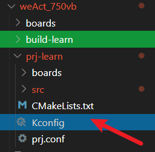

# zephyr学习记录

## [环境搭建](https://docs.zephyrproject.org/latest/develop/getting_started/index.html)

### 注意事项
**下载完毕后，需要执行以下命令**
```
<!-- 如果修改文件存储路径，需要重新执行以下脚本 -->
<!-- 导出环境变量，方便设计zephyr独立程序 -->
source zephyr-env.sh
<!-- 设置工具链路径，否则会报错 -->
source setup.sh 
```
## [应用开发](https://docs.zephyrproject.org/latest/develop/application/index.html)
 
### [自定义板](https://docs.zephyrproject.org/latest/hardware/porting/board_porting.html#create-your-board-directory)

自定义板时，**自定义板文件夹**需要包含以下文件
```
<!-- 注意：需要将 my_custom_board 替换为实际的板名称，同时自定义板文件夹名称需要与 my_custom_board 一致 -->
my_custom_board_defconfig
my_custom_board.dts
my_custom_board.yaml
board.cmake
board.h
CMakeLists.txt
doc/
Kconfig.my_custom_board
Kconfig.defconfig
support/
```

#### 传递自定义板路径
```
west build -b <board name> -- -DBOARD_ROOT=<path to boards>

cmake -Bbuild -GNinja -DBOARD=<board name> -DBOARD_ROOT=<path to boards> .
ninja -Cbuild
```

#### 指定文件夹
```
#指定build文件夹
west build -b <board name> -- -DBOARD_ROOT=<path to boards> -d <build directory>
#指定烧录文件夹
west flash -d <build directory>
```

### [bindings文件](https://docs.zephyrproject.org/latest/build/dts/bindings-syntax.html)

### [DTS文件](https://docs.zephyrproject.org/latest/build/dts/index.html)

- [C/C++使用dts生成的文件](https://docs.zephyrproject.org/latest/build/dts/api-usage.html)

- [DTS参考链接](https://www.cnblogs.com/jayant97/articles/17209392.html#1-%E5%89%8D%E8%A8%80)
- 注意事项:
  name@x: 这里的x表示设备的地址，必须是十六进制数(x没有0x前缀，如果节点没有reg属性，则可以省略@x部分)
  reg属性首地址必须与name@x中的x值一致，且地址必须加0x前缀
- compatible属性必须与bindings文件夹下的yaml文件中的compatible值一致
- *.conf文件用于覆盖Kconfig，有prj.conf和${boardname}.conf两种，默认情况下app.conf优先级高于${boardname}.conf。其中，prj.conf用于应用层的覆盖（例如，部分功能开启/关闭），${boardname}.conf用于板级的覆盖（例如，外设修改）。

### OVERLAY文件注意事项
- *.overlay文件用于覆盖dts内节点配置，有app.overlay和board.overlay两种，默认情况下app.overlay优先级高于board.overlay。其中，app.overlay用于应用层的覆盖（例如，节点修改），board.overlay用于板级的覆盖（例如，引脚修改）。
- overlay文件中不允许重复定义节点，否则会报错（即同一文件冲出现两个相同名字的节点）
- overlay移除节点的几种方法
  - 使用status = "disabled";将节点禁用
  - 使用/delete-node/删除节点
  - 使用/delete-node/删除绝对路径的节点
- 举例
```
/* 删除特定名称的子节点 */
  &quadspi {
      /delete-node/ flash@0;  /* ✅ 删除 flash@0 节点 */
  };

/* 禁用节点（不是真正删除，但设备不会被初始化） */
&quadspi {
    flash@0 {
        status = "disabled";  /* ✅ 设备驱动不会绑定此节点 */
    };
};

/* 通过完整路径删除 */
/delete-node/ &{/soc/quadspi@a0001000/flash@0};
```
### chosen与alias的区别
- 如下表

|  名称  |   chosen   |   alias    |
|----|-----------|-----------|
|  目的  |   系统级配置 |   便利的引用名称 |
|  用途  |   告诉系统使用哪个设备 |   提供设备的简短名称 |
|  影响  |   影响系统行为 |   不影响功能，只是别名 |
|  必要性 |   某些 chosen 是必需的 |   完全可选 |
|  命名空间 |   通常带前缀（如 zephyr,） |   自由命名 |
|  代码访问 |   DT_CHOSEN() |   DT_ALIAS() |
|  示例 |   zephyr,console = &uart1; |   uart0 = &uart1; |
- demo
```
# chosen 和 alias 示例
/ {
    chosen {
        /* 必需的基础配置 */
        zephyr,console = &uart0;        // 控制台
    };

    aliases {
        /* LED（通常 led0, led1, led2...） */
        led0 = &green_led;
        led1 = &red_led;
    };
}
# 查找设备示例
const struct device *console_dev = DEVICE_DT_GET(DT_CHOSEN(zephyr_console));
const struct device *led0_dev = DEVICE_DT_GET(DT_ALIAS(led0));
```

### 应用Kconfig配置
- 在prj.conf同目录下增加Kconfig文件
- 在Kconfig文件中使用source语句引入其他Kconfig文件

- 这个Kconfig文件是所有Kconfig的入口点，必须包含Kconfig.zephyr，确保标准符号可用
```
# SPDX-License-Identifier: Apache-2.0

# 引入 Zephyr 默认应用层 Kconfig，确保标准符号可用
source "Kconfig.zephyr"

# 引入自定义库的 Kconfig（相对路径）
rsource "mylib/Kconfig"
```

### 问题排查思路
- 编译报错
  - 检查CMakeLists.txt文件中是否正确引入了需要的模块
  - 检查prj.conf文件中是否正确配置了所需的Kconfig选项
  - 检查DTS文件和overlay文件中是否存在冲突或错误的节点定义
- 运行时错误
  - 使用日志功能（LOG_MODULE_REGISTER）记录关键操作和状态
  - 使用断言（__ASSERT）检查关键条件
  - 检查设备树节点是否正确绑定到驱动程序（前往build/zephyr/zephyr.dts检查生成的设备树是否与源代码中的设备树定义一致，前往build/zephyr/include/generated/autoconf.h检查配置选项）
- 调试技巧
  - 使用GDB进行调试，设置断点，单步执行

## 在Ubuntu上进行vscode在线仿真

- 如果不用zephyr-SDK自带的openocd，gdbserver会报错，提示Error: CMSIS-DAP: SWD not supported,具体原因还不清楚
```
#launch.json配置文件
{
  "name": "Attach (OpenOCD, CMSIS-DAP)",
  "device": "STM32F767IG",
  "cwd": "${workspaceFolder}",
  "executable": "build-app/zephyr/zephyr.elf",//指定可执行文件路径
  "request": "attach",//仿真请求类型，attach表示附加到正在运行的进程，不会复位。launch表示启动一个新的调试会话，通常会复位目标设备。
  "type": "cortex-debug",
  "runToEntryPoint": "main",
  "servertype": "openocd",
  "serverpath": "${userHome}/.local/zephyr-sdk-0.17.4/sysroots/x86_64-pokysdk-linux/usr/bin/openocd",//指定openocd路径
  "toolchainPrefix": "arm-zephyr-eabi",//指定工具链前缀
  "configFiles": [//指定openocd配置文件路径
    "${workspaceFolder}/boards/vendor/stm32f767ig/support/openocd.cfg"
  ],  
  "armToolchainPath": "${userHome}/.local/zephyr-sdk-0.17.4/arm-zephyr-eabi/bin",
  "gdbPath": "${userHome}/.local/zephyr-sdk-0.17.4/arm-zephyr-eabi/bin/arm-zephyr-eabi-gdb"
},
{
  "name": "Attach (JLink)",
  "device": "STM32F767IG",
  "cwd": "${workspaceFolder}",
  "executable": "build-app/zephyr/zephyr.elf",
  "request": "attach",
  "type": "cortex-debug",
  "runToEntryPoint": "main",
  "servertype": "jlink",
  "armToolchainPath": "${userHome}/.local/zephyr-sdk-0.17.4/arm-zephyr-eabi/bin",
  "gdbPath": "${userHome}/.local/zephyr-sdk-0.17.4/arm-zephyr-eabi/bin/arm-zephyr-eabi-gdb",
  "interface": "swd",
  // "preLaunchTask": "West Build"
}
```

