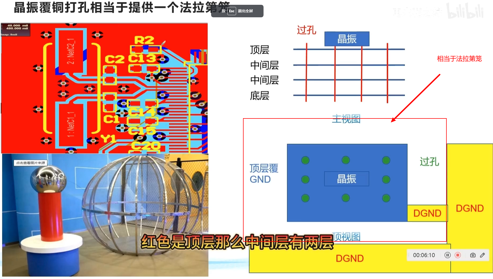

# PCB

## MOS管

[MOSFET 导通条件_mos管导通条件-CSDN博客](https://blog.csdn.net/zhengyanan815/article/details/68921668)

## 常识

### 寄生电容

**寄生电容**（**parasitic capacitance**），也称为**杂散电容**，是[电路](https://zh.wikipedia.org/wiki/电路)中[电子元件](https://zh.wikipedia.org/wiki/电子元件)之间或电路模组之间，由于相互靠近所形成的[电容](https://zh.wikipedia.org/wiki/电容)，寄生电容是[寄生元件](https://zh.wikipedia.org/wiki/寄生元件)，多半是不可避免的，同时经常是设计时不希望得到的电容特性。

### 晶振

#### 有源晶振

有源晶振有4只引脚，是一个完整的振荡器，其中除了石英晶体外，还有晶体管和阻容元件，因此体积较大。有源晶振的封装有4个引脚，分别为VCC（电压）、GND（地）、OUT（时钟信号输出）、NC（空脚）。

#### 无源晶振

无源晶振是有2个引脚的无极性元件，需要借助于时钟电路才能产生振荡信号，自身无法振荡起来，所以“无源晶振”这个说法并不准确。

#### 参考资料

[【科普】一文教你区分有源晶振与无源晶振 | 电子创新元件网 (eetrend.com)](https://murata.eetrend.com/article/2020-07/1003665.html)

## PCB99问

1. 有极性的元器件如何布局

同一种类型的有极性分立原件要求在X或Y方向上尽量保持一致，便于生产和检验。

优先级：首先保持一致，在考虑布线

2. PCB设计中的接插件如何放置

接插件建议放在板子边缘，便于调试以及板级连接

3. PCB当中芯片滤波电容如何放置

靠近芯片管脚放置，可以在管脚输入电源或信号时对纹波滤除。如果放置太远，依然有可能引入纹波

4. PCB的安装孔如何设计

- 外径一般是内径的2倍

- 安装孔内径 = 钉直径 + 0.5mm~1mm

- 孔外径可以加一些小孔用于散热，便于焊接

5. PCB相邻层走线为何呈现正交结构

因为加入两条线平行，同时电流方向相反。电磁感应相互作用，会引起信号干扰

6. 滴类的作用

- 避免板子受外力冲撞时，导线与焊盘的接触点断开，也可使PCB更加美观
- 保护焊盘，避免多次焊接时焊盘脱落
- 信号传输平滑阻抗，减小阻抗的急剧跳变（如果没有滴类，导线与焊盘的接口为直角，那么**电子向导线移动时很大概率冲击到焊盘的边上！**）。可使得走线与元件焊盘之间的连接趋于平稳过度化。

7. 邮票孔是什么，如何设计

邮票孔用于PCB拼版，打样好后收到板子可以将板子一分为多。

邮票孔间距1mm，直径一般为06.mm

8. PCB设计中的Mark点是干啥的，如何制作Mark点以及如何放置

组成：标记点，空旷区域（绝缘），丝印

Mark点在左下角，一般距离原点5mm，其它元器件距离Mark点5mm

9. PCB的3W原则是什么

W = 线宽度

3W = 线线中心的距离为线宽的3倍距离 

线与线离得远用于避免电磁干扰！右手螺旋定制

信号线特别注意！！！

10. PCB的20H原则是什么

**20H原则**是指电源层相对地层内缩20H的距离，当然也是为抑制边缘辐射效应。在板的边缘会向外辐射电磁干扰。将电源层内缩，使得电场只在接地层的范围内传导。有效的提高了EMC。**若内缩20H则可以将70%的电场限制在接地边沿内；内缩100H则可以将98%的电场限制在内。**

11. 爬电距离和电气间隙的关系？？？？？、

12. 电气间隙与爬电距离的经验值是多少

电气间隙 = 爬电距离 - 0.5mm

13. 晶振布局布线与法拉第笼的关系

- 尽量避免晶振布局在板子边缘，防止板子跌落导致晶振破损
- 保证晶振周围没有其它元件，建议这个距离为6MM,放置信号互相干扰
- 走线要短，在电路中，高速信号优先级最高。布线时，信号线速度越高，要求其走线尽量短，保证信号的失真度最小
- 无源晶振布的负载电容靠近晶振本体，减少寄生电容的影响
- 有源晶振布局走线尽量短，滤波电容尽量靠近晶振管脚，保证滤波的效果更佳
- 晶振底下要覆盖GND铜，单独隔离形成法拉第笼 

14. 走线宽度与电流的关系

15. PCB走大电流时走线宽度不够怎么办

[PCB设计99问-第17问：PCB走大电流时PCB走线宽度不够怎么办？_哔哩哔哩_bilibili](https://www.bilibili.com/video/BV1RN4y1r7ce/?spm_id_from=333.788&vd_source=2e33a3cba9dea05126d330dcf100be27)

16. PCB的数字模组和模拟模组布线如何走

- 数字模组和模拟模组单独走线

- 如果需要数字模组和模拟模组有联系，可以使用统一走线并满足设计规则
- 如果需要数字模组和模拟模组有联系，可以使用隔离走线，如光耦隔离

- 数字模组：数字信号，时钟 ，信号线，IO电平

- 模拟模组：ADC

17. PCB电源如何分配，为啥不能绕圈

18. PCB模拟地和数字地如何分配

19. PCB阻抗是什么？如何计算

20. 晶振布线重点

21. 原理图内的电容靠近引脚时，PCB布局是否也要靠近？

晶振布线时，需要进行包地处理（将晶振周围用地线包围）
