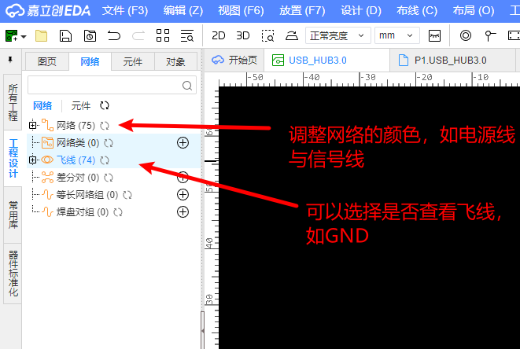

# 立创EDA常用功能总结

- [官方快捷键](https://docs.lceda.cn/cn/Introduction/Shortcut-Keys/index.html)右键编辑符号，可以修改器件引脚颜色
- SHIFT+F 搜索器件
- 放置网络标签为N键，选中网络标签，按下TAB调增标签规则
- 如何对选中目标进行镜像

Y X进行镜像，基本可以镜像所以选中的目标

- 如何计算外部晶振匹配电容？？？

[嘉立创阻抗计算 (jlc.com)](https://tools.jlc.com/jlcTools/index.html#/impedanceCalculateNew)

- 如何将原理图的位号重新自动分配？

在原理图界面，选中 设计-》分配位号-》选择分配的规则即可自动分配位号

- 如何添加多层

在PCB界面，选中 工具-》图层管理器 可以添加多图层，或者快捷键ctrl+L即可快速调出添加图层弹框

- ctrl+shift+x进行布局传递，可以在PCB画线时，将所有的元器件进行模块化，方便布局
- 绘制PCB时，先布局，再走线
- PCB飞线及网络颜色

- 

走线前需要对设计规则进行设置

内电层用作参考，到板框距离为40mil

电源线向内部过孔，避免影响信号线

查分对管理：设计->差分对

走线时先走有阻挡的地方，避免最后走无可走

信号刚出来时，不要着急拐弯

告诉信号线越小越好，旁边用GND过孔占位

电源线过大电流，需要加大宽度

绘制填充区域，将电源整理成一大块

高速信号线旁边需要有一些地过孔，用于增加信号传输质量

- 差分对等长调节采用3W原则，即等长调节内的间距为3倍线宽
- 内电层保留孤岛

shift+m 隐藏铺铜 shift+b重新铺铜

游离铜块不利于铺铜