## Vscode 全局搜索无法搜索到某一个文件夹

**注**：用户为全局配置，工作区为打开的文件夹配置

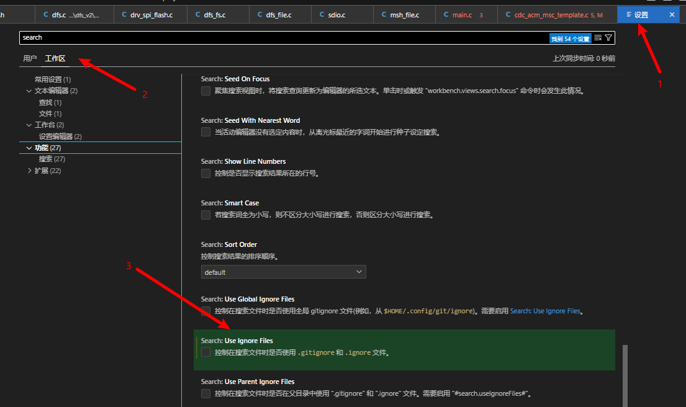

## Vscode 配置搜索文件及非搜索文件

在**settings.json**内添加需要排除的文件,如排除build目录

```json
"files.exclude": {
        "**/build": true
    },
```

## Vscode 配置[Doxygen Documentation Generator](https://marketplace.visualstudio.com/items?itemName=cschlosser.doxdocgen)

- 前往插件商城下载Doxygen Documentation Generator
- 打开工作区settings
- 配置自定义Doxygen Documentation Generator的设置

```json
"files.associations": {
        "*.md": "markdown",
        "pub_memory.h": "c"
    },
    "editor.fontSize": 24,
    "doxdocgen.file.copyrightTag": [
        "@copyright Copyright (c) {year} XXX ",
        "For study and research only, no reprinting",
    ],
    "doxdocgen.file.customTag": [
        "************************************************************************",
    ],
    "doxdocgen.file.fileOrder": [
        "custom",
        "empty",
        "file",
        "author",
        "brief",
        "empty",
        "custom",
        "copyright",
        "custom"
    ],
    "doxdocgen.generic.authorEmail": "123.com",
    "doxdocgen.generic.authorName": "yuyf",
    "doxdocgen.generic.authorTag": "@author {author} ({email})",
    "doxdocgen.generic.order": [
        "custom",
        "brief",
        "empty",
        "param",
        "empty",
        "return",
        "custom",
    ],
    "doxdocgen.generic.customTags": [
        "************************************************************************"
    ],
    "doxdocgen.generic.paramTemplate": "@param[in] {indent:8}{param} {indent:8} Comment",
    "doxdocgen.generic.returnTemplate": "@return ",
```

**注：**工作区的settings显示效果会覆盖用户区的settings的显示效果。可以根据具体项目编写工作区的settings文件

## Vscode 配置CLang-format

### 下载Clang-Format插件
### 配置工作空间的setting.json
 复制以下内容到setting.json

```json
"files.autoSave": "afterDelay",//未知
        "editor.formatOnSave": false,//保存时格式化失能
        "clang-format.assumeFilename": "${workspaceFolder}/.clang-format",//.clang-format的路径，这个需要把.clang-format放在工程的根目录
        "clang-format.executable": "C:\\Users\\huahuo\\.vscode\\extensions\\ms-vscode.cpptools-1.14.5-win32-x64\\LLVM\\bin\\clang-format.exe",//clang-format.exe绝对路径
```

### 配置C/C++文件的默认格式化方式
复制以下内容到用户区或工作区的setting.json都可以

```json
"[c]": {
        "editor.defaultFormatter": "xaver.clang-format"
    },
"[cpp]": {
        "editor.defaultFormatter": "xaver.clang-format"
    },
```

### .clang-format模板

注意使用的clang-format.exe，可能使用下边的模板会报错

```.clang-format
# 初始化数组或者结构体时，注意三项事项：1.大括号在等号后边，不要换行 2.最后一个元素加一个逗号 3.初始化的结构体内有宏时，不要让clang-format参与初始化
# 语言: None, Cpp, Java, JavaScript, ObjC, Proto, TableGen, TextProto
Language: Cpp
#BasedOnStyle:	LLVM

# 访问说明符(public、private等)的偏移
AccessModifierOffset: -4

# 开括号(开圆括号、开尖括号、开方括号)后的对齐: Align, DontAlign, AlwaysBreak(总是在开括号后换行)
AlignAfterOpenBracket: Align

# 连续赋值时，对齐所有等号
#AlignConsecutiveAssignments: true

# 连续声明时，对齐所有声明的变量名
#AlignConsecutiveDeclarations: true

# 右对齐逃脱换行(使用反斜杠换行)的反斜杠
#AlignEscapedNewlines: Right

# 水平对齐二元和三元表达式的操作数
AlignOperands: DontAlign

# 对齐连续的尾随的注释
AlignTrailingComments: true

# 不允许函数声明的所有参数在放在下一行
AllowAllParametersOfDeclarationOnNextLine: false

# 不允许短的块放在同一行
AllowShortBlocksOnASingleLine: false

# 允许短的case标签放在同一行
AllowShortCaseLabelsOnASingleLine: false

# 允许短的函数放在同一行: None, InlineOnly(定义在类中), Empty(空函数), Inline(定义在类中，空函数), All
AllowShortFunctionsOnASingleLine: None

# 允许短的if语句保持在同一行
AllowShortIfStatementsOnASingleLine: false

# 允许短的循环保持在同一行
AllowShortLoopsOnASingleLine: false

#AlignAfterOpenBracket: Align
AlignArrayOfStructures: Right
AlignConsecutiveAssignments:
  Enabled:         true
  AcrossEmptyLines: false
  AcrossComments:  false
  AlignCompound:   true
  PadOperators:    true
AlignConsecutiveBitFields:
  Enabled:         true
  AcrossEmptyLines: false
  AcrossComments:  false
  AlignCompound:   true
  PadOperators:    true
AlignConsecutiveDeclarations:
  Enabled:         true
  AcrossEmptyLines: false
  AcrossComments:  false
  AlignCompound:   true
  PadOperators:    true
AlignConsecutiveMacros:
  Enabled:         true
  AcrossEmptyLines: false
  AcrossComments:  false
  AlignCompound:   true
  PadOperators:    true

#宏后边的连接符 '\'位置
AlignEscapedNewlines: Right

# Should be declared this way: 控制块的大括号换行？
BreakBeforeBraces: Custom

# 大括号换行，只有当BreakBeforeBraces设置为Custom时才有效
BraceWrapping:
  # AfterControlStatement: MultiLine,
  # class定义后面
  AfterClass: false
  # 控制语句后面
  AfterControlStatement: true
  # enum定义后面
  AfterEnum: true
  # 函数定义后面
  AfterFunction: true
  # 命名空间定义后面
  AfterNamespace: true
  # struct定义后面
  AfterStruct: true
  # union定义后面
  AfterUnion: true
  # extern之后
  AfterExternBlock: false # 如果设置为true，那么extern c后的内容会全部进行缩进。这是不需要的！！！！！！！！
  # catch之前
  BeforeCatch: true
  # else之前
  BeforeElse: true
  # 缩进大括号
  IndentBraces: false
  # 分离空函数
  SplitEmptyFunction: true
  # 分离空语句
  SplitEmptyRecord: false
  # 分离空命名空间
  SplitEmptyNamespace: false

# 总是在返回类型后换行: None, All, TopLevel(顶级函数，不包括在类中的函数), 
# AllDefinitions(所有的定义，不包括声明), TopLevelDefinitions(所有的顶级函数的定义)
AlwaysBreakAfterReturnType: None

# 总是在多行string字面量前换行
AlwaysBreakBeforeMultilineStrings: false

# 总是在template声明后换行
AlwaysBreakTemplateDeclarations: true

# false表示函数实参要么都在同一行，要么都各自一行
BinPackArguments: true

# false表示所有形参要么都在同一行，要么都各自一行
BinPackParameters: true

# 在二元运算符前换行: None(在操作符后换行), NonAssignment(在非赋值的操作符前换行), All(在操作符前换行)
BreakBeforeBinaryOperators: NonAssignment

# 在大括号前换行: Attach(始终将大括号附加到周围的上下文), Linux(除函数、命名空间和类定义，与Attach类似), 
#   Mozilla(除枚举、函数、记录定义，与Attach类似), Stroustrup(除函数定义、catch、else，与Attach类似), 
#   Allman(总是在大括号前换行), GNU(总是在大括号前换行，并对于控制语句的大括号增加额外的缩进), WebKit(在函数前换行), Custom
#   注：这里认为语句块也属于函数
# BreakBeforeBraces: Custom

# 在三元运算符前换行
BreakBeforeTernaryOperators: false

# 在构造函数的初始化列表的冒号后换行
BreakConstructorInitializers: AfterColon

#BreakInheritanceList: AfterColon

BreakStringLiterals: false

# 每行字符的限制，0表示没有限制
ColumnLimit: 0

CompactNamespaces: true

# 构造函数的初始化列表要么都在同一行，要么都各自一行
ConstructorInitializerAllOnOneLineOrOnePerLine: false

# 构造函数的初始化列表的缩进宽度
ConstructorInitializerIndentWidth: 4

# 延续的行的缩进宽度
ContinuationIndentWidth: 4

# 去除C++11的列表初始化的大括号{后和}前的空格
Cpp11BracedListStyle: true

# 继承最常用的指针和引用的对齐方式
DerivePointerAlignment: false

# 固定命名空间注释
FixNamespaceComments: true

# 缩进case标签
IndentCaseLabels: false

IndentPPDirectives: None

# 缩进宽度
IndentWidth: 4

# 函数返回类型换行时，缩进函数声明或函数定义的函数名
IndentWrappedFunctionNames: false

# 保留在块开始处的空行
KeepEmptyLinesAtTheStartOfBlocks: false

# 连续空行的最大数量
MaxEmptyLinesToKeep: 1

# 命名空间的缩进: None, Inner(缩进嵌套的命名空间中的内容), All
NamespaceIndentation: None

# 指针和引用的对齐: Left, Right, Middle
PointerAlignment: Left

# 允许重新排版注释
ReflowComments: false

# 允许排序#include
SortIncludes: false

# 允许排序 using 声明
SortUsingDeclarations: false

# 在C风格类型转换后添加空格
SpaceAfterCStyleCast: false

# 在Template 关键字后面添加空格
SpaceAfterTemplateKeyword: true

# 在赋值运算符之前添加空格
SpaceBeforeAssignmentOperators: true

# SpaceBeforeCpp11BracedList: true

# SpaceBeforeCtorInitializerColon: true

# SpaceBeforeInheritanceColon: true

# 开圆括号之前添加一个空格: Never, ControlStatements, Always
SpaceBeforeParens: ControlStatements

# SpaceBeforeRangeBasedForLoopColon: true

# 在空的圆括号中添加空格
SpaceInEmptyParentheses: false

# 在尾随的评论前添加的空格数(只适用于//)
SpacesBeforeTrailingComments: 1

# 在尖括号的<后和>前添加空格
SpacesInAngles: false

# 在C风格类型转换的括号中添加空格
SpacesInCStyleCastParentheses: false

# 在容器(ObjC和JavaScript的数组和字典等)字面量中添加空格
SpacesInContainerLiterals: true

# 在圆括号的(后和)前添加空格
SpacesInParentheses: false

# 在方括号的[后和]前添加空格，lamda表达式和未指明大小的数组的声明不受影响
SpacesInSquareBrackets: false

# 标准: Cpp03, Cpp11, Auto
Standard: Cpp11

# tab宽度
TabWidth: 4

# 使用tab字符: Never, ForIndentation, ForContinuationAndIndentation, Always
UseTab: Never

```

## 配置C/C++开发C/C++代码

### 需要的插件

```
#extensions.json
{
    "recommendations": [
        "ms-vscode.cpptools",
        "jbenden.c-cpp-flylint",
        "danielpinto8zz6.c-cpp-compile-run",
        "hars.CppSnippets"
    ]
}
```

- 一般将静态审查工具配置为[cppcheck](https://cppcheck.sourceforge.io/),从这里下载并在插件里指定路径

## Vscode 配置C/C++头文件、宏定义等

- 配置工作空间的c_cpp_properties.json
- **c_cpp_properties.json也可以使用环境变量内的头文件**

```json
"configurations": [  
        {  
            "name": "Win32",  
            "includePath": [  
                "${workspaceFolder}/**",  
                "C:/Program Files (x86)/My Include Files/**",
                "${env:ADF_PATH}/components/**",//引用环境变量的头文件
                "${env:IDF_PATH}/frameworks/esp-idf-v5.0.4/components/**"
            ],  
            "defines": [],  
            "compilerPath": "C:/Program Files (x86)/My Compiler",  
            "cStandard": "c11",  
            "cppStandard": "c++17",  
            "intelliSenseMode": "gcc-x64",
			"compileCommands": "${workspaceFolder}/build/compile_commands.json"//用于支持跳转，不必再添加C文件路径
        }  
    ],  
    "version": 4
```

根据实际情况修改json内的变量

## Vscode 配置代码模板


选中用户代码片段，点击**新建全局代码片段**，会提示确认文件名，输入文件名，在生成的文件内输入模板内容。

```json
{
	// Place your 全局 snippets here. Each snippet is defined under a snippet name and has a scope, prefix, body and 
	// description. Add comma separated ids of the languages where the snippet is applicable in the scope field. If scope 
	// is left empty or omitted, the snippet gets applied to all languages. The prefix is what is 
	// used to trigger the snippet and the body will be expanded and inserted. Possible variables are: 
	// $1, $2 for tab stops, $0 for the final cursor position, and ${1:label}, ${2:another} for placeholders. 
	// Placeholders with the same ids are connected.
	// Example:
	// "Print to console": {
	// 	"scope": "javascript,typescript",
	// 	"prefix": "log",
	// 	"body": [
	// 		"console.log('$1');",
	// 		"$2"
	// 	],
	// 	"description": "Log output to console"
	// }
	"New project template": {
		"prefix": "project_template",
		"body": [
		   "/**",
		   "  *Copyright(C),2023 - 2022, Company Tech. Co., Ltd.",
		   "  *FileName:   ${TM_FILENAME}",
		   "  *Date:       ${CURRENT_YEAR}-${CURRENT_MONTH}-${CURRENT_DATE} ${CURRENT_HOUR}:${CURRENT_MINUTE}:${CURRENT_SECOND}",
		   "  *Author:     Author",
		   "  *Version:    1.0",
		   "  *Path:       ${TM_DIRECTORY}",
		   "  *Description:$1",
			"*/"
		],
		"description": "c function header template"
   },
   "New .c file template": {
		"prefix": "cfile_template",
		"body": [
			"/* ----------------------- System includes ----------------------------------*/",
			"\n\n\n/* ----------------------- Platform includes --------------------------------*/",
			"\n\n\n/* ----------------------- Defines ------------------------------------------*/",
			"\n\n\n/* ----------------------- Type definitions ---------------------------------*/",
			"\n\n\n/* ----------------------- Static variables ---------------------------------*/",
			"\n\n\n/* ----------------------- Static function ----------------------------------*/",
			"\n\n\n/* ----------------------- Start implementation -----------------------------*/"
			],
		"description": "c source file template"
	},
	"New .h file template": {
		"prefix": "hfile_template",
		"body": [
		   "#ifndef __${TM_FILENAME_BASE}_H_ //shift+U转换为大写",
		   "#define __${TM_FILENAME_BASE}_H_",  //json变量读出的小写不知道怎么转换为大写
		   "\n#ifdef __cplusplus",
		   "extern \"C\" {",
		   "#endif",
		   "\n\n/* ----------------------- Defines ------------------------------------------*/",
		   "\n\n\n/* ----------------------- Type definitions ---------------------------------*/",
		   "\n\n\n/* ----------------------- Extern variable ---------------------------------*/",
		   "\n\n\n/* ----------------------- Extern function ----------------------------------*/",
		   "\n\n\n/* ----------------------- End ----------------------------------------------*/",
		   "\n\n",
		   "#ifdef __cplusplus",
		   "}",
		   "#endif",		   
		   "\n\n#endif"
		],
		"description": "c head file template"
	},
	 "New c function header template": {
	 	"prefix": "function_template",
	 	"body": [
			"/**",
			"  * @brief  ${1:Desc}",
			"  * @param  ${2:None}",
			"  * @retval ${3:None}",
			"  * @note   ${4:None}",
			"*/",
			"static void ${5:function}(void)",
			"{\n\t$6\n}"
	 	],
		 "description": "c function header template"
	}
}

```

### 如何使用代码模板

新建一个文件，输入关键词，会自动在文件内生成模板文件。

eg:

新建一个C文件：

- 在C文件内输入“project_template”，会生成文件的模板文件

- 在C文件内输入“cfile_template”，会生成文件的模板文件

## 配置clangd、cmake、clang-format开发C/C++代码

### 需要的插件

| 插件         | 作用                             |
| ------------ | -------------------------------- |
| CMake        | 编写cmakelist会提示              |
| CMake Tools  | 配置cmake.exe                    |
| clangd       | 方便开发代码，静态审查，代码跳转 |
| Clang-Format | 格式化代码                       |
| CodeLLDB     | 调试代码                         |

### 需要的可执行文件

需要配置到环境变量

[cmake.exe](https://cmake.org/download/)

[make.exe](https://gnuwin32.sourceforge.net/packages/make.htm)

[cland.exe](https://github.com/clangd/clangd)

### 插件配置

- CMake Tools

需要添加cmake.exe的可执行路径

需要配置构建文件的输出路径

- Clang-Format

参考上文

> Vscode 配置CLang-format

- clangd

配置clangd.exe的执行路径

配置clangd.exe的参数

**特别注意，--compile-commands-dir需要根据情况修改**

~~~json
//在settings.json内
"clangd.arguments": [
    // 在后台自动分析文件（基于complie_commands)
    "--background-index",
    // 标记compelie_commands.json文件的目录位置
    "--compile-commands-dir=build",
    // 同时开启的任务数量
    "-j=12",
    // clang-tidy功能
    "--clang-tidy",
    // 全局补全（会自动补充头文件）
    "--all-scopes-completion",
    // 详细补全
    "--completion-style=detailed",
    // 补充头文件
    "--header-insertion=iwyu",
    // pch优化的位置
    "--pch-storage=disk",
  ],
~~~

注：clangd识别文件路径以来cmake生成的compelie_commands.json，因此需要配置正确的compelie_commands.json路径，即上述**"--compile-commands-dir=build",**具体[连接](https://zhuanlan.zhihu.com/p/145430576?utm_id=0)。

- Clang-Format

配置clang-format.exe路径

配置”.clang-format“文件的路径

- extensions.json

extensions.json 是 VS Code 编辑器中的一个配置文件，用于存储您当前安装的扩展（插件）列表和它们的配置信息。通过编辑这个文件，您可以轻松地将您当前的扩展列表备份并在其他环境中恢复它们，或在多个开发人员之间共享相同的扩展列表和配置。具体[连接](https://juejin.cn/s/extensions.json%20vscode)。

## VScode MCU开发

### 需要的插件

```json
//extensions.json 
{
    "recommendations": [
        "ms-vscode.cpptools",
        "llvm.clangd",
        "ms-vscode.cmake-tools",
        "marus25.cortex-debug",
        "twxs.cmake",
        "dan-c-underwood.arm",
        "zixuanwang.linkerscript",
    ]
}
```

### 需要的环境变量

- gcc编译器环境变量

- pyocd或其他调试server环境变量

- > 配置clangd、cmake、clang-format开发C/C++代码内的环境变量

### 需要配置的json

#### task.json

```
{
            "type": "shell",
            "label": "pyocd programing",
            "command": "pyocd",
            "args": [
                "flash",                
                "--target=APM32E103CE",
                "--erase=chip",
                "-a=0x08000000",
                "--frequency=1000000",
                "./build/Debug/boot_temp.bin"//"${workspaceFolder}"路径是'\' 而git_bash的路径是'/ 会导致识别错误
            ],
            "options": {
                "cwd": "${workspaceFolder}"
            },
            "problemMatcher": [],            
        }
```

#### settings.json

```
"clangd.arguments": [
        "--compile-commands-dir=build/Debug"//配置clangd识别compelie_commands.json的路径
    ],
```

#### launch.json

```
 {//配置Cortex-Debug需要的信息
            //没问题
            "name": "rt-spark-pyocd",
            "cwd": "${workspaceRoot}",
            "executable":  "${workspaceRoot}/build/Debug/stm32h750-cmake.elf",
            "request": "launch",
            "type": "cortex-debug",
            "runToEntryPoint": "main",
            "targetId": "STM32H750VBTx",
            "servertype": "pyocd",
            "serverpath": "C:/Users/yyf/AppData/Local/Programs/Python/Python312/Scripts/pyocd.exe",
            "armToolchainPath": "C:/Program Files/arm-gnu-toolchain-13.2.Rel1-mingw-w64-i686-arm-none-eabi/bin",
            "svdFile": "${workspaceFolder}/STM32H750.svd",
            "gdbPath": "C:/Program Files/arm-gnu-toolchain-13.2.Rel1-mingw-w64-i686-arm-none-eabi/bin/arm-none-eabi-gdb",
            //"cmsisPack": "${workspaceRoot}/Keil.STM32H7xx_DFP.3.1.1.pack",//不屏蔽该语句，会导致调试频繁出错误
            "showDevDebugOutput":"parsed",
        },    
        {
            "cwd": "${workspaceRoot}", //工作区根目录
            "executable": "${workspaceRoot}/build/Debug/stm32h750-cmake.elf", //执行文件
            "name": "Debug Microcontroller", //Debug名称，需要与其它调试json命名不一致
            "request": "launch",//调试模式
            "type": "cortex-debug",
            "servertype": "pyocd",
            "targetId":"STM32H750VBTx",//目标
            "armToolchainPath": "C:/Program Files/arm-gnu-toolchain-13.2.Rel1-mingw-w64-i686-arm-none-eabi/bin",
            "svdFile": "${workspaceFolder}/STM32H750.svd",    
            "runToEntryPoint": "main",
            "cmsisPack": "${workspaceFolder}/Keil.STM32H7xx_DFP.3.1.1.pack",
            "showDevDebugOutput":"raw",
        }    
```

#### c_cpp_properties.json

​	基本用不到，省略

**注意，以上json全部来自模板修改，参考[这里](https://github.com/MyFlyChicken/stm32-cube-cmake-vscode)**

模板这里配置需要注意的地方

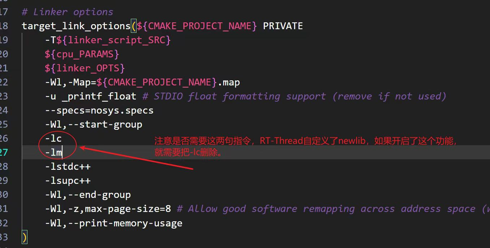

## Vscode 修改默认终端

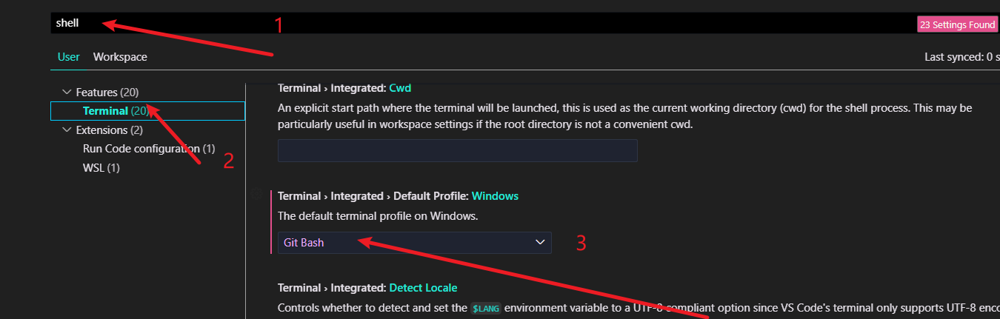

**注意将默认终端切换为Git Bash后，路径符号会由Win的'\\'变为'/'**
**注：由于clangd与C/C++存在冲突，如果仍然需要使用C/C++插件，则需要新增一个配置文件，在新增的配置文件内禁用clangd，使能C/C++。**

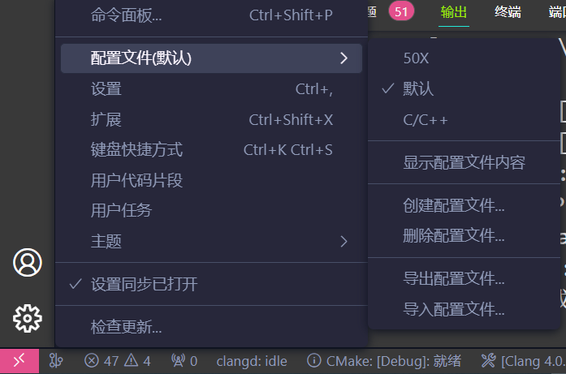

## Vscode C/C++静态代码审查

- cppcheck：一个强大的静态代码分析工具，可以检测出许多常见的错误和代码问题。

- Clang-tidy：一个 LLVM 项目的静态代码分析工具，可以检测出许多常见的代码问题，如内存泄漏、未初始化变量、循环错误等。

- Lint：一个静态代码分析工具，可以检测出许多常见的代码风格问题，如缩进错误、命名错误等。

## Vscode 编译32位应用程序

起因：编译[event-os](https://gitee.com/event-os/eventos) 时，环境变量内的mingw编译器默认只能编译64位的程序。如果需要编译32位的，则需要配置mingw32。具体操作步骤如下。

### Linux:

1. 设置编译标志位 -m32，指定本次编译的程序为32位

   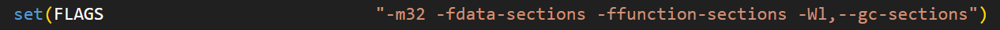

2. 编译程序，如果出现编译错误，则根据提示一步一步解决

### Windos：

1. 设置编译标志位 -m32，指定本次编译的程序为32位

   

2. 下载[mingw32](https://sourceforge.net/projects/mingw-w64/files/)

   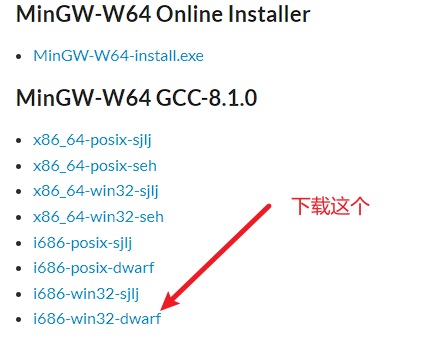

   其中

   x86_64指示x86 架构的 64 位系统，i686指示x86 架构的 32 位系统。

   posix/win32表示目标操作系统。

   sjlj/seh/dwarf表示异常处理模型的种类

3. 配置mingw32环境变量

   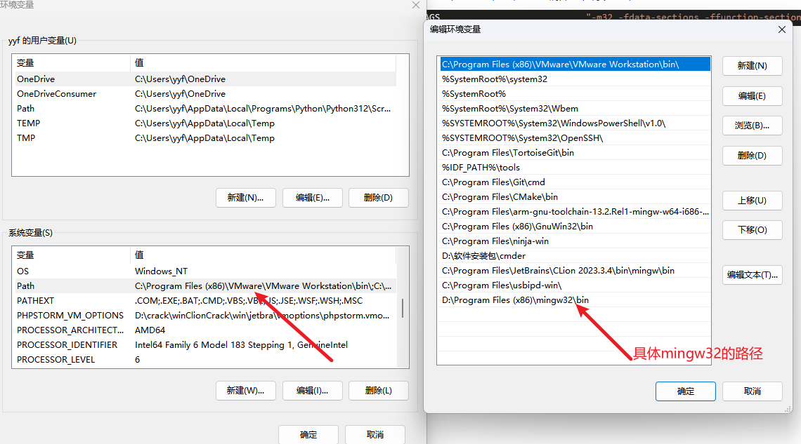

4. 查看环境变量是否配置成功

   有时候我们的一台电脑可能有多个 gcc 编译器版本，在用环境变量时，需要先指定编译器的前缀进行区分到底用哪个编译器

   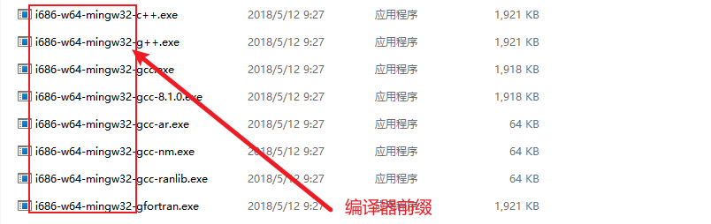

   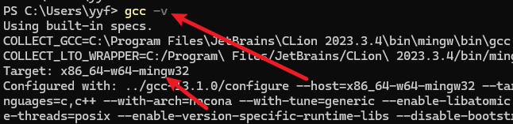

   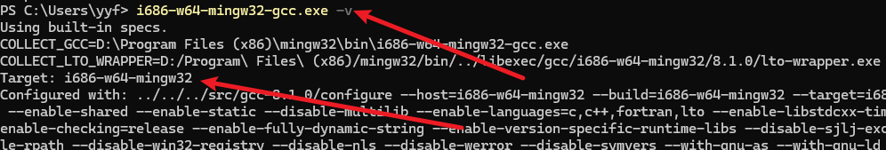

   前缀不一样，执行的程序也不一样

5. 编译32位程序

## Vscode工作区

[Visual Studio Code 用户和工作区设置](https://vscode.github.net.cn/docs/getstarted/settings)

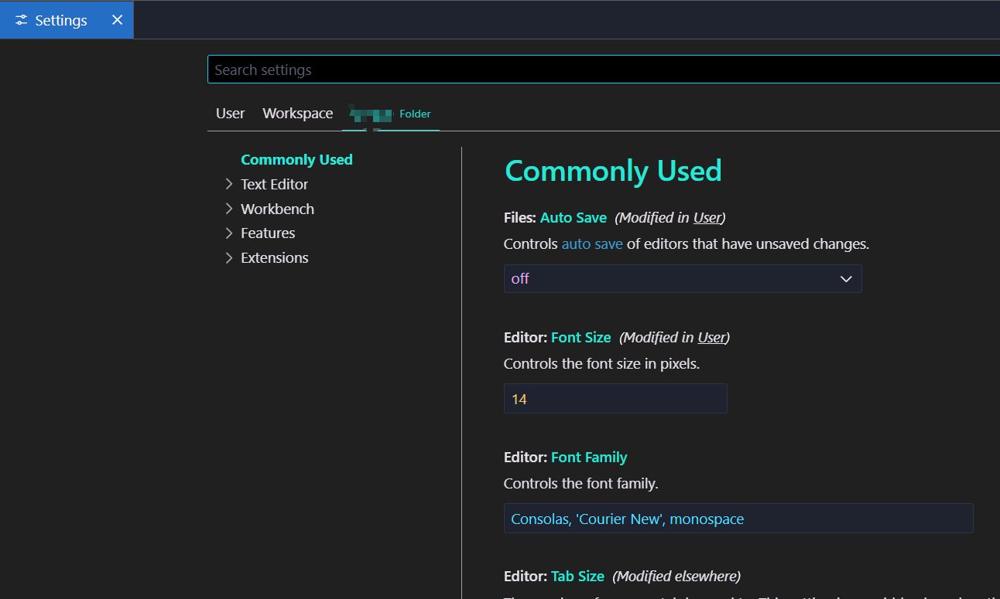

优先级：工作区配置>默认配置

[多项目工作区](https://em-ide.com/zh-cn/docs/advance/multi_prj_workspace)

可以通过工作区配置实现[多项目工作区](https://em-ide.com/zh-cn/docs/advance/multi_prj_workspace)，demo如下。新建一个`.code-workspace` 文件

```
{
	"folders": [
		{
			"name": "code_one",
			"path": "code_one"
		},
		{
			"name": "code_two",
			"path": "code_two"
		}		
	],
	"settings": {
		...
	}	
}
```

[多项目工作区](https://em-ide.com/zh-cn/docs/advance/multi_prj_workspace)

 
