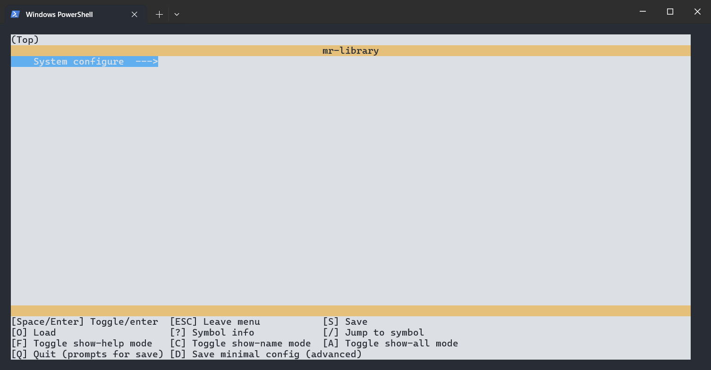

# menuconfig使用

为了方便程序配置及模块化，menuconfig是必须的

## windows使用menuconfig

### 环境搭建

1. 安装python
2. 安装([kconfiglib · PyPI](https://pypi.org/project/kconfiglib/))

```
 pip install windows-curses
 pip install -i https://pypi.tuna.tsinghua.edu.cn/simple kconfiglib
```

3. 编写Kconfig

   - 注意事项

     ```shell
     #旧的Kconfig(14.1以前)
     #配置 PKGS_DIR 的值，类型为字符串。option env 表示如果环境变量 PKGS_ROOT 存在且有值，那么 PKGS_DIR 的值即为环境变量的值，否则为 packages
     config PKGS_DIR 
         string
         option env="PKGS_ROOT" #环境变量PKGS_ROOT
         default "packages" #默认字符串
     
     #新的Kconfiglib(14.1及以后)
     mainmenu "RT-Thread Configuration"
     #直接对配置项进行赋值，如下
     RTT_DIR := rt-Thread
     #win 环境变量用%(foo)%取出 linux $foo取出
     PKGS_DIR := %PKGS_ROOT%
     
     #source 包含目录下级的Kconfig文件
     source "$(RTT_DIR)/Kconfig"
     #osource等于optional source，表示可选的，如果osource指定的kconfig文件不存在，也不报错。
     osource "$(PKGS_DIR)/Kconfig"
     #rsource等于 relative source，后面引用的kconfig文件支持相对路径。路径相对于包含rsource语句的kconfig而言。
     rsource "drivers/Kconfig"
     
     config RT_STUDIO_BUILT_IN
         bool
     	select ARCH_ARM_CORTEX_M3
         select RT_USING_COMPONENTS_INIT
         select RT_USING_USER_MAIN
         default y
     #实测，RT-thread的env工具，在window下，Kconfig环境变量$(FOO)（新语法）引用，与旧的 $FOO（旧语法）引用不兼容，推荐使用$(FOO)
     ```
     
     [鸿蒙内核Kconfig](https://developer.huawei.com/consumer/cn/forum/topic/0202760853720230022)
     
     [kconfiglib · PyPI](https://pypi.org/project/kconfiglib/)

4. 编写C语言头文件生成脚本kconfig.py

```
import re
import pip


def log_print(level, text):
    # Log level colors
    LEVEL_COLORS = {
        'error': '\033[31m',
        'success': '\033[32m',
        'warning': '\033[33m',
        'info': '\033[34m',
    }
    RESET_COLOR = '\033[0m'
    # Log level name
    LEVEL_NAME = {
        'error': 'ERROR',
        'success': 'SUCCESS',
        'warning': 'WARNING',
        'info': 'INFO',
    }
    print(LEVEL_COLORS[level] + LEVEL_NAME[level] + ': ' + text + RESET_COLOR)


def install_package(package):
    log_print('info', "%s package installing..." % package)
    pip.main(['install', package])


try:
    from kconfiglib import Kconfig
except ImportError:
    install_package('kconfiglib')
    from kconfiglib import Kconfig

try:
    import curses
except ImportError:
    install_package('windows-curses')
    import curses


def generate_config(kconfig_file, config_in, config_out, header_out):
    kconf = Kconfig(kconfig_file, warn=False, warn_to_stderr=False)

    # Load config
    kconf.load_config(config_in)
    kconf.write_config(config_out)
    kconf.write_autoconf(header_out)

    with open(header_out, 'r+') as header_file:
        content = header_file.read()
        header_file.truncate(0)
        header_file.seek(0)

        # Remove CONFIG_ and MR_USING_XXX following number
        content = content.replace("#define CONFIG_", "#define ")
        content = re.sub(r'#define MR_USING_(\w+) (\d+)', r'#define MR_USING_\1', content)

        # Add the micro
        header_file.write("#ifndef _MR_CONFIG_H_\n")
        header_file.write("#define _MR_CONFIG_H_\n\n")

        header_file.write("#ifdef __cplusplus\n")
        header_file.write("extern \"C\" {\n")
        header_file.write("#endif /* __cplusplus */\n\n")

        # Write back the original data
        header_file.write(content)

        # Add the micro
        header_file.write("\n#ifdef __cplusplus\n")
        header_file.write("}\n")
        header_file.write("#endif /* __cplusplus */\n\n")
        header_file.write("#endif /* _MR_CONFIG_H_ */\n")

        header_file.close()
        log_print('success', "menuconfig %s make success" % header_out)


def main():
    kconfig_file = ''#Kconfig的路径
    config_in = '.config'
    config_out = '.config'
    header_out = 'config.h'#输出头文件路径
    generate_config(kconfig_file, config_in, config_out, header_out)


if __name__ == "__main__":
    main()
```

### 使用步骤

1. 在Kconfig同目录下使用menuconfig



2. 保存变更，生成config头文件

```
python kconfig.py
```

```
#ifndef _MR_CONFIG_H_
#define _MR_CONFIG_H_

#ifdef __cplusplus
extern "C" {
#endif /* __cplusplus */

#define MR_USING_ASSERT
#define MR_CFG_HEAP_SIZE 4096
#define MR_USING_LOG_ERROR
#define MR_USING_LOG_WARN
#define MR_USING_LOG_INFO
#define MR_USING_LOG_DEBUG
#define MR_USING_LOG_SUCCESS
#define MR_CFG_PRINTF_BUFSZ 128
#define MR_CFG_PRINTF_DEV_NAME "serial1"
#define MR_USING_PRINTF_NONBLOCKING

#ifdef __cplusplus
}
#endif /* __cplusplus */

#endif /* _MR_CONFIG_H_ */

```

3. 工程引用config.h头文件实现menuconfig配置

### 参考文档

[kconfiglib](https://pypi.org/project/kconfiglib/#installation-with-pip)

[mr-library](https://github.com/Mac-Rsh/mr-library)

[menuconfig在windows上安装](https://blog.csdn.net/qq_33229007/article/details/129340204)

[Kconfig语法](https://www.rt-thread.org/document/site/#/development-tools/build-config-system/Kconfig)

[Kconfig语法](https://www.kernel.org/doc/html/latest/kbuild/kconfig-language.html)

### Linux(Ubuntu)使用menuconfig，且使用scons编译

具体步骤如下

```shell
#安装python
sudo apt-get install python3
#安装编译器
sudo apt-get install gcc-arm-none-eabi
#安装kconfiglib
sudo apt-get install python3-kconfiglib
#安装scons
sudo apt-get install scons
#进入项目根目录
cd demo_project
#编译工程
scons
#配置工程
python  config.py
```

可以使用同文件夹[demo_project](https://gitee.com/wanlichangjiang/my-scons-template/tree/main/demo_project)进行验证。需要将build.json内的biuld_flags修改为以下内容

```json
"biuld_flags":{
        "exec_path" : "/usr/bin/",
        "target"    : "hello.elf",
        "biuld_dir" : "build"
    },

"LINKFLAGS" : [
            "-mcpu=cortex-m3",
            "-mthumb",
            "-ffunction-sections",
            "-fdata-sections",
            "-Wl,--gc-sections,-Map=hello.map,-cref,-u,Reset_Handler",
            "-T",
            "link_script/link.lds"
        ],
```

