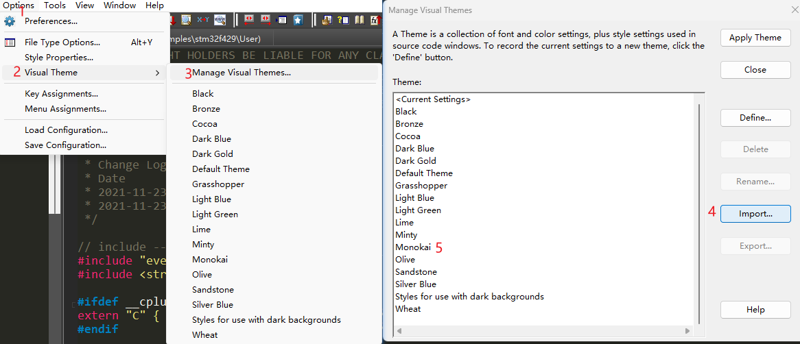

## [Vofa+](https://www.vofa.plus/)

用于调试数据，显示波形，例如调试PID

## [Hxd](https://mh-nexus.de/en/hxd/)

免费的二进制文件编辑器

## [everything](https://www.voidtools.com/zh-cn/)

免费的文件搜索

### [WOX](http://www.wox.one/)

免费WIN启动器

## [deepl](https://www.deepl.com/translator)

收费但可以试用的翻译软件

## [snipaste](https://www.snipaste.com/)

免费的截图软件

## [drawio](https://github.com/jgraph/drawio)

免费优秀的开源绘图软件

## [imhex](https://imhex.werwolv.net/)

免费HEX查看器，可以渲染

## [sublimetext](https://www.sublimetext.com/)

免费的文本编辑器

## [tortoisegit](https://tortoisegit.org)

免费的GIT GUI

## [sublimemerge](https://www.sublimemerge.com/)

免费的GIT GUI

## [Source Insight](./source insight/Source Insight 4.00.0126.7z)

[汉化工具](https://github.com/MyFlyChicken/SourceInsight_i18n)

[主题配置](./source insight/Monokai_theme.xml)



[快捷操作配置](https://www.armbbs.cn/forum.php?mod=viewthread&tid=95564&highlight=source%2Binsight)

## GCC

### 下载链接

- Windows

  [Windows命令](https://learn.microsoft.com/zh-cn/windows-server/administration/windows-commands/windows-commands)

  ```shell
  #windows设置环境变量
  set inc_dir=c:\directory
  ```

  [Arm GNU Toolchain Downloads](https://developer.arm.com/downloads/-/arm-gnu-toolchain-downloads)

  [Downloads - MinGW-w64](https://www.mingw-w64.org/downloads/)

- Linux

  ```shell
  # arch linux为例
  sudo pacman -S arm-none-eabi-gcc # 交叉编译
  sudo pacman -S gcc # x86 gcc编译
  ```

### lds链接脚本

```*.lds
.module :
{
	KEEP (*(SORT(poll.item.*)))  #保证扇区（poll.item.）不被优化，同时根据扇区命名，对生成的变量位置排序
}
```

### 常见标志

```cmake
-Wl,--gc-sections #去除未使用的代码，优先级低于链接脚本lds
-m32 #指定编译的程序为32位
```

## cmake

### cmake 语法

```cmake
#command(args ...) 其中command为命令的名字，args为命令参数，多个参数使用空格隔开
cmake_minimum_required(VERSION 2.8.5)
#set(<variable> <value>... [PARENT_SCOPE]) {}为引用变量的作用，$的作用是取出变量的值吗，${}一般配合使用,用于引出变量的值
set(COCOS2D_ROOT ${CMAKE_SOURCE_DIR}/cocos2d)
#if语句
#当 constant 为 1/ON/YES/TRUE/Y/Non-zero 时判别为真
#当 constant 为 0/OFF/NO/FALSE/N/IGNORE/NOTFOUND 或者为空字符串或后缀为 -NOTFOUND 时判断为假。
#字符串的比较可以使用 STREQUAL 来进行
if(${CMAKE_BUILD_TYPE} STREQUAL "Release")
　　...
elseif(${CMAKE_BUILD_TYPE} STREQUAL "Debug")
　　...
endif()
```

[参考资料1](https://www.cnblogs.com/phillee/p/12831765.html)

## makefile

### [makefile语法](https://dlonng.com/posts/makefile)

## [bittly](git@github.com:sige5193/bittly.git)

一个支持多种通讯方式和协议的测试工具，支持串口，网络，蓝牙，HTTP，Websocket ...

## python

linux 加入python 虚拟环境并激活

```shell
#在当前路径下创建一个名为python-venv的python虚拟环境
python -m venv ./python-venv
#激活虚拟环境，根据不同的shell，需要选择不同的激活脚本
source python-venv/bin/activate.fish
#直接输入
deactivate
```

### [pyenv](git@github.com:pyenv/pyenv.git)

pyenv支持管理多个python包，操作步骤如下(基于Arch Linux)

```shell
#安装pyenv
sudo pacman -S pyenv
#初始化pyenv环境
pyenv init
#每次启动shell后不需要重新初始化pyenv环境(pyenv init - | source 这个会在执行pyenv init进行提示)
echo pyenv init - | source >> ~/.config/fish/config.fish
#查看能够安装的版本
pyenv install --list
#安装python2.7.18版本
pyenv install 2.7.18
#设置当前shell的python版本
pyenv shell 2.7.18
#设置当前目录的python版本
pyenv local 2.7.18
#设置全局python版本
pyenv global 2.7.18
```

[在 linux 发行版中，python 多版本共存并自由切换](https://www.fkxxyz.com/c/python-env/)

在设置好python版本后，可以在shell内调用其它的shell执行文件，python的环境变量会传递到被调用的shell执行文件

```shell
#在fish内调用bash，执行./make.sh，此时python的版本为2.7.18
pyenv shell 2.7.18
bash ./make.sh
```

## [excalidraw](https://excalidraw.com/)

在线绘图软件

## [VsCode](../Vs Code/Vscode学习笔记.md)

[详情](../Vs Code/Vscode学习笔记.md)
