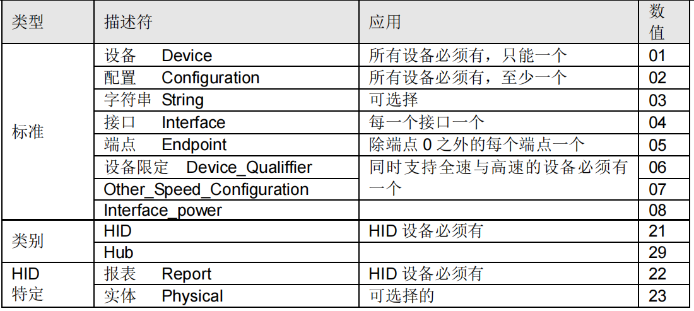
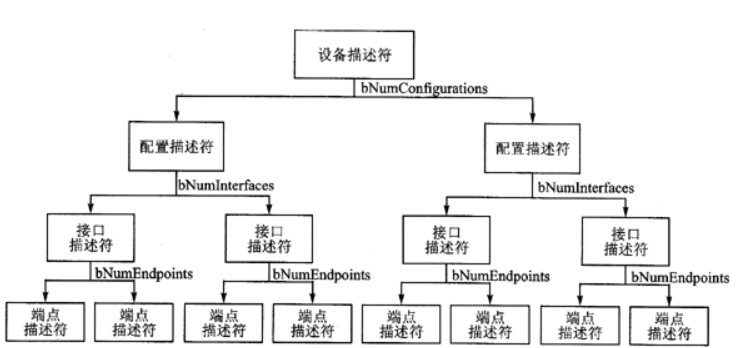
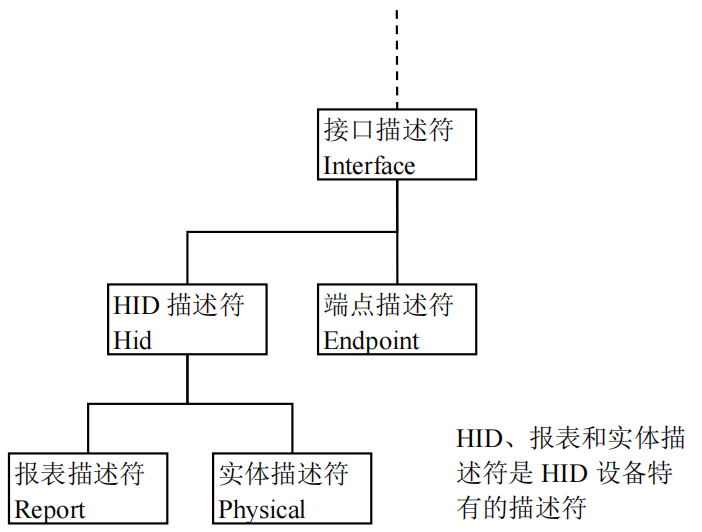
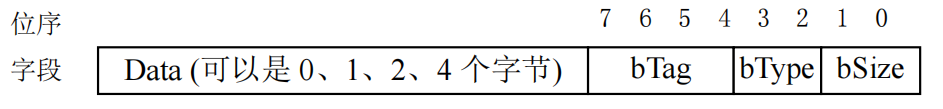
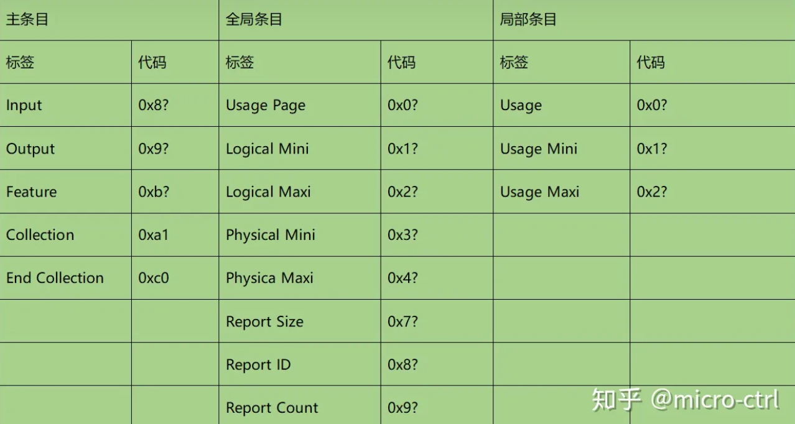
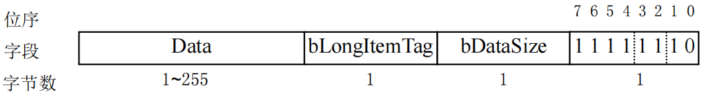

# USB相关知识点

USB是串行总线，所以数据是一位一位在数据线上传送的，USB使用的是LSB在前的方式，即先出来的是最低位的数据，接下来是次低位，最后是最高位（MSB）。

## USB描述符

标准的描述符有5种，USB为这些描述符定义了编号：

- [设备描述符](https://www.usbzh.com/article/detail-104.html)
- 配置描述符
- [字符串描述符](https://www.usbzh.com/article/detail-53.html)
- [接口描述符](https://www.usbzh.com/article/detail-64.html)
- [端点描述符](https://www.usbzh.com/article/detail-56.html)
- [HID描述符](https://www.usbzh.com/article/detail-62.html)
- [报表描述符](https://www.usbzh.com/article/detail-48.html)

- 限定描述符 DEVICE_QUALIFIER
- [其它速率配置描述符](https://www.usbzh.com/article/detail-88.html) OTHER_SPEED_CONFIGURATION
- 接口功率描述符 INTERFACE_POWER

### USB设备描述符关系

- 一个USB设备只有一个设备描述符。
- 一个USB设备可以有多个配置描述符（在设备描述符的bNumConfigurations下指定），但设备只能工作在一个配置描述符下。
- 一个配置描述符下可以有多个（在配置描述符的bNumInterfaces下指定）接口描述符。
- 一个接口描述符下可以有多个（在接口描述符的bNumEndPoints下指定）端点描述符。

### 配置描述符

配置描述符定义了设备的配置信息，一个设备可以有多个配置描述符。**多个配置描述符时，主机将发送具有非零值的 SetConfiguration 命令，该值与其中一个配置的bConfigurationValue 匹配。这用于选择所需的配置。**

~~~c
struct _CONFIGURATION_DESCRIPTOR_STRUCT 
{ 
  BYTE bLength;           //配置描述符的字节数大小，固定为9字节
  BYTE bDescriptorType;   //描述符类型编号，为0x02 
  WORD wTotalLength;     //返回整个数据的长度．指此配置返回的配置描述符，接口描述符以及端点描述符的全部大小．
  BYTE bNumInterface;     //此配置所支持的接口数量 
  BYTE bConfigurationVale;   //Set_Configuration命令需要的参数值 
  BYTE iConfiguration;       //描述该配置的字符串的索引值 
  BYTE bmAttribute;           //供电模式的选择 
  BYTE MaxPower;             //设备从总线提取的最大电流 
}CONFIGURATION_DESCRIPTOR_STRUCT
~~~

### 接口描述符

接口描述符一般是按设备的运行状态分类，这样设备可以在不同的接口中切换来实现设备运行状态的切换，如在设备在运行状态下使用正常的接口描述符，在停止状态下使用该接口描述符的备用接口描述符。

~~~c
struct _INTERFACE_DESCRIPTOR_STRUCT 
{ 
    BYTE bLength;           //设备描述符的字节数大小，为0x09 
    BYTE bDescriptorType;   //描述符类型编号，为0x04
    BYTE bInterfaceNumber; //接口的编号 
    BYTE bAlternateSetting;//备用的接口描述符编号 
    BYTE bNumEndpoints;     //该接口使用端点数，不包括端点0 
    BYTE bInterfaceClass;   //接口类型 
    BYTE bInterfaceSubClass;//接口子类型 
    BYTE bInterfaceProtocol;//接口所遵循的协议 
    BYTE iInterface;         //描述该接口的字符串索引值 
}INTERFACE_DESCRIPTOR_STRUCT
~~~

### 接口关联描述符

对于复合USB设备的[接口描述符](https://www.usbzh.com/article/detail-64.html)，可以在每个类（Class）要合并的[接口描述符](https://www.usbzh.com/article/detail-64.html)之前加一个接口关联描述符（Interface Association Descriptor，IAD),其作用就是把多个接口定义成一个类设备，即多个接口作用于一个设备。类似于UAC、UVC。

~~~c
typedef struct _USB_INTERFACE_ASSOCIATION_DESCRIPTOR {
    UCHAR   bLength;            //长度为8
    UCHAR   bDescriptorType;    //USB_INTERFACE_ASSOCIATION_DESCRIPTOR_TYPE，值为0x0b
    UCHAR   bFirstInterface;    //第一个接口编号
    UCHAR   bInterfaceCount;    //接口总数量，接口编号为连续的
    UCHAR   bFunctionClass;     //接口关联描述符的功能所实现的USB类
    UCHAR   bFunctionSubClass;  //接口关联描述符所实现的USB子类
    UCHAR   bFunctionProtocol;  //接口关联描述符所实现的USB协议
    UCHAR   iFunction;          //功能的字符串索引
} USB_INTERFACE_ASSOCIATION_DESCRIPTOR, *PUSB_INTERFACE_ASSOCIATION_DESCRIPTOR;
~~~

### 端点描述符

USB设备中的每个端点都有自己的端点描述符，由[接口描述符](https://www.usbzh.com/article/detail-64.html)中的bNumEndpoint决定其数量

~~~c
struct _ENDPOIN_DESCRIPTOR_STRUCT 
{ 
    BYTE bLength;           //设备描述符的字节数大小，为0x7 
    BYTE bDescriptorType;   //描述符类型编号，为0x05
    BYTE bEndpointAddress;  //USB设备的端点地址．Bit7，方向，对于控制端点可以忽略，1/0:IN/OUT．Bit6-4，保留．BIt3-0：端点号
    BYTE bmAttribute;       //端点属性．Bit7-2，保留（同步有定义）．BIt1-0：00控制，01同步，02批量，03中断．
    WORD wMaxPacketSize;    //本端点接收或发送的最大信息包大小 
    BYTE bInterval;         //主机查询端点的时间间隔 
} ENDPOIN_DESCRIPTOR_STRUCT;
~~~

> BYTE bmAttribute;       //端点属性．Bit7-2，保留（同步有定义）．BIt1-0：00控制，01同步，02批量，03中断．
>
> 当为[同步传输](https://www.usbzh.com/article/detail-118.html)时，bEndpointType的bit3-2的值不同代表的含义不同：
> 00：无同步
> 01：异步
> 10：适配
> 11：同步
> BIT5：4
> 00：表示数据端点
> 01：表示反馈端点Feedback endpoint
> 10：表示隐式反馈数据端点 Implicit feedback Data endpoint
> 11：保留

## UBS-HID

HID的核心主要是报表描述符，以下着重介绍HID的报表描述符，以及如何利用报表描述符符合设备。

### HID描述符

| 偏移量 | 字段                   | 字节数 | 数值类型 | 说明                                   |
| ------ | ---------------------- | ------ | -------- | -------------------------------------- |
| 0      | bLength                | 1      | Numeric  | 描述符字节数                           |
| 1      | bDescriptorType        | 1      | Constant | 0x21 = HID 描述符                      |
| 2      | bcdHID                 | 2      | Numeric  | HID 规范版本号（BCD）                  |
| 4      | bCountryCode           | 1      | Numeric  | 硬件设备所在国家的国家代码             |
| 5      | bNumDescriptors        | 1      | Numeric  | 类别描述符数目（至少有一个报表描述符） |
| 6      | bDescriptorType        | 1      | Constant | 类别描述符的类型                       |
| 7      | wDescriptorLength      | 2      | Numeric  | 报表描述符的总长度                     |
| 9      | [bDescriptorType]...   | 1      | Constant | 附加的描述符的类型，可选的             |
| 10     | [wDescriptorLength]... | 2      | Numeric  | 附加的描述符的总长度，可选的           |

### HID报表描述符

报表描述符是报表描述项目（Item）的集合，每一个描述项目都有相对统一的数据结构，项目很多，通过编码实现。

- HID短项目字段结构

bSize，0为0字节，1为1字节，2为2字节，3为4字节。

bType，表示该用途的类型。**0为主用途，1为全局用途，2为局部用途**。

bTag，表示该用途的功能，具体参见下表

- HID长项目字段结构

长项目一般不用，不做介绍（其实没学习）

#### 主用途

主用途用来**定义或者分组报告的数据域**，例如，可以使用输入主用途将输入报告划分为不同的数据域，以及指定该域的属性。

- Input、Output 和 Feature 项目的前缀字之后是 32 位描述数据，目前最多定义了 9 个位，余的位则是保留。位 0~8 的定义中只有位 7 不能应用于 Input 项目，除此之外其他的位定义都适应于 Input、utput 和 Feature 项目。

-  Collection 与 End Collection 项目来将相关的 Main 类型项目组成群组。这两个项目分别用于打开和关闭集合。项目之间的 Main 类型项目都是 Collection 的一部分。

#### 全局用途

主要用来选择用途页，定义数据域的长度、数量、报告ID等。**全局用途出现后对接下来的所有主用途都有效，除非遇到另一个全局用途来改变它。**

- 常用的全局用途有：Usage Page（用途页），Logical Minimum（逻辑最小值），Logical Maximum（逻辑最大值），Physical Minimum（物理最小值），Physical Maximum（物理最大值），Report Size（数据域大小，单位为位！），Report Count（数据域数量），Report ID（报告ID）。

其中Reprot Size 用来描述某个数据域有多少个位；Report Count用来描述这样的数据域有多少个；Logical Minimum和Logical Maximum用来描述数据域的取值范围。**Report Count不包含Report ID的大小**

#### 局部用途

用来定义控制的特性，例如，该数据域的用途、用途最小值、用途最大值。

- 常用的局部用途有：Usage(用途)、Usage Minimum(用途最小值)、Usage Maximum(用途最大值)。

简单来说，局部用途只是说明用途而已，标签Usage应该称为Usage ID，它搭配全局用途的Usage Page标签才形成所定义的用途。

### 报表描述符原理解释

报表的结构主要由报表的字段的长度（size）、数量（count）、属性（输入、输出等）决定，而报表的用途则由 [HID](https://www.usbzh.com/article/detail-76.html) 用途表文档规定。

HID报表的结构大致如下

~~~c
Usage Page //用途页
Usage//用途
Collection//开集合
    Report ID // 非必要
    Usage Page//指定用途
    Usage Minimum//用途最小值
    Usage Maximum//用途最大值
    ***//属性
    Usage Page//指定用途
    Usage Minimum//用途最小值
    Usage Maximum//用途最大值
    ***//属性
End Collection//关集合
    

~~~

### 键盘描述符，鼠标描述符

对于报表描述符，Usage在报表描述符内顺序排列，用于规定报告数据时数据的作用。**例如一个报表描述符内有Usage A，Usage B。同时Usage A，Usage B均为Report Size (8)，Report Count (1)，那么在上报数据时会先出现Usage A的数据项，再出现Usage B的数据项，假如这个描述符内有Report ID，那么上报数据时会先出现Report ID，再出现Usage A，Usage B的数据项。**

~~~c
//键盘描述符
0x05, 0x01,        // Usage Page (Generic Desktop Ctrls)
0x09, 0x06,        // Usage (Keyboard)
0xA1, 0x01,        // Collection (Application)
0x05, 0x07,        //   Usage Page (Kbrd/Keypad)
0x19, 0xE0,        //   Usage Minimum (0xE0)
0x29, 0xE7,        //   Usage Maximum (0xE7)
0x15, 0x00,        //   Logical Minimum (0)
0x25, 0x01,        //   Logical Maximum (1)
0x75, 0x01,        //   Report Size (1)
0x95, 0x08,        //   Report Count (8)
0x81, 0x02,        //   Input (Data,Var,Abs,No Wrap,Linear,Preferred State,No Null Position)
0x95, 0x01,        //   Report Count (1)
0x75, 0x08,        //   Report Size (8)
0x81, 0x03,        //   Input (Const,Var,Abs,No Wrap,Linear,Preferred State,No Null Position)
0x95, 0x05,        //   Report Count (5)
0x75, 0x01,        //   Report Size (1)
0x05, 0x08,        //   Usage Page (LEDs)
0x19, 0x01,        //   Usage Minimum (Num Lock)
0x29, 0x05,        //   Usage Maximum (Kana)
0x91, 0x02,        //   Output (Data,Var,Abs,No Wrap,Linear,Preferred State,No Null Position,Non-volatile)
0x95, 0x01,        //   Report Count (1)
0x75, 0x03,        //   Report Size (3)
0x91, 0x03,        //   Output (Const,Var,Abs,No Wrap,Linear,Preferred State,No Null Position,Non-volatile)
0x95, 0x06,        //   Report Count (6)
0x75, 0x08,        //   Report Size (8)
0x15, 0x00,        //   Logical Minimum (0)
0x25, 0xFF,        //   Logical Maximum (-1)
0x05, 0x07,        //   Usage Page (Kbrd/Keypad)
0x19, 0x00,        //   Usage Minimum (0x00)
0x29, 0x65,        //   Usage Maximum (0x65)
0x81, 0x00,        //   Input (Data,Array,Abs,No Wrap,Linear,Preferred State,No Null Position)
0xC0,              // End Collection
// 63 bytes
~~~

~~~c
//鼠标描述符
0x05, 0x01,        // Usage Page (Generic Desktop Ctrls)
0x09, 0x02,        // Usage (Mouse)
0xA1, 0x01,        // Collection (Application)
0x09, 0x01,        //   Usage (Pointer)
0xA1, 0x00,        //   Collection (Physical)
0x05, 0x09,        //     Usage Page (Button)
0x19, 0x01,        //     Usage Minimum (0x01)
0x29, 0x03,        //     Usage Maximum (0x03)
0x15, 0x00,        //     Logical Minimum (0)
0x25, 0x01,        //     Logical Maximum (1)
0x95, 0x03,        //     Report Count (3)
0x75, 0x01,        //     Report Size (1)
0x81, 0x02,        //     Input (Data,Var,Abs,No Wrap,Linear,Preferred State,No Null Position)
0x95, 0x01,        //     Report Count (1)
0x75, 0x05,        //     Report Size (5)
0x81, 0x01,        //     Input (Const,Array,Abs,No Wrap,Linear,Preferred State,No Null Position)
0x05, 0x01,        //     Usage Page (Generic Desktop Ctrls)
0x09, 0x30,        //     Usage (X)
0x09, 0x31,        //     Usage (Y)
0x09, 0x38,        //     Usage (Wheel)
0x15, 0x81,        //     Logical Minimum (-127)
0x25, 0x7F,        //     Logical Maximum (127)
0x75, 0x08,        //     Report Size (8)
0x95, 0x03,        //     Report Count (3)
0x81, 0x06,        //     Input (Data,Var,Rel,No Wrap,Linear,Preferred State,No Null Position)
0xC0,              //   End Collection
0x09, 0x3C,        //   Usage (Motion Wakeup)
0x05, 0xFF,        //   Usage Page (Reserved 0xFF)
0x09, 0x01,        //   Usage (0x01)
0x15, 0x00,        //   Logical Minimum (0)
0x25, 0x01,        //   Logical Maximum (1)
0x75, 0x01,        //   Report Size (1)
0x95, 0x02,        //   Report Count (2)
0xB1, 0x22,        //   Feature (Data,Var,Abs,No Wrap,Linear,No Preferred State,No Null Position,Non-volatile)
0x75, 0x06,        //   Report Size (6)
0x95, 0x01,        //   Report Count (1)
0xB1, 0x01,        //   Feature (Const,Array,Abs,No Wrap,Linear,Preferred State,No Null Position,Non-volatile)
0xC0,              // End Collection
// 74 bytes
~~~

~~~c
//自定义数据收发
0x06, 0x00, 0xFF,  // Usage Page (Vendor Defined 0xFF00)
0x09, 0x01,        // Usage (0x01)
0xA1, 0x01,        // Collection (Application)
0x85, 0x02,        //   Report ID (2)
0x09, 0x01,        //   Usage (0x01)
0x15, 0x00,        //   Logical Minimum (0)
0x26, 0xFF, 0x00,  //   Logical Maximum (255)
0x95, 0x3F,        //   Report Count (63)
0x75, 0x08,        //   Report Size (8)
0x81, 0x02,        //   Input (Data,Var,Abs,No Wrap,Linear,Preferred State,No Null Position)
0x85, 0x03,        //   Report ID (3)
0x09, 0x01,        //   Usage (0x01)
0x15, 0x00,        //   Logical Minimum (0)
0x26, 0xFF, 0x00,  //   Logical Maximum (255)
0x95, 0x3F,        //   Report Count (63)
0x75, 0x08,        //   Report Size (8)
0x91, 0x03,        //   Output (Const,Var,Abs,No Wrap,Linear,Preferred State,No Null Position,Non-volatile)
0xC0,              // End Collection
// 38 bytes

~~~

#### HID报表描述符复合设备

复合设备由report id进行区分。**一个报告描述符可以描述多个报告，不同的报告通过报告ID来识别。报告ID放到报告的最前面。当报告描述符中没有规定报告ID时，报告中就没有ID字段，开始就是数据。**

~~~c
//复合设备
//-------------键盘部分报告描述符----------------  
    //表示用途页为通用桌面设备  
    0x05, 0x01,                    // USAGE_PAGE (Generic Desktop)  
 
    //表示用途为键盘  
    0x09, 0x06,                    // USAGE (Keyboard)  
      
    //表示应用集合，必须要以END_COLLECTION来结束它，见最后的END_COLLECTION  
    0xa1, 0x01,                    // COLLECTION (Application)  
      
    //报告ID（报告ID 0是保留的）  
    0x85, 0x01, //Report ID (1)  
      
    //表示用途页为按键  
    0x05, 0x07,                    //   USAGE_PAGE (Keyboard)  
 
    //用途最小值，这里为左ctrl键  
    0x19, 0xe0,                    //   USAGE_MINIMUM (Keyboard LeftControl)  
    //用途最大值，这里为右GUI键，即window键  
    0x29, 0xe7,                    //   USAGE_MAXIMUM (Keyboard Right GUI)  
    //逻辑最小值为0  
    0x15, 0x00,                    //   LOGICAL_MINIMUM (0)  
    //逻辑最大值为1  
    0x25, 0x01,                    //   LOGICAL_MAXIMUM (1)  
    //报告大小（即这个字段的宽度）为1bit，所以前面的逻辑最小值为0，逻辑最大值为1  
    0x75, 0x01,                    //   REPORT_SIZE (1)  
    //报告的个数为8，即总共有8个bits  
    0x95, 0x08,                    //   REPORT_COUNT (8)  
    //输入用，变量，值，绝对值。像键盘这类一般报告绝对值，  
    //而鼠标移动这样的则报告相对值，表示鼠标移动多少  
    0x81, 0x02,                    //   INPUT (Data,Var,Abs)  
    //上面这这几项描述了一个输入用的字段，总共为8个bits，每个bit表示一个按键  
    //分别从左ctrl键到右GUI键。这8个bits刚好构成一个字节，它位于报告的第一个字节。  
    //它的最低位，即bit-0对应着左ctrl键，如果返回的数据该位为1，则表示左ctrl键被按下，  
    //否则，左ctrl键没有按下。最高位，即bit-7表示右GUI键的按下情况。中间的几个位，  
    //需要根据HID协议中规定的用途页表（HID Usage Tables）来确定。这里通常用来表示  
    //特殊键，例如ctrl，shift，del键等   
 
    //这样的数据段个数为1  
    0x95, 0x01,                    //   REPORT_COUNT (1)  
    //每个段长度为8bits  
    0x75, 0x08,                    //   REPORT_SIZE (8)  
    //输入用，常量，值，绝对值  
    0x81, 0x03,                    //   INPUT (Cnst,Var,Abs)  
      
    //上面这8个bit是常量，设备必须返回0  
 
    //这样的数据段个数为5  
    0x95, 0x05,                    //   REPORT_COUNT (5)  
    //每个段大小为1bit  
    0x75, 0x01,                    //   REPORT_SIZE (1)  
    //用途是LED，即用来控制键盘上的LED用的，因此下面会说明它是输出用  
    0x05, 0x08,                    //   USAGE_PAGE (LEDs)  
    //用途最小值是Num Lock，即数字键锁定灯  
    0x19, 0x01,                    //   USAGE_MINIMUM (Num Lock)  
    //用途最大值是Kana，这个是什么灯我也不清楚^_^  
    0x29, 0x05,                    //   USAGE_MAXIMUM (Kana)  
    //如前面所说，这个字段是输出用的，用来控制LED。变量，值，绝对值。  
    //1表示灯亮，0表示灯灭  
    0x91, 0x02,                    //   OUTPUT (Data,Var,Abs)  
 
    //这样的数据段个数为1  
    0x95, 0x01,                    //   REPORT_COUNT (1)  
    //每个段大小为3bits  
    0x75, 0x03,                    //   REPORT_SIZE (3)  
    //输出用，常量，值，绝对  
    0x91, 0x03,                    //   OUTPUT (Cnst,Var,Abs)      
    //由于要按字节对齐，而前面控制LED的只用了5个bit，  
    //所以后面需要附加3个不用bit，设置为常量。  
   
 
    //报告个数为6  
    0x95, 0x06,                    //   REPORT_COUNT (6)  
    //每个段大小为8bits  
    0x75, 0x08,                    //   REPORT_SIZE (8)  
    //逻辑最小值0  
    0x15, 0x00,                    //   LOGICAL_MINIMUM (0)  
    //逻辑最大值255  
    0x25, 0xFF,                    //   LOGICAL_MAXIMUM (255)  
    //用途页为按键  
    0x05, 0x07,                    //   USAGE_PAGE (Keyboard)  
    //使用最小值为0  
    0x19, 0x00,                    //   USAGE_MINIMUM (Reserved (no event indicated))  
    //使用最大值为0x65  
    0x29, 0x65,                    //   USAGE_MAXIMUM (Keyboard Application)  
    //输入用，变量，数组，绝对值  
    0x81, 0x00,                    //   INPUT (Data,Ary,Abs)  
    //以上定义了6个8bit宽的数组，每个8bit（即一个字节）用来表示一个按键，所以可以同时  
    //有6个按键按下。没有按键按下时，全部返回0。如果按下的键太多，导致键盘扫描系统  
    //无法区分按键时，则全部返回0x01，即6个0x01。如果有一个键按下，则这6个字节中的第一  
    //个字节为相应的键值（具体的值参看HID Usage Tables），如果两个键按下，则第1、2两个  
    //字节分别为相应的键值，以次类推。  
 
    //关集合，跟上面的对应  
    0xc0 ,                          // END_COLLECTION  
      
 //-----------------------鼠标部分报告描述符----------------------------  
    0x05, 0x01,                    // USAGE_PAGE (Generic Desktop)  
    0x09, 0x02,                    // USAGE (Mouse)  
    0xa1, 0x01,                    // COLLECTION (Application)  
    0x85, 0x02,            // 报告ID (2)  
    0x09, 0x01,                    //   USAGE (Pointer)  
    0xa1, 0x00,                    //   COLLECTION (Physical)  
    0x05, 0x09,                    //     USAGE_PAGE (Button)  
    0x19, 0x01,                    //     USAGE_MINIMUM (Button 1)  
    0x29, 0x03,                    //     USAGE_MAXIMUM (Button 3)  
    0x15, 0x00,                    //     LOGICAL_MINIMUM (0)  
    0x25, 0x01,                    //     LOGICAL_MAXIMUM (1)  
    0x95, 0x03,                    //     REPORT_COUNT (3)  
    0x75, 0x01,                    //     REPORT_SIZE (1)  
    0x81, 0x02,                    //     INPUT (Data,Var,Abs)  
    0x95, 0x01,                    //     REPORT_COUNT (1)  
    0x75, 0x05,                    //     REPORT_SIZE (5)  
    0x81, 0x03,                    //     INPUT (Cnst,Var,Abs)  
    0x05, 0x01,                    //     USAGE_PAGE (Generic Desktop)  
    0x09, 0x30,                    //     USAGE (X)  
    0x09, 0x31,                    //     USAGE (Y)  
    0x09, 0x38,                    //     USAGE (Wheel)  
    0x15, 0x81,                    //     LOGICAL_MINIMUM (-127)  
    0x25, 0x7f,                    //     LOGICAL_MAXIMUM (127)  
    0x75, 0x08,                    //     REPORT_SIZE (8)  
    0x95, 0x03,                    //     REPORT_COUNT (3)  
    0x81, 0x06,                    //     INPUT (Data,Var,Rel)  
    0xc0,                          //   END_COLLECTION  
    0xc0                           // END_COLLECTION  
~~~

- 复合设备上报数据时，不同的report id上报的数据长度不同，由report id后跟随的集合决定
- 参考资料[USB开源项目：Easy USB 51 Programer Plus-USB HID复合设备实例—键盘+鼠标_USB开发网_百合电子工作室USB专题站 (baiheee.com)](http://usb.baiheee.com/usb_projects/easy_usb_51_programer_plus/usb_keyboard_mouse.html)

## 参考资料

- [USB_HID协议中文版](.\资料\USB_HID协议中文版.pdf)

- [USB-HID设备6-HID报告描述符详解 - 知乎 (zhihu.com)](https://zhuanlan.zhihu.com/p/41960639)

- [USB标准请求及描述符在线分析工具 - USB中文网 (usbzh.com)](https://www.usbzh.com/tool/usb.html))
