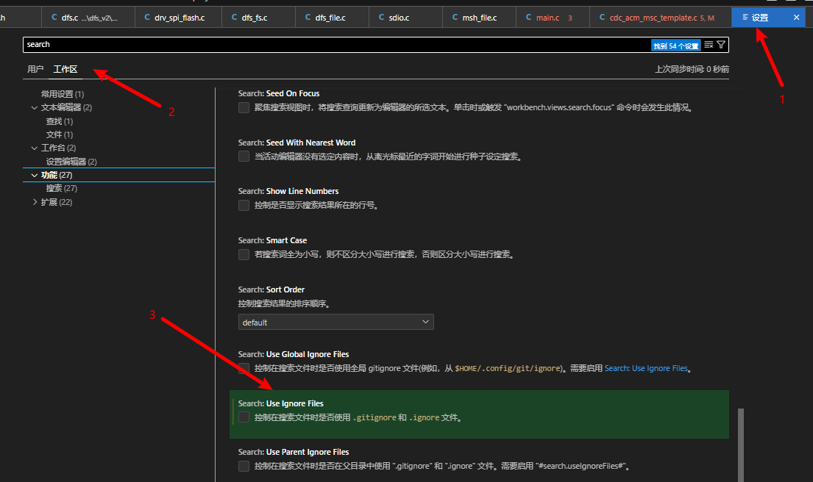

## Vscode 全局搜索无法搜索到某一个文件夹



## Vscode 配置搜索文件及非搜索文件

在**settings.json**内添加需要排除的文件,如排除build目录

```json
"files.exclude": {
        "**/build": true
    },
```

## Vscode 配置[Doxygen Documentation Generator](https://marketplace.visualstudio.com/items?itemName=cschlosser.doxdocgen)

- 前往插件商城下载Doxygen Documentation Generator
- 打开工作区settings
- 配置自定义Doxygen Documentation Generator的设置

```json
"files.associations": {
        "*.md": "markdown",
        "pub_memory.h": "c"
    },
    "editor.fontSize": 24,
    "doxdocgen.file.copyrightTag": [
        "@copyright Copyright (c) {year} XXX ",
        "For study and research only, no reprinting",
    ],
    "doxdocgen.file.customTag": [
        "************************************************************************",
    ],
    "doxdocgen.file.fileOrder": [
        "custom",
        "empty",
        "file",
        "author",
        "brief",
        "empty",
        "custom",
        "copyright",
        "custom"
    ],
    "doxdocgen.generic.authorEmail": "123.com",
    "doxdocgen.generic.authorName": "yuyf",
    "doxdocgen.generic.authorTag": "@author {author} ({email})",
    "doxdocgen.generic.order": [
        "custom",
        "brief",
        "empty",
        "param",
        "empty",
        "return",
        "custom",
    ],
    "doxdocgen.generic.customTags": [
        "************************************************************************"
    ],
    "doxdocgen.generic.paramTemplate": "@param[in] {indent:8}{param} {indent:8} Comment",
    "doxdocgen.generic.returnTemplate": "@return ",
```

**注：**工作区的settings显示效果会覆盖用户区的settings的显示效果。可以根据具体项目编写工作区的settings文件

## Vscode 配置CLang-format

### 下载Clang-Format插件
### 配置工作空间的setting.json
 复制以下内容到setting.json

```json
"files.autoSave": "afterDelay",//未知
        "editor.formatOnSave": false,//保存时格式化失能
        "clang-format.assumeFilename": "${workspaceFolder}/.clang-format",//.clang-format的路径，这个需要把.clang-format放在工程的根目录
        "clang-format.executable": "C:\\Users\\huahuo\\.vscode\\extensions\\ms-vscode.cpptools-1.14.5-win32-x64\\LLVM\\bin\\clang-format.exe",//clang-format.exe绝对路径
```

### 配置C/C++文件的默认格式化方式
复制以下内容到用户区或工作区的setting.json都可以

```json
"[c]": {
        "editor.defaultFormatter": "xaver.clang-format"
    },
"[cpp]": {
        "editor.defaultFormatter": "xaver.clang-format"
    },
```

### .clang-format模板

```.clang-format
# 初始化数组或者结构体时，注意三项事项：1.大括号在等号后边，不要换行 2.最后一个元素加一个逗号 3.初始化的结构体内有宏时，不要让clang-format参与初始化
# 语言: None, Cpp, Java, JavaScript, ObjC, Proto, TableGen, TextProto
Language: Cpp
#BasedOnStyle:	LLVM

# 访问说明符(public、private等)的偏移
AccessModifierOffset: -4

# 开括号(开圆括号、开尖括号、开方括号)后的对齐: Align, DontAlign, AlwaysBreak(总是在开括号后换行)
AlignAfterOpenBracket: Align

# 连续赋值时，对齐所有等号
AlignConsecutiveAssignments: true

# 连续声明时，对齐所有声明的变量名
AlignConsecutiveDeclarations: true

# 右对齐逃脱换行(使用反斜杠换行)的反斜杠
AlignEscapedNewlines: Right

# 水平对齐二元和三元表达式的操作数
AlignOperands: DontAlign

# 对齐连续的尾随的注释
AlignTrailingComments: true

# 不允许函数声明的所有参数在放在下一行
AllowAllParametersOfDeclarationOnNextLine: false

# 不允许短的块放在同一行
AllowShortBlocksOnASingleLine: false

# 允许短的case标签放在同一行
AllowShortCaseLabelsOnASingleLine: false

# 允许短的函数放在同一行: None, InlineOnly(定义在类中), Empty(空函数), Inline(定义在类中，空函数), All
AllowShortFunctionsOnASingleLine: None

# 允许短的if语句保持在同一行
AllowShortIfStatementsOnASingleLine: false

# 允许短的循环保持在同一行
AllowShortLoopsOnASingleLine: false

AlignAfterOpenBracket: Align
AlignArrayOfStructures: Right
AlignConsecutiveAssignments:
  Enabled:         true
  AcrossEmptyLines: true
  AcrossComments:  false
  AlignCompound:   true
  PadOperators:    true
AlignConsecutiveBitFields:
  Enabled:         true
  AcrossEmptyLines: true
  AcrossComments:  false
  AlignCompound:   true
  PadOperators:    true
AlignConsecutiveDeclarations:
  Enabled:         true
  AcrossEmptyLines: true
  AcrossComments:  false
  AlignCompound:   true
  PadOperators:    true
AlignConsecutiveMacros:
  Enabled:         true
  AcrossEmptyLines: true
  AcrossComments:  false
  AlignCompound:   true
  PadOperators:    true

#宏后边的连接符 '\'位置
AlignEscapedNewlines: Right

# Should be declared this way: 控制块的大括号换行？
BreakBeforeBraces: Custom

# 大括号换行，只有当BreakBeforeBraces设置为Custom时才有效
BraceWrapping:
  AfterControlStatement: MultiLine,
  # class定义后面
  AfterClass: false
  # 控制语句后面
  AfterControlStatement: true
  # enum定义后面
  AfterEnum: true
  # 函数定义后面
  AfterFunction: true
  # 命名空间定义后面
  AfterNamespace: true
  # struct定义后面
  AfterStruct: true
  # union定义后面
  AfterUnion: true
  # extern之后
  AfterExternBlock: true
  # catch之前
  BeforeCatch: true
  # else之前
  BeforeElse: true
  # 缩进大括号
  IndentBraces: false
  # 分离空函数
  SplitEmptyFunction: true
  # 分离空语句
  SplitEmptyRecord: false
  # 分离空命名空间
  SplitEmptyNamespace: false

# 总是在返回类型后换行: None, All, TopLevel(顶级函数，不包括在类中的函数), 
# AllDefinitions(所有的定义，不包括声明), TopLevelDefinitions(所有的顶级函数的定义)
AlwaysBreakAfterReturnType: None

# 总是在多行string字面量前换行
AlwaysBreakBeforeMultilineStrings: false

# 总是在template声明后换行
AlwaysBreakTemplateDeclarations: true

# false表示函数实参要么都在同一行，要么都各自一行
BinPackArguments: true

# false表示所有形参要么都在同一行，要么都各自一行
BinPackParameters: true

# 在二元运算符前换行: None(在操作符后换行), NonAssignment(在非赋值的操作符前换行), All(在操作符前换行)
BreakBeforeBinaryOperators: NonAssignment

# 在大括号前换行: Attach(始终将大括号附加到周围的上下文), Linux(除函数、命名空间和类定义，与Attach类似), 
#   Mozilla(除枚举、函数、记录定义，与Attach类似), Stroustrup(除函数定义、catch、else，与Attach类似), 
#   Allman(总是在大括号前换行), GNU(总是在大括号前换行，并对于控制语句的大括号增加额外的缩进), WebKit(在函数前换行), Custom
#   注：这里认为语句块也属于函数
BreakBeforeBraces: Custom

# 在三元运算符前换行
BreakBeforeTernaryOperators: false

# 在构造函数的初始化列表的冒号后换行
BreakConstructorInitializers: AfterColon

#BreakInheritanceList: AfterColon

BreakStringLiterals: false

# 每行字符的限制，0表示没有限制
ColumnLimit: 0

CompactNamespaces: true

# 构造函数的初始化列表要么都在同一行，要么都各自一行
ConstructorInitializerAllOnOneLineOrOnePerLine: false

# 构造函数的初始化列表的缩进宽度
ConstructorInitializerIndentWidth: 4

# 延续的行的缩进宽度
ContinuationIndentWidth: 4

# 去除C++11的列表初始化的大括号{后和}前的空格
Cpp11BracedListStyle: true

# 继承最常用的指针和引用的对齐方式
DerivePointerAlignment: false

# 固定命名空间注释
FixNamespaceComments: true

# 缩进case标签
IndentCaseLabels: false

IndentPPDirectives: None

# 缩进宽度
IndentWidth: 4

# 函数返回类型换行时，缩进函数声明或函数定义的函数名
IndentWrappedFunctionNames: false

# 保留在块开始处的空行
KeepEmptyLinesAtTheStartOfBlocks: false

# 连续空行的最大数量
MaxEmptyLinesToKeep: 1

# 命名空间的缩进: None, Inner(缩进嵌套的命名空间中的内容), All
NamespaceIndentation: None

# 指针和引用的对齐: Left, Right, Middle
PointerAlignment: Left

# 允许重新排版注释
ReflowComments: false

# 允许排序#include
SortIncludes: false

# 允许排序 using 声明
SortUsingDeclarations: false

# 在C风格类型转换后添加空格
SpaceAfterCStyleCast: false

# 在Template 关键字后面添加空格
SpaceAfterTemplateKeyword: true

# 在赋值运算符之前添加空格
SpaceBeforeAssignmentOperators: true

# SpaceBeforeCpp11BracedList: true

# SpaceBeforeCtorInitializerColon: true

# SpaceBeforeInheritanceColon: true

# 开圆括号之前添加一个空格: Never, ControlStatements, Always
SpaceBeforeParens: ControlStatements

# SpaceBeforeRangeBasedForLoopColon: true

# 在空的圆括号中添加空格
SpaceInEmptyParentheses: false

# 在尾随的评论前添加的空格数(只适用于//)
SpacesBeforeTrailingComments: 1

# 在尖括号的<后和>前添加空格
SpacesInAngles: false

# 在C风格类型转换的括号中添加空格
SpacesInCStyleCastParentheses: false

# 在容器(ObjC和JavaScript的数组和字典等)字面量中添加空格
SpacesInContainerLiterals: true

# 在圆括号的(后和)前添加空格
SpacesInParentheses: false

# 在方括号的[后和]前添加空格，lamda表达式和未指明大小的数组的声明不受影响
SpacesInSquareBrackets: false

# 标准: Cpp03, Cpp11, Auto
Standard: Cpp11

# tab宽度
TabWidth: 4

# 使用tab字符: Never, ForIndentation, ForContinuationAndIndentation, Always
UseTab: Never

```

## Vscode 配置C/C++头文件、宏定义等

- 配置工作空间的c_cpp_properties.json

```json
"configurations": [  
        {  
            "name": "Win32",  
            "includePath": [  
                "${workspaceFolder}/**",  
                "C:/Program Files (x86)/My Include Files/**"  
            ],  
            "defines": [],  
            "compilerPath": "C:/Program Files (x86)/My Compiler",  
            "cStandard": "c11",  
            "cppStandard": "c++17",  
            "intelliSenseMode": "gcc-x64"  
        }  
    ],  
    "version": 4
```

根据实际情况修改json内的变量
