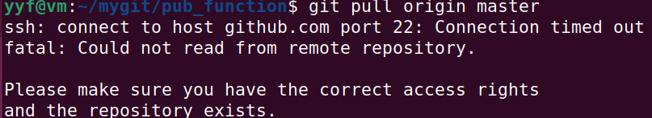

# github常用操作命令

- 一般在命令行内，[]括号表示括号内的内容是可选项，<>括号表示括号内的内容是必选项

- 在一个本地仓库内的修改，如果没有提交，切换仓库后，这个修改依然存在。如果这个修改被提交了，那么切换到新的仓库，这个提交也会跟随新仓库，如果切换到已经有的仓库，这个提交的不会跟随到已有的仓库。

## ssh key生成步骤

1. 设置Git的user name和email

```cmd
git config --global user.name "git的名字"
git config --global user.email "git的邮箱"

git config --list #查看git配置
```

2. 生成密钥

~~~cmd
ssh-keygen -t rsa -C "git的邮箱"

cat ~/.ssh/id_rsa.pub #打印出公钥内容，复制添加到git的SSH key
~~~

## 回滚代码

1. git log
2. git reset --hard <需要恢复到的hash值>

## 合并不同仓库的提交

eg:a仓库提交了一个变更，b仓库提交了一个变更，需要将a提交的变更合并到b，此时就需要用到merge功能

1. git checkout <b仓库>
2. git merge <a仓库>
3. 利用vscode 搭配gitlens插件解决冲突

## 查看指定文件commit日志

git log <文件路径>

## 比较文件历史

git diff <commit hash值1> <commit hash值2>

## 贮藏文件弹出的几种情况

a分支贮藏了一份内容

- 切换到b分支，b分支未作修改，直接弹出a分支的贮藏内容，不会报错
- 切换到b分支，b分支做了一些改动，未提交，假如要将a分支的贮藏与b分支的改动合并，需要先将b分支改动贮藏，再将a分支贮藏弹出，再弹出b分支贮藏，再通过vscode 搭配gitlens插件解决冲突，再将合并后的内容提交

## 恢复某个文件或文件夹

可以将文件还原到上一次提交的状态。如果还原的文件改动没有提交，那么就会丢弃所做的更改

git restore <文件夹或文件路径>

## 修改已提交commit的信息

[参考连接](https://cloud.tencent.com/developer/article/1730774)

## 子模块处理

### 添加子模块

添加一个远程仓库项目 `https://github.com/iphysresearch/GWToolkit.git` 子模块到一个已有主仓库项目中。代码形式是 `git submodule add <url> <repo_name>`， 如下面的例子：

```bash
$ git submodule add https://github.com/iphysresearch/GWToolkit.git GWToolkit
```

这时，你会看到一个名为 `GWToolkit` 的文件夹在你的主仓库目录中。

> 如果你是旧版 Git 的话，你会发现 `./GWToolkit` 目录中是空的，你还需要在执行一步「更新子模块」，才可以把远程仓库项目中的内容下载下来。
>
> ```bash
> $ git submodule update --init --recursive
> ```
>
> 如果你不小心把路径写错了，可以用下面的代码来删掉，详细可查阅 `git help submodule`。
>
> ```bash
> $ git rm --cached GWToolkit
> ```

添加子模块后，若运行 `git status`，可以看到主仓库目录中会增加一个文件 `.gitmodules`，这个文件用来保存子模块的信息。

```bash
$ git status
位于分支 main
您的分支与上游分支 'origin/main' 一致。

要提交的变更：
  （使用 "git restore --staged <文件>..." 以取消暂存）
	新文件：   .gitmodules
	新文件：   GWToolkit
```

另外，在 `.git/config` 中会多出一块关于子模块信息的内容：

```v
[submodule "GWToolkit"]
        url = https://github.com/iphysresearch/GWToolkit.git
        active = true
```

该配置文件保存了项目 URL 与已经拉取的本地目录之间的映射。如果有多个子模块，该文件中就会有多条记录。 要重点注意的是，该文件也像 `.gitignore` 文件一样受到（通过）版本控制。 它会和该项目的其他部分一同被拉取推送。 这就是克隆该项目的人知道去哪获得子模块的原因。

新生成的还有相关子模块的文件：`.git/modules/GWToolkit/`。

此时若把上述「添加子模块」的修改更新到主仓库的 GitHub 上去的话，会看到相应子模块仓库的文件夹图标会有些不同：


此时还要留意的是，在终端 Git 命令操作下，**位于主仓库目录中除了子模块外的任何子目录下进行的 commit 操作，都会记到主仓库下**。只有在子模块目录内的任何 commit 操作，才会记到子模块仓库下。如下面的示例：

```bash
$ cd ~/projects/<module>
$ git log # log shows commits from Project <module>
$ cd ~/projects/<module>/<sub_dir>
$ git log # still commits from Project <module>
$ cd ~/projects/<module>/<submodule>
$ git log # commits from <submodule>
```

### 查看子模块

```bash
$ git submodule
 13fe233bb134e25382693905cfb982fe58fa94c9 GWToolkit (heads/main)
```

------

### 更新子模块

更新项目内子模块到最新版本：

```bash
$ git submodule update
```

更新子模块为远程项目的最新版本

```bash
$ git submodule update --remote
```

------

### `Clone` 包含子模块的项目

对于你的主仓库项目合作者来说，如果只是 `git clone` 去下载主仓库的内容，那么你会发现子模块仓库的文件夹内是空的！

此时，你可以像上面「添加子模块」中说到的使用 `git submodule update --init --recursive` 来递归的初始化并下载子模块仓库的内容。

也可以分初始化和更新子模块两步走的方式来下载子模块仓库的内容：

```bash
$ git submodule init		# 初始化子模块
$ git submodule update	# 更新子模块
```

但是，如果你是第一次使用 `git clone` 下载主仓库的所有项目内容的话，我建议你可以使用如下的代码格式来把主仓库和其中子模块的所有内容，都**一步到位**的下载下来：

```bash
$ git clone --recursive <project url>
```

以后可以在子模块仓库目录下使用 `git pull origin main` 或者 `git push` 等来进行更新与合并等操作。

------

### 删除子模块

**删除子模块比较麻烦，需要手动删除相关的文件，否则在添加子模块时有可能出现错误** 同样以删除 `GWToolkit` 子模块仓库文件夹为例：

1. 删除子模块文件夹

   ```bash
   $ git rm --cached GWToolkit
   $ rm -rf GWToolkit
   ```

2. 删除 `.gitmodules` 文件中相关子模块的信息，类似于：

   ```v
   [submodule "GWToolkit"]
           path = GWToolkit
           url = https://github.com/iphysresearch/GWToolkit.git
   ```

3. 删除 `.git/config` 中相关子模块信息，类似于：

   ```v
   [submodule "GWToolkit"]
           url = https://github.com/iphysresearch/GWToolkit.git
           active = true
   ```

4. 删除 `.git` 文件夹中的相关子模块文件

   ```bash
   $ rm -rf .git/modules/GWToolki
   ```

### 关于子模块的个人理解

1. 在子模块内地操作会push会推送到子模块的远端，如果想自己管理子模块，需要单独切一个分支。
2. 在子模块目录内提交自己的提交，再切换到主目录进行提交。
3. 如果远端有更新，可以切换到子模块目录进行pull操作，然后再merge到自己管理的子模块分支

## git如何忽略已经提交的文件 (.gitignore文件无效)

.gitignore**只对新增的文件有效**，对已经提交的文件无效

如果想要忽略已经提交的文件，分三步

1. 修改.gitignore

2. 删除提交的文件

3. 提交操作

   

# 异常处理

### pull、push提示22端口超时



首先排查原因，使用命令

```ssh
ssh -vT github@github.com #查看连接日志，其中-v为显示连接日志，不加v只显示结果
```

解决办法

1. 将22端口替换为443端口，在.ssh文件夹内加入config文件，内容如下

[参考连接](https://blog.csdn.net/weixin_43233914/article/details/125143340)

```config
Host github.com
User 你的邮箱
Hostname ssh.github.com #注意这里是ssh.github.com
PreferredAuthentications publickey
IdentityFile ~/.ssh/id_rsa
Port 443
```

2. 查看hosts内是否存在github.com的ip地址映射，22端口超时可能是因为ssh的默认ip地址与github.com的ip地址不一样

[参考连接](https://blog.csdn.net/weixin_44671418/article/details/107378693)

```
#Windows
# lines or following the machine name denoted by a '#' symbol.
#
# For example:
#
#      102.54.94.97     rhino.acme.com          # source server
#       38.25.63.10     x.acme.com              # x client host

# localhost name resolution is handled within DNS itself.
#	127.0.0.1       localhost
#	::1             localhost
140.82.113.3 github.com
199.232.69.194 github.global.ssl.fastly.net

#Linux
#与Windows一样，
```

在[IP查看](https://link.csdn.net/?target=https%3A%2F%2Fwww.ipaddress.com%2Fip-lookup)内查看github.com的ip地址，将网址的ip添加到hosts文件夹内，这样访问git时，直接访问ip就可以连接了
## 修复TAG分支的BUG

1. 切换到要修复的TAG分支(git checkout 要修复的分支)
2. 修改分支里的BUG
3. 切换到另一个新建分支(git checkout -b 新分支)
4. 提交相关代码(git add/git commit)
5. 新建tag(git tag 新分支)
6. 推送代码(git push origin 新分支)

