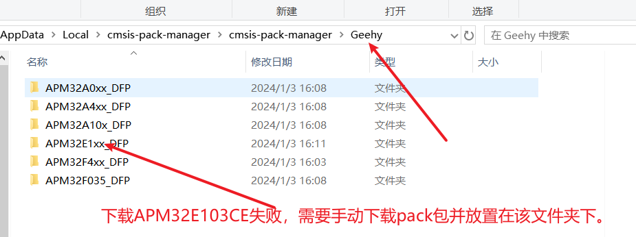

## 安装pack

1. pyocd pack -i (芯片支持包的索引)
2. 查看log是否下载成功
3. pyocd pack -f (芯片)，查看Installed是否成功
4. 如果为TRUE则说明下载成功，为FALSE则失败。需要手动下载pack包放置在对应的路径

~~~
pyocd pack -f apm32
pyocd pack -i APM32E103CE
Pyocd pack -s 
~~~

