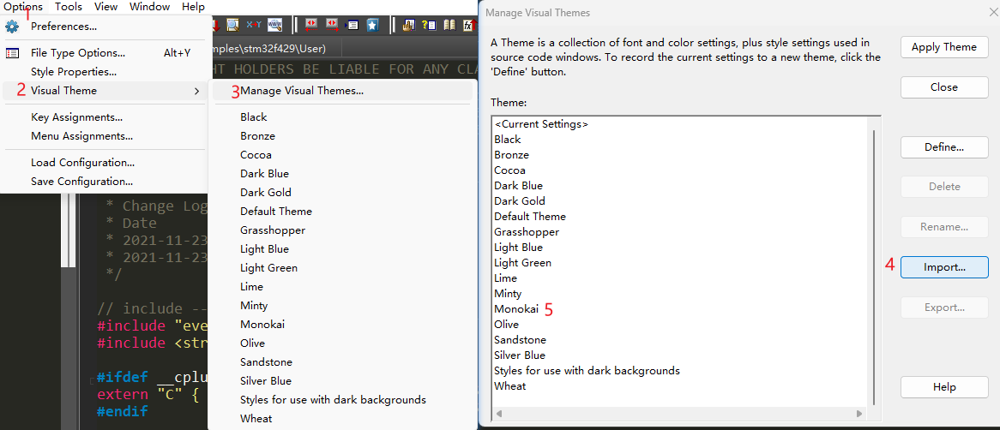

## [Vofa+](https://www.vofa.plus/)

用于调试数据，显示波形，例如调试PID

## [Hxd](https://mh-nexus.de/en/hxd/)

免费的二进制文件编辑器

## [everything](https://www.voidtools.com/zh-cn/)

免费的文件搜索

### [WOX](http://www.wox.one/)

免费WIN启动器

## [deepl](https://www.deepl.com/translator)

收费但可以试用的翻译软件

## [snipaste](https://www.snipaste.com/)

免费的截图软件

## [drawio](https://github.com/jgraph/drawio)

免费优秀的开源绘图软件

## [imhex](https://imhex.werwolv.net/)

免费HEX查看器，可以渲染

## [sublimetext](https://www.sublimetext.com/)

免费的文本编辑器

## [tortoisegit](https://tortoisegit.org)

免费的GIT GUI

## [sublimemerge](https://www.sublimemerge.com/)

免费的GIT GUI

## [Source Insight](./source insight/Source Insight 4.00.0126.7z)

[汉化工具](https://github.com/MyFlyChicken/SourceInsight_i18n)

[主题配置](./source insight/Monokai_theme.xml)



[快捷操作配置](https://www.armbbs.cn/forum.php?mod=viewthread&tid=95564&highlight=source%2Binsight)

## GCC

### 下载链接

- Windows

  [Arm GNU Toolchain Downloads](https://developer.arm.com/downloads/-/arm-gnu-toolchain-downloads)

  [Downloads - MinGW-w64](https://www.mingw-w64.org/downloads/)

- Linux

  ```shell
  # arch linux为例
  sudo pacman -S arm-none-eabi-gcc # 交叉编译
  sudo pacman -S gcc # x86 gcc编译
  ```

### lds链接脚本

```*.lds
.module :
{
	KEEP (*(SORT(poll.item.*)))  #保证扇区（poll.item.）不被优化，同时根据扇区命名，对生成的变量位置排序
}
```

### 常见标志

```cmake
-Wl,--gc-sections #去除未使用的代码，优先级低于链接脚本lds
-m32 #指定编译的程序为32位
```

