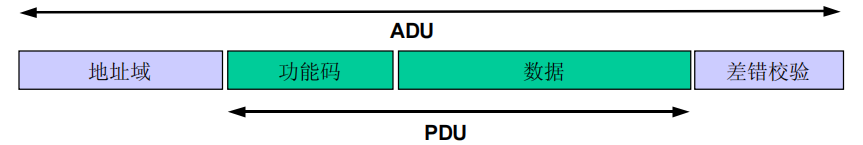
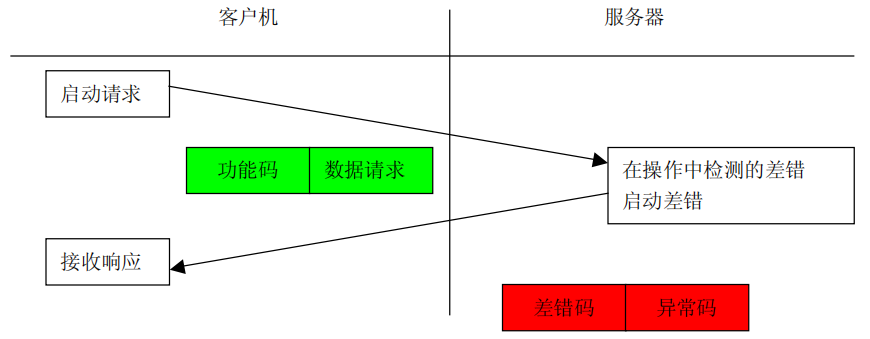
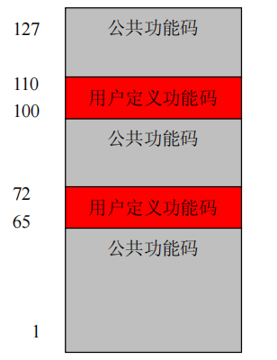
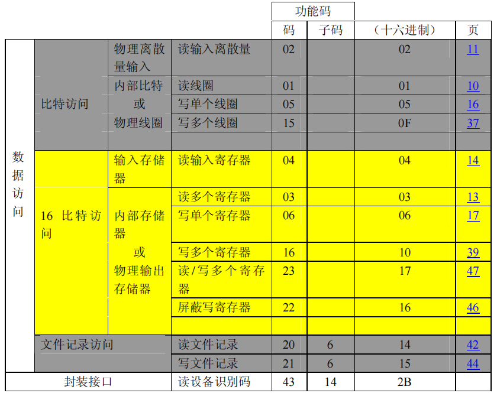
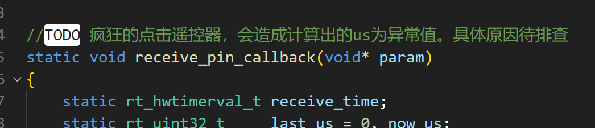

## modbus协议栈

### FreeModbus

仓库地址[点这里](https://github.com/armink/FreeModbus_Slave-Master-RTT-STM32)

#### ModbusRTU简介

通用Modbus帧：



**地址域的范围是1~247，0为广播地址**

Modbus事务处理(正常响应)：

.png)

Modbus事务处理(异常响应)：



Modbus功能码分类：



Modbus公共功能码定义：



##### 从机

使用步骤

1. 完善port文件夹内的所有接口
2. 在完善porttimer.c时，注意

```c
BOOL xMBPortTimersInit(USHORT usTim1Timerout50us)
```

参数为50us的倍数

3. 接口完善之后，可以在一个任务内调用eMBPoll

~~~c
while (1)
{
    eMBPoll();
    //rt_thread_mdelay(MB_POLL_CYCLE_MS);/* 不要用，会影响通讯速度 */
}
~~~

**总结：**从机程序框架主要分为4部分。分别是事件监听、串口中断接收、串口正常发送、定时器超时扫描。事件监听接收定时器超时（EV_FRAME_RECEIVED）、串口发送的事件（EV_EXECUTE）， 串口的接收会管理定时器的启停，避免计时错误。

##### 主机


### Libmodbus


## 音频相关

### Wavplayer


### MP3Player

## 


## 扇区管理

### Fal


## Bootloader

### QBoot

```
//增加一个dst_name，用于校验释放扇区内的程序是否与dst_name相匹配
static bool qbt_release_from_part(const char* part_name, const char* dst_name, bool check_sign)
{
    if (!qbt_fw_check(part_name, &fw_info, true))
    {
        return (false);
    }

#ifdef QBOOT_USING_PRODUCT_CODE
    if (strcmp((char*)fw_info.prod_code, QBOOT_PRODUCT_CODE) != 0)
    {
        LOG_E("The product code error.");
        return (false);
    }
#endif

    if (check_sign)
    {
        if (qbt_release_sign_check(part_name, &fw_info)) //not need release
        {
            LOG_I("Not need release");
            return (true);
        }
    }

	//增加判断条件
    LOG_D("fw_info.part_name= %s", fw_info.part_name);
    if (0 != strcmp((const char*)fw_info.part_name, dst_name))
    {
        LOG_E("Part is not match");
        return (false);
    }

    if (!qbt_fw_update((char*)dst_name, part_name, &fw_info))
    {
        return (false);
    }

    if (!qbt_release_sign_check(part_name, &fw_info))
    {
        qbt_release_sign_write(part_name, &fw_info);
    }

    LOG_I("Release firmware success from %s to %s.", part_name, fw_info.part_name);
    return (true);
}
```


## 异常分析

### CmBacktrace

ARM Cortex-M 系列 MCU 错误追踪库

### addr2line

根据地址定位源文件位置


## 单元测试

[Unity](https://github.com/ThrowTheSwitch/Unity)

## json解析

### cJson


## menuconfig使用

[mr-library](https://github.com/Mac-Rsh/mr-library)


## infrared使用

[infrared](https://github.com/RT-Thread-packages/infrared_framework)

使用注意事项（定时器使用逻辑有问题？）：

- 疯狂点击遥控器时，读取到的数据会偶尔异常，具体原因待排查	

  

  临时解决办法是在drv_infrared.c内加一个函数

  ```c
  //drv_infrared.c
  void infrared_receive_quit(void)
  {
      receive_flag = 0;
  }
  //将这个函数在nec_decoder.c的nec_decoder_decode函数内调用，用于重置接收状态
  	...
      nec_data.addr1  = nec_conv_val(t1);
      nec_data.iaddr  = nec_conv_val(t2);
      nec_data.repeat = 0;
      infrared_receive_quit();//解码后重置定时器
  	...
  ```

- 需要加大hwtimer的超时时间，修改宏

  ```c
  #define RECEIVE_HWTIMEER_SEC  10
  #define RECEIVE_HWTIMEER_USEC 1000 * 1000
  ```

  > 疯狂点击遥控器时，读取到的数据会偶尔异常，具体原因待排查

  ```c
  //定时器中断晚于gpio外部中断进入，导致receive_pin_callback回调函数获取到的receive_time
  //没有及时更新，从而导致if (now_us >= last_us)条件不满足，然后导致diff_us错误，继而导致
  //压入的diff_us错误
  //排查结果：HWTIMER_CTRL_FREQ_SET设置失败，导致HWTIMER_CTRL_MODE_SET为默认的HWTIMER_MODE_ONESHOT模式
  //定时器超时后被关闭，无法更新定时器的计数值rt_hwtimer_t成员overflow不再更新。导致获取receive_time的时候数据错误。
  static void receive_pin_callback(void* param)
  ```

  > > 疯狂点击遥控器时，读取到的数据会偶尔异常，具体原因待排查的**解决办法**

  ```c
  rt_err_t infrared_receive_init(void)
  {
      rt_err_t          ret = RT_EOK;
      rt_hwtimer_mode_t mode;
  
      rt_uint32_t freq = 1000000; //设置定时器频率为1Mhz，实现一个cnt就是1us方便计数
      ...
  }
  ```

- 第一次按下遥控器，无法接收到正确数据

  原因为第一次触发，会开启定时器，定时器重新设置后读取到的now_us不准确，解决办法

  ```c
  /* 第一次下降沿会产生一个错误的diff_us，需要将这个diff_us认为是合法的 */
  rt_uint8_t first_trig_flag = 0;
  static void receive_pin_callback(void* param)
  {
      static rt_hwtimerval_t receive_time;
      static rt_uint32_t     last_us = 0, now_us;
  
      if ((receive_flag & (1 << 0))) {
          rt_device_read(receive_time_dev, 0, &receive_time, sizeof(receive_time));
          now_us = (receive_time.sec * 1000000) + receive_time.usec;//开启定时器后读取到的now_us并没用重置，导致diff_us计算错误。怀疑时APM32E103的驱动有问题
  		...        
      }
      else {
          receive_time.sec  = RECEIVE_HWTIMEER_SEC;
          receive_time.usec = RECEIVE_HWTIMEER_USEC;
  
          rt_device_write(receive_time_dev, 0, &receive_time, sizeof(receive_time));
  
          receive_flag    |= 1 << 0;
          first_trig_flag  = 1;
          last_us          = 0;
          LOG_D("Start timer");
      }
  }
  
  static rt_err_t nec_decoder_decode(rt_size_t size)
  {
      static rt_uint8_t nec_state = 0;
  
      static struct ir_raw_data state_code[2];
  
      static rt_uint32_t            command;
      static struct nec_data_struct nec_data;
  
      rt_uint8_t t1, t2;
  
      LOG_D("size:%d", size);
      if (nec_state == 0x01) {
          ...
      }
      else if (nec_state == 0x04) {
          。。。
      }
      else {
          decoder_read_data(&state_code[0]);
          if ((state_code[0].level == CARRIER_WAVE)
              && ((state_code[0].us > 8500)
                  && (state_code[0].us < 9500))) /* if (guidance code or repetition code) */
          {
              ---
          }
          else {
              //按照这样修改，认为first_trig_flag==1时的数据合理
              extern rt_uint8_t first_trig_flag;
              if (1 == first_trig_flag) {
                  nec_state       = 0x04;
                  first_trig_flag = 2;
              }
              else {
                  nec_state = 0x00;
                  LOG_D("no 9000us:%d", state_code[0].us);
                  return -RT_ERROR;
              }
          }
      }
  
      return RT_EOK;
  }
  ```

  >第一次按下遥控器，无法接收到正确数据
  >
  >根本原因估计时APM32E103写的drv_hwtimer驱动有问题，写数据时，没有将有些计数变量重置

## cmbacktrace使用

[CmBacktrace](https://github.com/armink-rtt-pkgs/CmBacktrace/tree/master)

