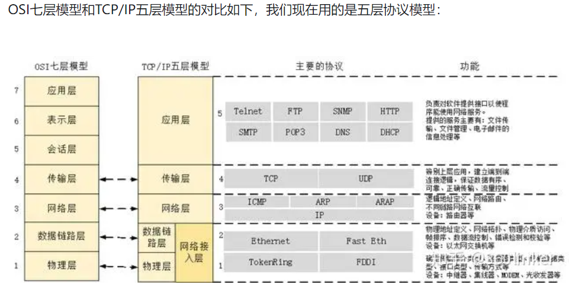
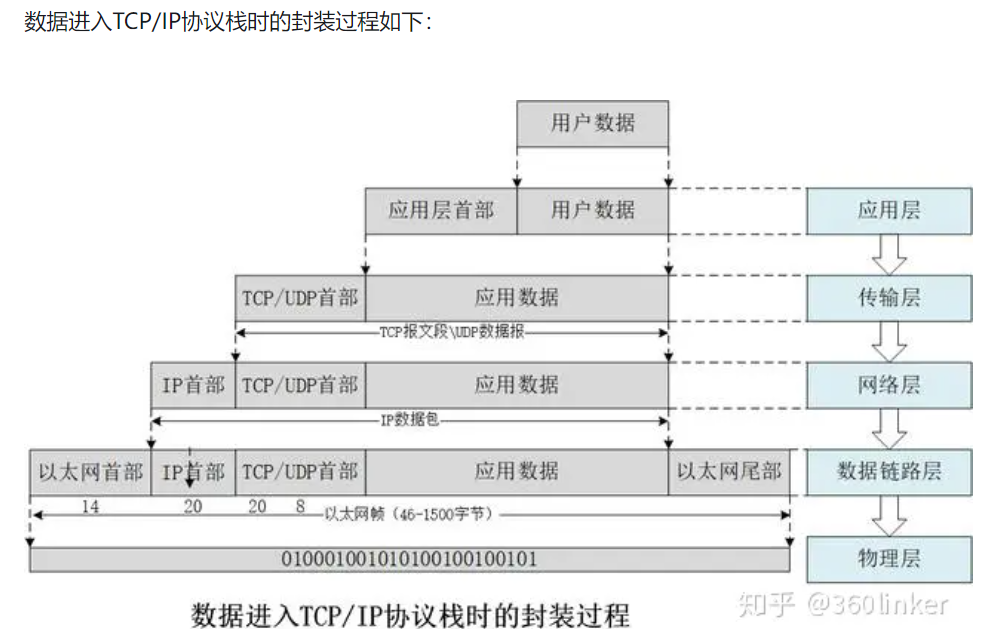
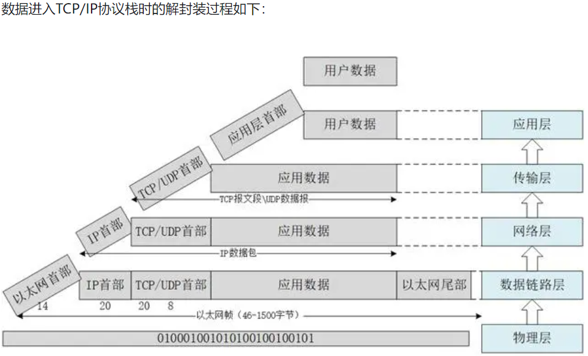
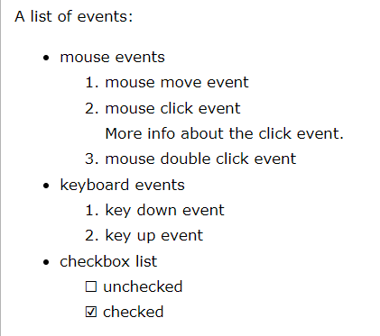
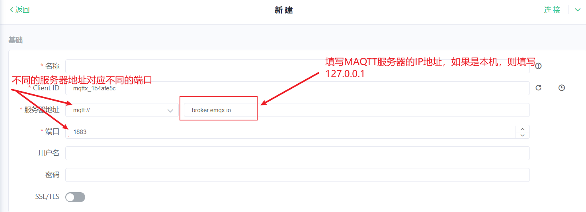
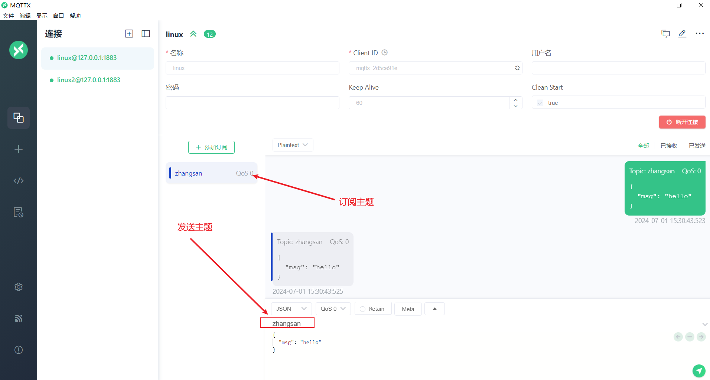
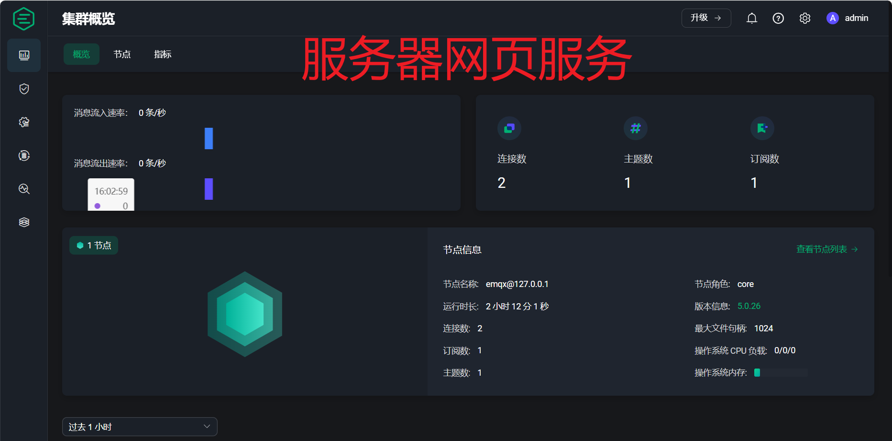
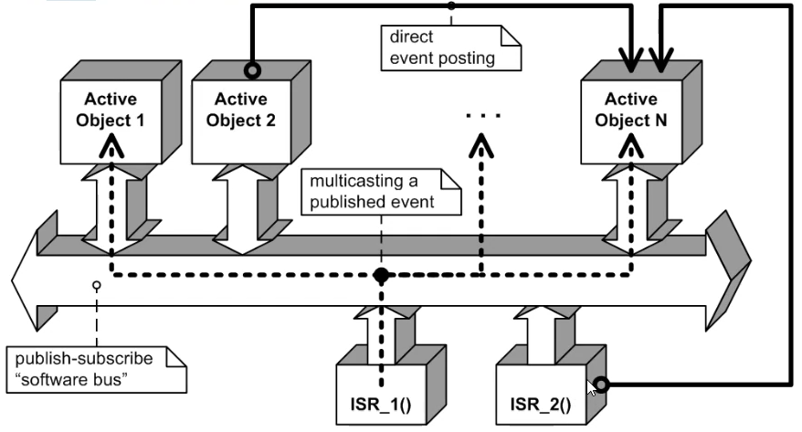
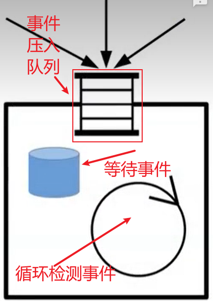

## 版本号命名规则

如果想要一个开发一个稳定的程序，那么规则的版本号命名是非常有必要的。如下

V1.0.0.20211028_base

- V 版本前缀

- 1主版本号，软件框架变动，需要增加该版本号

- 0 副版本号，增加或删除功能时，增加该版本号

- 0 修订版本号，修复BUG后增加该版本号

- 20211028 日期版本号，根据日期修改版本号

- base 希腊字母版本号，希腊字母包括如下

  | 希腊字母 | 描述                             |
  | -------- | -------------------------------- |
  | base     | 最初版本，功能可能不完善         |
  | alpha    | 软件的初级版本，基本完善所有功能 |
  | beta     | 修复了BUG，待测试                |
  | rc       | 测试通过，与发布版本相差很小     |
  | release  | 发布版本                         |

- [软件项目、产品版本号的命名规则、定义、命名规范（git代码分支版本、项目产品文档版本）](https://blog.csdn.net/qq_29974981/article/details/121008029)

## modbus协议栈

### FreeModbus

仓库地址[点这里](https://github.com/armink/FreeModbus_Slave-Master-RTT-STM32)

#### ModbusRTU简介

通用Modbus帧：


**地址域的范围是1~247，0为广播地址**

Modbus事务处理(正常响应)：

.png)

Modbus事务处理(异常响应)：


Modbus功能码分类：


Modbus公共功能码定义：


##### 从机

使用步骤

1. 完善port文件夹内的所有接口
2. 在完善porttimer.c时，注意

```c
BOOL xMBPortTimersInit(USHORT usTim1Timerout50us)
```

参数为50us的倍数

3. 接口完善之后，可以在一个任务内调用eMBPoll

~~~c
while (1)
{
    eMBPoll();
    //rt_thread_mdelay(MB_POLL_CYCLE_MS);/* 不要用，会影响通讯速度 */
}
~~~

**总结：**从机程序框架主要分为4部分。分别是事件监听、串口中断接收、串口正常发送、定时器超时扫描。事件监听接收定时器超时（EV_FRAME_RECEIVED）、串口发送的事件（EV_EXECUTE）， 串口的接收会管理定时器的启停，避免计时错误。

##### 主机


### Libmodbus


## 音频相关

### Wavplayer


### MP3Player

## 


## 扇区管理

### Fal


## Bootloader

### QBoot

```
//增加一个dst_name，用于校验释放扇区内的程序是否与dst_name相匹配
static bool qbt_release_from_part(const char* part_name, const char* dst_name, bool check_sign)
{
    if (!qbt_fw_check(part_name, &fw_info, true))
    {
        return (false);
    }

#ifdef QBOOT_USING_PRODUCT_CODE
    if (strcmp((char*)fw_info.prod_code, QBOOT_PRODUCT_CODE) != 0)
    {
        LOG_E("The product code error.");
        return (false);
    }
#endif

    if (check_sign)
    {
        if (qbt_release_sign_check(part_name, &fw_info)) //not need release
        {
            LOG_I("Not need release");
            return (true);
        }
    }

	//增加判断条件
    LOG_D("fw_info.part_name= %s", fw_info.part_name);
    if (0 != strcmp((const char*)fw_info.part_name, dst_name))
    {
        LOG_E("Part is not match");
        return (false);
    }

    if (!qbt_fw_update((char*)dst_name, part_name, &fw_info))
    {
        return (false);
    }

    if (!qbt_release_sign_check(part_name, &fw_info))
    {
        qbt_release_sign_write(part_name, &fw_info);
    }

    LOG_I("Release firmware success from %s to %s.", part_name, fw_info.part_name);
    return (true);
}
```


## 异常分析

### CmBacktrace

ARM Cortex-M 系列 MCU 错误追踪库

### addr2line

根据地址定位源文件位置


## 单元测试

[Unity](https://github.com/ThrowTheSwitch/Unity)

## json解析

### cJson


## menuconfig使用

[mr-library](https://github.com/Mac-Rsh/mr-library)


## infrared使用

[infrared](https://github.com/RT-Thread-packages/infrared_framework)

使用注意事项（定时器使用逻辑有问题？）：

- 疯狂点击遥控器时，读取到的数据会偶尔异常，具体原因待排查	

  

  临时解决办法是在drv_infrared.c内加一个函数

  ```c
  //drv_infrared.c
  void infrared_receive_quit(void)
  {
      receive_flag = 0;
  }
  //将这个函数在nec_decoder.c的nec_decoder_decode函数内调用，用于重置接收状态
  	...
      nec_data.addr1  = nec_conv_val(t1);
      nec_data.iaddr  = nec_conv_val(t2);
      nec_data.repeat = 0;
      infrared_receive_quit();//解码后重置定时器
  	...
  ```

- 需要加大hwtimer的超时时间，修改宏

  ```c
  #define RECEIVE_HWTIMEER_SEC  10
  #define RECEIVE_HWTIMEER_USEC 1000 * 1000
  ```

  > 疯狂点击遥控器时，读取到的数据会偶尔异常，具体原因待排查

  ```c
  //定时器中断晚于gpio外部中断进入，导致receive_pin_callback回调函数获取到的receive_time
  //没有及时更新，从而导致if (now_us >= last_us)条件不满足，然后导致diff_us错误，继而导致
  //压入的diff_us错误
  //排查结果：HWTIMER_CTRL_FREQ_SET设置失败，导致HWTIMER_CTRL_MODE_SET为默认的HWTIMER_MODE_ONESHOT模式
  //定时器超时后被关闭，无法更新定时器的计数值rt_hwtimer_t成员overflow不再更新。导致获取receive_time的时候数据错误。
  static void receive_pin_callback(void* param)
  ```

  > > 疯狂点击遥控器时，读取到的数据会偶尔异常，具体原因待排查的**解决办法**

  ```c
  rt_err_t infrared_receive_init(void)
  {
      rt_err_t          ret = RT_EOK;
      rt_hwtimer_mode_t mode;
  
      rt_uint32_t freq = 1000000; //设置定时器频率为1Mhz，实现一个cnt就是1us方便计数
      ...
  }
  ```

- 第一次按下遥控器，无法接收到正确数据

  原因为第一次触发，会开启定时器，定时器重新设置后读取到的now_us不准确，解决办法

  ```c
  /* 第一次下降沿会产生一个错误的diff_us，需要将这个diff_us认为是合法的 */
  rt_uint8_t first_trig_flag = 0;
  static void receive_pin_callback(void* param)
  {
      static rt_hwtimerval_t receive_time;
      static rt_uint32_t     last_us = 0, now_us;
  
      if ((receive_flag & (1 << 0))) {
          rt_device_read(receive_time_dev, 0, &receive_time, sizeof(receive_time));
          now_us = (receive_time.sec * 1000000) + receive_time.usec;//开启定时器后读取到的now_us并没用重置，导致diff_us计算错误。怀疑时APM32E103的驱动有问题
  		...        
      }
      else {
          receive_time.sec  = RECEIVE_HWTIMEER_SEC;
          receive_time.usec = RECEIVE_HWTIMEER_USEC;
  
          rt_device_write(receive_time_dev, 0, &receive_time, sizeof(receive_time));
  
          receive_flag    |= 1 << 0;
          first_trig_flag  = 1;
          last_us          = 0;
          LOG_D("Start timer");
      }
  }
  
  static rt_err_t nec_decoder_decode(rt_size_t size)
  {
      static rt_uint8_t nec_state = 0;
  
      static struct ir_raw_data state_code[2];
  
      static rt_uint32_t            command;
      static struct nec_data_struct nec_data;
  
      rt_uint8_t t1, t2;
  
      LOG_D("size:%d", size);
      if (nec_state == 0x01) {
          ...
      }
      else if (nec_state == 0x04) {
          。。。
      }
      else {
          decoder_read_data(&state_code[0]);
          if ((state_code[0].level == CARRIER_WAVE)
              && ((state_code[0].us > 8500)
                  && (state_code[0].us < 9500))) /* if (guidance code or repetition code) */
          {
              ---
          }
          else {
              //按照这样修改，认为first_trig_flag==1时的数据合理
              extern rt_uint8_t first_trig_flag;
              if (1 == first_trig_flag) {
                  nec_state       = 0x04;
                  first_trig_flag = 2;
              }
              else {
                  nec_state = 0x00;
                  LOG_D("no 9000us:%d", state_code[0].us);
                  return -RT_ERROR;
              }
          }
      }
  
      return RT_EOK;
  }
  ```

  >第一次按下遥控器，无法接收到正确数据
  >
  >根本原因估计时APM32E103写的drv_hwtimer驱动有问题，写数据时，没有将有些计数变量重置

## cmbacktrace使用

[CmBacktrace](https://github.com/armink-rtt-pkgs/CmBacktrace/tree/master)

## LWIP使用

### lwip扫盲

LWIP全称（LwIP 全名为 Light weight IP，意思是轻量化的 TCP/IP 协议），主要移植到微控制器内。





([LwIP系列（5）：TCP 3次握手+4次挥手+状态机转换_lwip tcp握手-CSDN博客](https://blog.csdn.net/u012351051/article/details/131625542))

- IP、子网掩码、网络地址、端口之间什么关系：

  - IP地址：一个32位的二进制数，通常被分割为4个“8位二进制数”。（如ip地址：192.168.0.1为四个八位二进制数）

  - 网络地址：由ip和子网掩码**按位与**得出，只有网络地址相同的ip才在同一子网内，网络地址是子网中最小的地址，（ip:192.168.1.22，子网掩码：255.255.255.0，那么网络地址为192.168.1。0）

  - 子网掩码：只有一个作用，就是将某个IP地址划分成“网络地址”和“主机地址（主机（IP）地址即该网段中 主机的地址编号）”两部分

  - 端口：TCP与UDP段结构中端口地址都是**16比特**，可以有在0---65535范围内的端口号。端口用于区分一个IP（一个IP可以表示一台计算机）内的多个服务。如FTP服务，HTTP服务，ssh服务的端口分别为21，80，22。

  - 参考资料：

    [详解IP与子网掩码的关系_子网掩码和ip地址的关系-CSDN博客](https://blog.csdn.net/qq_42144475/article/details/108803200)

    [【计算机网络】端口详解【概念、作用、分类、常见端口】_计算机网络端口的作用-CSDN博客](https://blog.csdn.net/qq_21989927/article/details/109812089)

参考资料：

[【LWIP】初学STM32+LWIP+网络遇到的基础问题记录_stm32 lwip-CSDN博客](https://blog.csdn.net/lrqblack/article/details/123842063?spm=1001.2014.3001.5501)

[网络协议栈基本知识 - 知乎 (zhihu.com)](https://zhuanlan.zhihu.com/p/114863612)

### lwip移植


## Doxygen使用

### 帮助文档

```
Doxygen version 1.10.0 (GIT-NOTFOUND)
Copyright Dimitri van Heesch 1997-2021

You can use doxygen in a number of ways:

1) Use doxygen to generate a template configuration file*:
    doxygen [-s] -g [configName]

2) Use doxygen to update an old configuration file*:
    doxygen [-s] -u [configName]

3) Use doxygen to generate documentation using an existing configuration file*:
    doxygen [configName]

4) Use doxygen to generate a template file controlling the layout of the
   generated documentation:
    doxygen -l [layoutFileName]

    In case layoutFileName is omitted DoxygenLayout.xml will be used as filename.
    If - is used for layoutFileName doxygen will write to standard output.

5) Use doxygen to generate a template style sheet file for RTF, HTML or Latex.
    RTF:        doxygen -w rtf styleSheetFile
    HTML:       doxygen -w html headerFile footerFile styleSheetFile [configFile]
    LaTeX:      doxygen -w latex headerFile footerFile styleSheetFile [configFile]

6) Use doxygen to generate a rtf extensions file
    doxygen -e rtf extensionsFile

    If - is used for extensionsFile doxygen will write to standard output.

7) Use doxygen to compare the used configuration file with the template configuration file
    doxygen -x [configFile]

   Use doxygen to compare the used configuration file with the template configuration file
   without replacing the environment variables or CMake type replacement variables
    doxygen -x_noenv [configFile]

8) Use doxygen to show a list of built-in emojis.
    doxygen -f emoji outputFileName

    If - is used for outputFileName doxygen will write to standard output.

*) If -s is specified the comments of the configuration items in the config file will be omitted.
   If configName is omitted 'Doxyfile' will be used as a default.
   If - is used for configFile doxygen will write / read the configuration to /from standard output / input.

If -q is used for a doxygen documentation run, doxygen will see this as if QUIET=YES has been set.

-v print version string, -V print extended version information
-h,-? prints usage help information
doxygen -d prints additional usage flags for debugging purposes
```

### 生成文档步骤

- doxygen -g [configName] 生成doxygen的配置文件
- 修改[configName]配置文件
- doxygen [configName] 生成
- TODO 函数调用关系

### 常用注释命令，[全部注释](https://www.doxygen.nl/manual/commands.html)

@exception <exception-object> {exception description} 对一个异常对象进行注释。

@warning {warning message } 一些需要注意的事情

@todo { things to be done } 对将要做的事情进行注释，链接到所有TODO 汇总的TODO 列表

@bug 缺陷，链接到所有缺陷汇总的缺陷列表

@see {comment with reference to other items } 一段包含其他部分引用的注释，中间包含对其他代码项的名称，自动产生对其的引用链接。

@relates <name> 通常用做把非成员函数的注释文档包含在类的说明文档中。

@since {text} 通常用来说明从什么版本、时间写此部分代码。

@deprecated

@pre { description of the precondition } 用来说明代码项的前提条件。

@post { description of the postcondition } 用来说明代码项之后的使用条件。

@code 在注释中开始说明一段代码，直到@endcode命令。

@endcode 注释中代码段的结束。

@brief 概要信息

@deprecated 已废弃函数

@details  详细描述

@note 开始一个段落，用来描述一些注意事项

@par 开始一个段落，段落名称描述由你自己指定

@param 标记一个参数的意义

@fn 函数说明

@ingroup 加入到一个组

@return 描述返回意义

@retval 描述返回值意义

@include 包含文件

@var、@enum、@struct、@class 对变量、美剧、结构体、类等进行标注

@list

```
  /*! 
   *  A list of events:
   *    - mouse events
   *         -# mouse move event
   *         -# mouse click event\n
   *            More info about the click event.
   *         -# mouse double click event
   *    - keyboard events
   *         1. key down event
   *         2. key up event
   *    - checkbox list
   *         - [ ] unchecked
   *         - [x] checked
   *
   *  More text here.
   */
```

上述demo生成的文档如下，list内的语法和markdown语法相似

，

- [Demo](./doxygenDemo)

### 如何区分普通注释与Doxygen注释

Doxygen通过在这里增加`*`，`/`，`!`来作为特殊标记，比如

```
/*
 * 正常注释
 */
/**
 * 要输出成文档的注释
 */
/*!
 * 要输出成文档的注释
 */
同时，中间的*号可以省略，像这样
/**
   要输出成文档的注释
 */
/*!
   要输出成文档的注释
 */
```

对于`//`这种类型的注释，Doxygen在第二个`/`后，增加`!`或`/`作为区分标志，如果检测到有这些，就将接下来的注释作为导出文档来解释

```
/// 要输出成文档的注释
或者
//! 要输出成文档的注释
```

对于单行注释，卸载程序后边，如下(再识别标志后边加一个‘<')

```
#define DEV_ON      ((int)(1))      //!< Simple device is power on.
#define DEV_OFF     ((int)(0))      //!< Simple device is power off.
```


### 参考连接

- [大佬的Confluence](https://www.midlane.top/wiki/display/utils/Doxygen)
- [知乎大佬总结](https://zhuanlan.zhihu.com/p/122523174)
- [官网](https://www.doxygen.nl/index.html)

## [EMQX：MQTT 平台](https://www.emqx.com/zh)

[MQTT扫盲](https://www.emqx.com/zh/mqtt-guide)

### Linux搭建EMQX服务器

[EMQX 5.0 文档](https://docs.emqx.com/zh/emqx/v5.0/deploy/install.html)

### MQTTX连接EMQX服务器



| 服务                  | 端口      |
| --------------------- | --------- |
| ws(WebSocket)         | 8083      |
| wss(WebSocket Secure) | 8084      |
| mqtt                  | 1883      |
| mqtts                 | 8883/8884 |





可以将emqx装在阿里云或其它云，实现外网访问emqx。

如**阿里云IP为192.168.1.111，那么可以用esp32连接192.168.1.111:18083，实现mqtt通讯**

## QP/C(state-machine)

最初状态

状态迁移（采用了函数指针复制的方式）

杰理SDK采用了事件驱动框架，ESP32也采用了事件驱动框架

尽量使用异步通信，隔离数据。

活动对象设计模式，非阻塞。发送-订阅



从零写一个RTOS

```c
//需要一些OS的类型别名
>>>os_typedef.h<<<
typedef unsigned char os_u8_t;
typedef unsigned short os_u16_t;
typedef unsigned long os_u32_t;

//需要一个状态结构体
typedef enum {
    OS_OK = 0,
    
}os_status_t;

//需要一个线程结构体，用于管理线程
>>>os_thread.h<<<
struct {
    //...
    //优先级 状态 入口 线程名
    
}os_thread;
typedef struct os_thread* os_thread_t;

//栈空间管理，压栈出栈，需要与线程结构体相关联
>>>os_thread.c<<<
os_status_t os_stack_push(void);
os_status_t os_stack_pop(void);
//线程管理及切换函数
//void os_thread_sched(---);

//中断函数重构，用于更新 os_thread_t
void PendSV_Handler(void)
{
    ...
}
//线程创建函数
os_thread_t os_thread_creat(const char *name,
                            void (*entry)(void *parameter),
                            void       *parameter,
                            os_u32_t stack_size,
                            rt_uint8_t  priority,
                            rt_uint32_t tick);
//空闲线程
void os_thread_idle(void *parameter);
//tick管理 管理线程的切换

```


### 事件驱动记录

事件驱动框架仅在有事件时执行。没有阻塞

活动对象



```c
//活动对象基类
#include "ucos_ii.h"  /* uC/OS-II API, port and compile-time configuration */
#include "qassert.h"  /* embedded-systems-friendly assertions (DbC) */

/*---------------------------------------------------------------------------*/
/* Event facilities... */
/* 定义信号别名 */ 
typedef uint16_t Signal; /* event signal */

/* 信号定义 */ 
enum ReservedSignals {
    INIT_SIG, /* dispatched to AO before entering event-loop */
    USER_SIG  /* first signal available to the users */
};

/* 事件基类 Event base class */
typedef struct {
    Signal sig; /* event signal */
    /* event parameters added in subclasses of Event */
} Event;

/*---------------------------------------------------------------------------*/
/* Actvie Object facilities... */
typedef struct Active Active; /* forward declaration */

typedef void (*DispatchHandler)(Active * const me, Event const * const e);

/* Active Object base class */
struct Active {
    INT8U thread;     /* private thread (the unique uC/OS-II task priority) */
    OS_EVENT *queue;  /* private message queue */

    DispatchHandler dispatch; /* pointer to the dispatch() function */

    /* active object data added in subclasses of Active */
};

/*活动对象初始化函数*/
void Active_ctor(Active * const me, DispatchHandler dispatch);
void Active_start(Active * const me,
                  uint8_t prio,       /* priority (1-based) */
                  Event **queueSto,
                  uint32_t queueLen,
                  void *stackSto,
                  uint32_t stackSize,
                  uint16_t opt);
void Active_post(Active * const me, Event const * const e);

/*---------------------------------------------------------------------------*/
/* Time Event facilities... */

/* Time Event class */
typedef struct {
    Event super;       /* inherit Event */
    Active *act;       /* the AO that requested this TimeEvent */
    uint32_t timeout;  /* timeout counter; 0 means not armed */
    uint32_t interval; /* interval for periodic TimeEvent, 0 means one-shot */
} TimeEvent;

void TimeEvent_ctor(TimeEvent * const me, Signal sig, Active *act);
void TimeEvent_arm(TimeEvent * const me, uint32_t timeout, uint32_t interval);
void TimeEvent_disarm(TimeEvent * const me);

/* static (i.e., class-wide) operation */
void TimeEvent_tick(void);

/*
初始化对象步骤
1 继承基类，定义生成的私有数据
2 初始化继承的基类，初始化初始变量
3 开始事件循环
*/

```

UML建模工具

状态迁移

状态表，无效的不处理

| 状态/事件 | 超时 | 暂停 | 按键 |
| --------- | ---- | ---- | ---- |
| blink     |      |      |      |
| button    |      |      |      |

编程可以先写伪代码，再将伪代码替换修改为正确的代码

抽象出有限状态机FSM

