## N型半导体

参入P(磷)元素，导致自由电子非常多，电子带负电，N即negative。

多子：自由电子     少子：空穴

## P型半导体

加入硼元素，导致空穴非常多，空穴带正电，P即positive。

多子：空穴     少子：自由电子

## PN结

### PN结的形成

由于有扩散运动，高浓度向低浓度运动，N区自由电子向P区移动，P区空穴向N区移动。

当P型半导体和N型半导体相接触时，由于两种半导体的掺杂原子种类和浓度不同，会产生电子和空穴的扩散运动。在P型半导体中，空穴浓度较高，电子浓度较低，而在N型半导体中，电子浓度较高，空穴浓度较低。

由于电子和空穴的扩散运动，P型半导体和N型半导体之间形成了一个电势差，并产生了电场。这个电势差和电场在PN结的两侧形成了一个电势垒。

当PN结处于静止状态时，电势垒会阻止电子和空穴的扩散运动，从而形成一个电子空穴密度分布的稳定状态。在PN结的P型半导体侧，电子和空穴会被电势差吸引，从而形成一个空穴的富集层；在PN结的N型半导体侧，电子和空穴会被电势差排斥，从而形成一个电子的富集层。

### PN结的单向导电性

外加正向电压，改变内电场。其中R为限流电阻。

疑问：死区？不对称结

### PN结伏安特性

[PN结与二极管的特性_二极管和pn结的区别](https://blog.csdn.net/VsitorZL/article/details/116352609)

- 正向特性
- 反向特性
- 反向击穿

## 二极管

设计原理图时，二极管前边都会有一个限流电阻

### 伏安特性

- 体电阻存在，使得相同电压下电流比PN结小
- 反向电流比PN结大一些

### 温度影响

> 

- T（温度）向上，正向左移（虚线），反向下移（虚线），由图可知反向电流时，反向电流增大一倍。

### 主要参数

- If(最大工作平均电流)
- Ur(最大承受反向电压)
- Ir(最大反向电流)？？？？？？？
- Fm(最大导通频率)

### 稳压二极管

1处电压上升，引起3处电压跟随上升，由于二极管的伏安特性曲线，电压增大会导致电流增大，电流增大会引起2处压降。**由于U1 = IR2 + U3，U3在稳压二极管稳定后为一为固定值，因此推导出U3在电流的增大下很快达到稳定状态，同时这个电路也减小了导线流经的电。**

## 双极晶体管

集电极：收集能量

基极：控制

发射极：发射能量

### 构成方式

#### 结构

三个区域，三个电极，两个PN结

### 电流放大

- 共射：Ic / Ib = β，β为常数，Ib控制Ic大小

- 共基：

#### 共射特性曲线

|        | 发射结 | 集电结 |
| ------ | ------ | ------ |
| 饱和区 | 正偏   | 正偏   |
| 放大区 | 正偏   | 反偏   |
| 截止区 | 反偏   | 反偏   |

## 场效应管

- 结型场效应管
- 绝缘栅型结晶体管
- N沟道增强MOS管

g：栅极 S：源极 d：漏极

## 峰峰值与有效值的关系 峰峰值和幅值的关系

### 概念

- 峰峰值（Vpp）：指[正弦波](https://www.eefocus.com/baike/481525.html)在一个周期内振荡的最大电压值与最小电压值之差
- 有效值（Vrms）：指交流信号所带电荷能量相同时，相对稳定[直流电](https://www.eefocus.com/baike/1534453.html)压所产生的功率与该交流信号所产生的功率相等的电压值
- 幅值（Vm）：指交流信号振幅的大小，即信号波形从零点到峰值的距离
- 峰值（Vp）:指是交流电信号波形中最大的正或负振幅。例如，一个正弦波的峰值大小就是正半个周期中最大正振幅或负半个周期中最小负振幅

### 公式

- Vpp = 2 x Vm
- Vrms = Vp / sqrt(2)

## 元器件

[在线换算器](https://www.digikey.cn/zh/resources/online-conversion-calculators)

### 电阻

#### 原理图标识

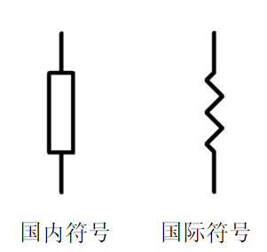

#### 常见电阻

色环电阻，贴片电阻，电位器(类似滑动变阻器)

#### 单位

Ω，kΩ，MΩ

[贴片电阻代码计算器](https://www.digikey.cn/zh/resources/conversion-calculators/conversion-calculator-smd-resistor-code)

例：103 表示 10 x 10^3Ω = 10 kΩ，4701表示470 x 10^1 = 4.7 kΩ

#### 参数

阻值，功率，耐压

#### 特性

#### 作用

限流，分压

### 电感

#### 原理图标识

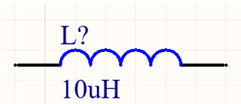

#### 常见的电感

有工字电感，CD系列电感，线圈电感，贴片电感，一体成型电感

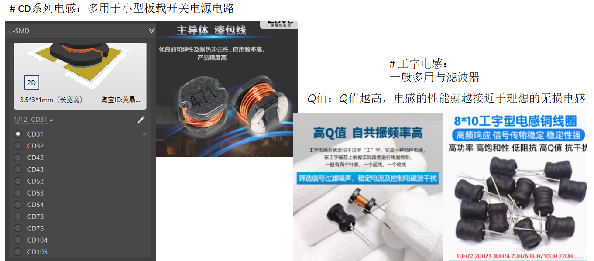

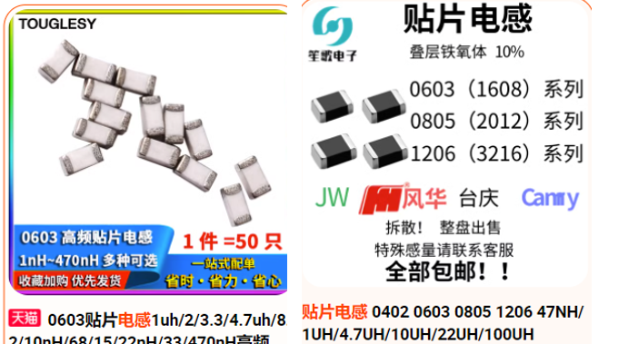

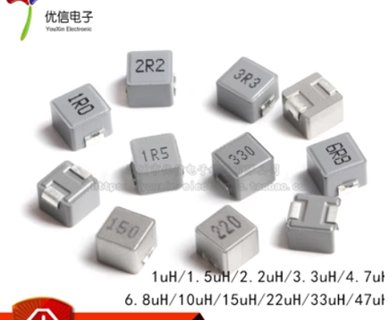

#### 单位

亨（L），mL，uL，nL，通常单位是uL

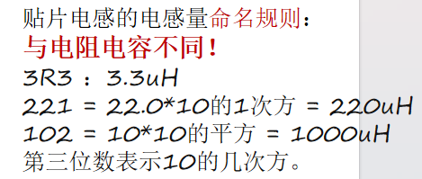

#### 参数

电感量，**饱和电流？**

#### 特性

通直阻交，具有电流惯性，即电感上的电流不能突变

#### 作用

通直阻交

### 电容

#### 原理图标识

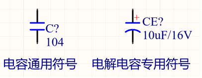

#### 常见电容

贴片电容，直插电容，电解电容

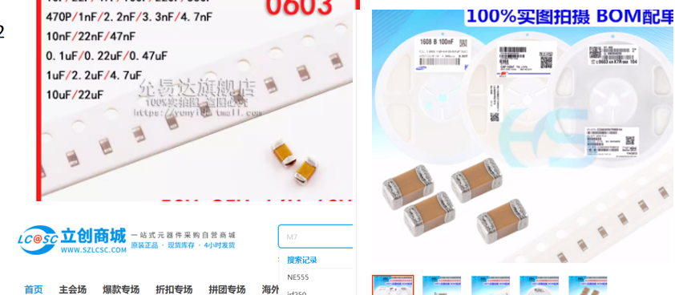

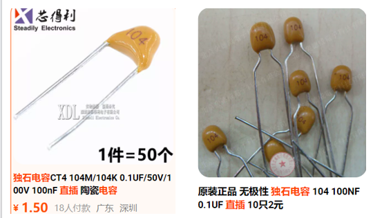

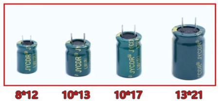

#### 单位

法拉（F），mF，uF，nF，pF，常用单位是uF

#### 参数

耐压值，电容量

#### 特性

隔直通交，储能，滤波，电容上的电压不能突变

#### 作用

隔直通交，储能，滤波

### 二极管

#### 原理图标识

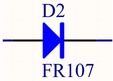

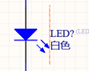

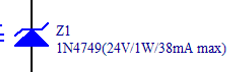

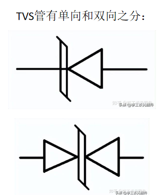

#### 常见二极管

普通二极管、稳压二极管（工作在反向击穿条件，用于稳定电压，电流增大不会影响电压）、TVS二极管（避免反向击穿，反向击穿时能够对击穿电压进行削顶）、肖特基二极管（能够快速进入截止状态）、发光二极管

#### 单位

#### 参数

#### 特性

#### 作用

