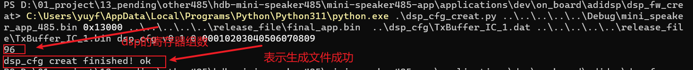

#### 配置dsp_cfg_creat.py参数

- dsp_cfg_creat.py入口参数介绍

| 入口参数 | app_file_path             | app_length      | final_app_path      | input_file_path            | output_file_path           | part_name                               | version     | prog_code           |
| -------- | ------------------------- | --------------- | ------------------- | -------------------------- | -------------------------- | --------------------------------------- | ----------- | ------------------- |
| 描述     | RT-Studio编译出的结果路径 | app分区指定长度 | app+dsp_cfg文件路径 | sigmastudio生成的*.dat路径 | dat文件转换为bin文件的路径 | dat文件对应的bin文件在FAL库中的分区名字 | dsp_cfg版本 | DSP_CFG的产品识别码 |

1. 进入dsp_cfg_creat.py所在路径

2. 在文件夹内打开cmd，或者打开cmd后切换至dsp_cfg_creat.py所在路径

3. 输入C:\Users\yuyf\AppData\Local\Programs\Python\Python311\python.exe .\dsp_cfg_creat.py ..\..\..\..\..\Debug\mini_speaker_app_485.bin 0x13000 ..\..\..\..\..\release_file\final_app.bin  ..\dsp_cfg\TxBuffer_IC_1.dat ..\..\..\..\..\release_file\TxBuffer_IC_1.bin dsp_cfg v0.1.0 00010203040506070809

4. 执行命令

   观察是否有错误或者直接查看是否在指定路径生成相关文件

   