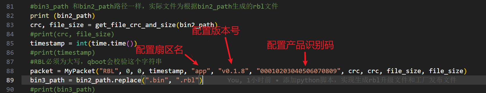

#### 配置merge.py参数

* merge.py入口参数介绍

| 入口参数 | bin1_path | bin1_start   | bin1_end     | bin2_path | bin2_start  | bin2_end    | bin3_path               | bin3_start       | bin3_end         | output_path          |
| -------- | --------- | ------------ | ------------ | --------- | ----------- | ----------- | ----------------------- | ---------------- | ---------------- | -------------------- |
| 描述     | boot路径  | boot起始地址 | boot结束地址 | app路径   | app起始地址 | app结束地址 | 无效，实际为output_path | 出厂固件起始地址 | 出厂固件结束地址 | 输出工厂发布文件路径 |

* class MyPacket 参数介绍

| 成员   | packet_type | algo           | algo2          | time_stamp     | part_name        | fw_ver           | prog_code              | pkg_crc        | raw_crc        | raw_size       | pkg_size       | hdr_crc        |
| ------ | ----------- | -------------- | -------------- | -------------- | ---------------- | ---------------- | ---------------------- | -------------- | -------------- | -------------- | -------------- | -------------- |
| 属性   | 字符串      | 16位无符号整数 | 16位无符号整数 | 32位无符号整数 | 字符串           | 字符串           | 字符串                 | 32位无符号整数 | 32位无符号整数 | 32位无符号整数 | 32位无符号整数 | 32位无符号整数 |
| 字节   | 4           | 2              | 2              | 4              | 16               | 24               | 24                     | 4              | 4              | 4              | 4              | 4              |
| 描述   | 文件头，为  | 算法选择       | 算法选择       | 时间戳         | 固件分区名       | 固件版本         | 产品识别码             | 固件CRC        | 打包CRC        | 打包尺寸       | 固件尺寸       | 包头CRC        |
| 默认值 | "RBL"       | 0              | 0              | 软件计算       | “APP”            | "v0.1.8"         | “00010203040506070809” | 软件计算       | 软件计算       | 软件计算       | 软件计算       | 软件计算       |
| 属性   | 不可修改    | 不可修改       | 不可修改       | 不可修改       | 根据实际情况修改 | 根据实际情况修改 | 根据实际情况修改       | 不可修改       | 不可修改       | 不可修改       | 不可修改       | 不可修改       |

* 根据实际情况配置merge.py的程序
  

* 命令行窗口调用merge.py

  **调用merge.py之前，务必先执行dsp_cfg_creat.py，生成文件，否则执行merge.py时会报错**

  ****

  此处以生成文件放置在release_file文件内进行举例。
  
  在命令行输入C:\Users\yuyf\AppData\Local\Programs\Python\Python311\python.exe  ..\release_tools\merge.py ..\..\mini-speaker485-boot\Debug\mini_speaker_boot_485.bin 0 0x0F000 ..\release_file\final_app.bin 0x0F000 0x33000  0x33000 0x57000 ..\release_file\merge.bin

  其中，C:\Users\yuyf\AppData\Local\Programs\Python\Python311\python.exe为实际python安装的路径
  按下Enter键，生成文件，生成文件路径由merge.py的最后一个入口参数决定
  
  如果出现其它log，请检测输入参数是否存在或被其它程序占用
  进入最后一个参数的路径，查看生成的文件，确认文件时间是否为执行merge.py时的时间 

#### Bin Merger.exe

该工具用于将指定的bin文件合并为一个文件，左上角文件可以选择保存配置

**注意事项：**

- 合成文件时，需要重新加载一下这个工具的配置文件，否则可能造成某一个文件已经修改，但是并没有检测到。依然用之前的文件合成